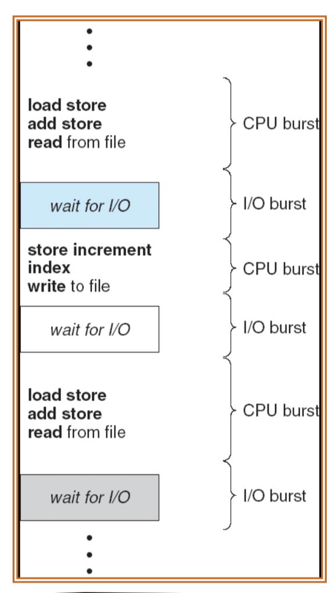

# 6 Lecture 6 — Uniprocessor Scheduling

## 6.1 Types of Processor Scheduling

### 6.1.1 Scheduling and Its Objectives

- An OS must allocate resources amongst competing processes.
- The resource provided by a processor is execution time.
- Processor resource is allocated by means of scheduling, which determines which processes will wait and which will progress.
- The aim of processor scheduling is to assign processes to be executed by the processor in a way that meets system objectives, such as **response time**, **turnaround time**, **throughput** and **processor utilization**.

Objectives: the scheduling functions should:

- Share time *fairly* among processes
- Prevent starvation of a process
- Use the processor efficiently
- Have low overhead
- Prioritize processes when necessary (real time deadlines)

### 6.1.2 Types of Scheduling

| Type                   | Description                                                  |
| ---------------------- | ------------------------------------------------------------ |
| Long-term scheduling   | The decision to add to the pool of processes to be executed  |
| Medium-term scheduling | The decision to add to the number of processes that are partially or fully in main memory |
| Short-term scheduling  | The decision as to which available process will be executed by the processor |
| I/O scheduling         | The decision as to which process's pending I/O request shall be handled by available I/O device |

Note:

- Long-term scheduling is performed when a new process is created
- Medium-term scheduling is a part of the swapping function
- Short-term scheduling is the actual decision of which ready process to execute next

Scheduling is a matter of managing queues to minimize queuing delay and to optimize performance.

#### 6.1.2.1 Long-term Scheduling

Determines which programs are admitted to the system for processing

- May be first-come-first-served
- Or according to criteria such as priority, I/O requirements or expected execution time

Controls the **degree of multiprogramming** to provide satisfactory service to the current set of processes

- the more processes that are created, the smaller the percentage of time that each process can be executed

#### 6.1.2.2 Medium-Term Scheduling

It is part of the swapping function.

Swapping-in decisions are based on:

- the need to manage the degree of multiprogramming
- the memory requirements of the swapped-out processes

#### 6.1.2.3 Short-Term Scheduling

This is the main topic we to be discussed in this lecture.

- Short-term scheduler is also known as the **dispatcher**
- Executes most frequently to decide which process to execute next
- Invoked when an event occurs that may lead to the blocking of the current process or that may provide an opportunity to preempt a currently running process in favor of another
  - clock interrupts
  - I/O interrupts
  - operating system calls
  - signals (e.g., semaphores)

### 6.1.3 Issues Related to Short-Term Scheduling

#### 6.1.3.1 Criteria: User/System

The main objective of short-term scheduling is to allocate processor time to optimize certain aspects of system behaviour.

A set of criteria is needed to evaluate the scheduling policy

- User-oriented criteria
  - Behavior of the system is perceived by individual user or process
  - Example: response time in an interactive system. (Elapsed time between submission of a request until there is output)
- System-oriented criteria
  - Effective and efficient utilization of the processor
  - Example: throughput (number of processes completed within a unit of time)

#### 6.1.3.2 Performance

Performance-related:

- Quantitative
- Easily measured
- Example: response time and throughput

Non-performance related:

- Qualitative
- Hard to measure
- Example: predictability (stable service provided to users over time)

For the above two sections, refer to slides 14-15, Lecture 6 for more examples of criterion.

It is impossible to optimize all criteria simultaneously. For example, good response time requires frequent process switching which increases the system overhead, reducing throughput. Therefore, design of a scheduling policy involves compromising ampng competing requirements.

#### 6.1.3.3 Priorities

- In many systems, each process is assigned a priority
- Scheduler will always choose a process of higher priority over one of lower priority
  - Problem: lower-priority may suffer starvation if there is a steady supply of high priority processes
  - Solution: allow a process to change process to change its priority based on its age or execution history.

In this solution, have multiple ready queues, in descending order of priority: $RQ_0, RQ_1,…,RQ_n$. The scheduler will start at the highest-priority ready queue ($RQ_0$)

Apart from priority queuing, there are plenty of alternative scheduling policies, which will be introduced in the next section. There are characteristics are listed below:

## 6.2 Scheduling Algorithms

In this section, we start with discussing selection function and decision mode, followed by some general scheduling algorithms. All illustrations of the algorithm relies on the following example:

Set of processes:

| Process | Arrival Time | Service Time |
| ------- | ------------ | ------------ |
| A       | 0            | 3            |
| B       | 2            | 6            |
| C       | 4            | 4            |
| D       | 6            | 5            |
| E       | 8            | 2            |

Process requires alternate use of the processor and I/O in a repetitive fashion.

The serveice time represent the processor time required in one cycle,

### 6.2.1 Selection Function

- Determines which process is selected next for execution
- Important quantities based on execution characteristics are:
  - $w=\text{time spent waiting in system so far}$
  - $e=\text{time spent in execution so far}$
  - $s=\text{total service time required by the process, including } e;\\ \text{generally, this quantity must be estimated or supplied by the user}$

### 6.2.2 Decision Mode

Specifies the instants in time at which the selection function is exercised.

The categories of decision mode:

- **Non-preemptive**: once a process is in the running state, it will continue until it terminates or blocks itself for I/O or OS service
- **Preemptive**:
  - Currently running process may be *interrupted* and moved to ready state by the OS
  - Preemtion may occur
    - when a new process arrives
    - when an interrupt occurs that places a blocked process in the ready state, or
    - Periodically, based on a clock interrupt

### 6.2.3 First-Come-First-Served (FCFS)

Also known as first-in-first-out (FIFO) or a strict queuing scheme. When the current process ceases to execute, select the process that has been in the ready queue the longest time.

Performance:

- Favors long processes over short ones: a short process has to wait a long time when it arrives just after a long process
- Favors CPU-bound processes over I/O-bound ones

### 6.2.4 Round Robin (RR)

RR uses **preemption** based on a clock:

- Clock interrupts are generated at periodic intervals
- When an interrupt occurs, the currently running process is placed in the ready queue, select next ready job on a FCFS basis
- Also known as time slicing, because each process is given a slice of time (time quantum) before being preempted.
- Reduce the penalty that short jobs suffer with FCFS
- Particularly effective in a general-purpose time-sharing system

The principal design issue of RR is the length of a time quantum. To avoid overhead, very short time quanta should be avoided. It should be slightly greater than the time required for a typical interaction so that short processes requires only one time quantum.

Performance: RR favors CPU-bound processes over I/O-bound ones

### 6.2.5 Shortest Process Next (SPN)

- Non-preemtive policy
- Select process with shortest expected processing time
- Reduce the bias in favor of long processes in FCFS by allowing short processes jump ahead of longer processes.

SPN performance:

- Overall performance is significantly improved in terms of response time
- Need to know or estimate the required processing time of each process
  - For batch jobs, programmers may be required to supply an estimate
  - For repeating jobs, statistics may be gathered
- Variability of response times is increased, especially for longer processes
- Possibility of starvation for longer processes
- Because of lack of preemption, late short processes may still be heavily penalized

### 6.2.6 Shortest Remaining Time (SRT)

- Preemtive version of SPN
- Select the process with the **shortest expected remaining processing time** at arrival of a process

SRT performance:

- Does not have to bias in favor of long processes found in FCFS
- Unlike RR, no additional interrupts are generated, reducing overhead
  - Preemtion may occur when a new process becomes ready
- Give superior turnaround time performance to SPN, because a short job is given immediate preference to a running longer job
- Must estimate processing time and record elapsed service time
- A risk of starvation of longer processes

### 6.2.7 Highest Response Ratio Next (HRRN)

- Non-preemptive
- Select next process with the greatest ratio, trying to minimize the **normalized turnaround time**

$$
\text{ratio}=\frac{\text{time spent waiting}+\text{expected service time}}{\text{expected service time}}
$$

HRRN performance:

- Shorter jobs are favoured (a smaller denominator yields a higher ratio)
- Attractive because it accounts for the age of the process. Longer processes will eventually get past competing shorter jobs (aging without service also increases with the ratio).
- As with SRT and SPN, the expected sevice time must be estimated.

### 6.2.8 Feedback Scheduling (FB)

- Service time may not be available or cannot be estimated
- Alternative solution: scheduling with preemtive and dynamic priority mechanism
  - Penalize jobs that have been running longer by demoting to the next lower priority queue
  - Favors lower, shorter processes over older, longer ones

Variations:

- Pre-empts periodically, similar to round robin
  - Longer processes may suffer starvation if new jobs are entering the system frequently
- A process scheduled from $RQ_i$ is allowed to execute $2^i$ time units before preemption
  - Allow a greater time allocation at lower priority
- Promote a process to a higher-priority queue after it spends a certain amount of time waiting for service in its current queue

## 6.3 Fair-Share Scheduling

- User's application runs as a collection of processes (threads)
- User is more concerned about the performance of the application, not a particular process
- Fair-share sheduling: make scheduling decisions based on process sets
- This concept can be extended to groups of users

The user community is divided into a set of fair-share groups and a fraction of the processor resource is allocated to each group.

Scheduling is done on the basis of priority. The fair-share groups are prioritized by how close they are to achieving their fair share.

- Groups doing poorly receive higher priority
- Groups doing well receive lower priority

Objective:

- To give fewer resources to users who have had more than their fair share and 
- To give more to those who have less than their fair share

# 7 Lecture 7 — Memory Management and Virtual Memory

## 7.1 Basic Requirements of Memory Management

### 7.1.1 Terminology

- Real memory
  - Main memory, the actual RAM, where a process executes.
  - Real address (physical address) is the address of a storage location in main memory.