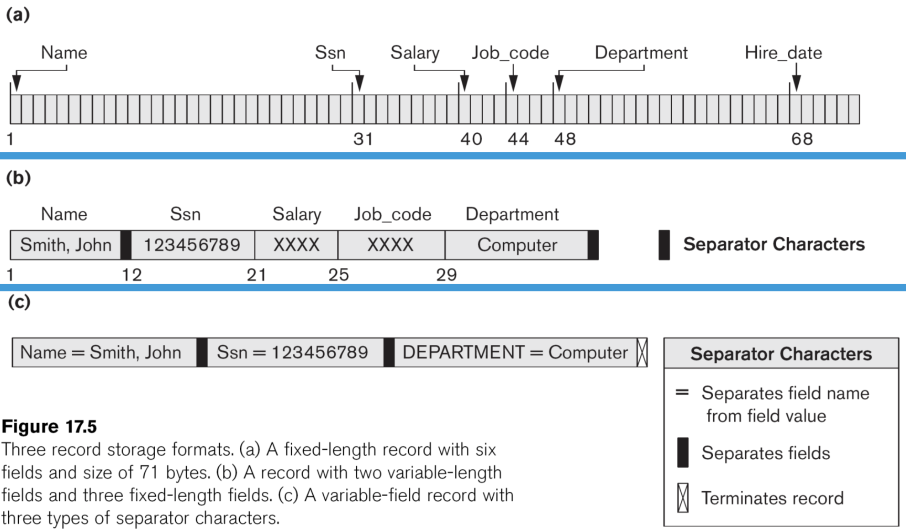
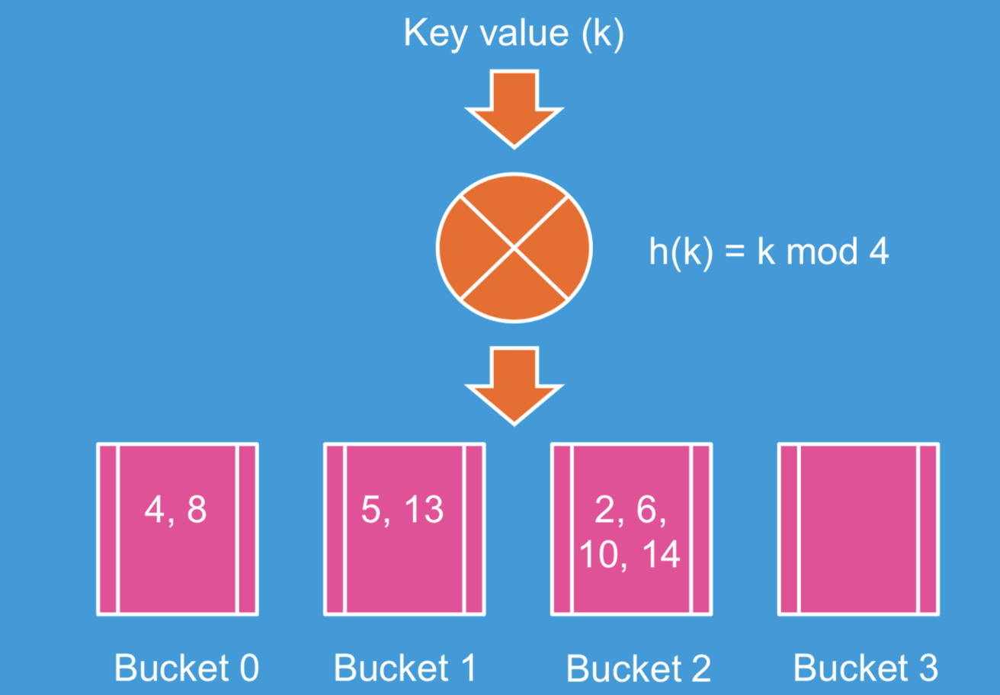
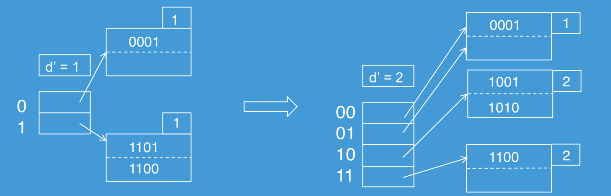
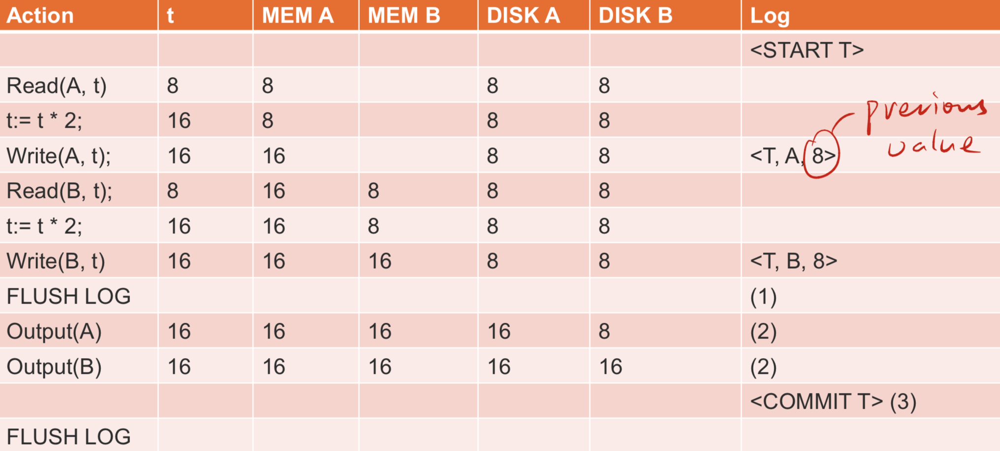
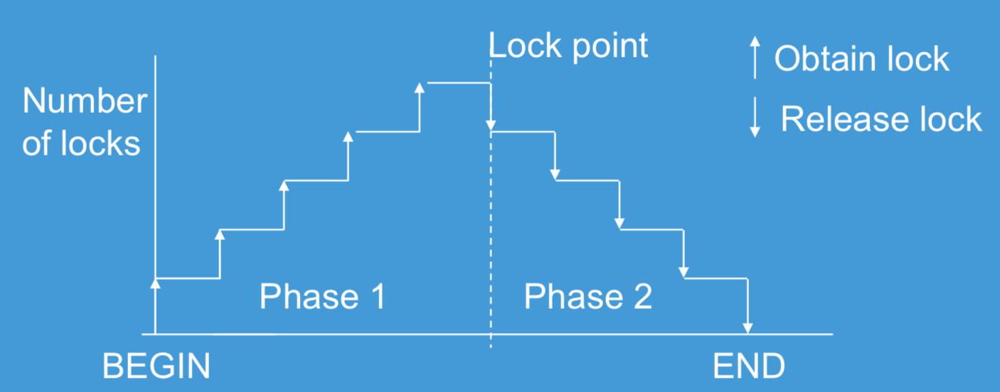
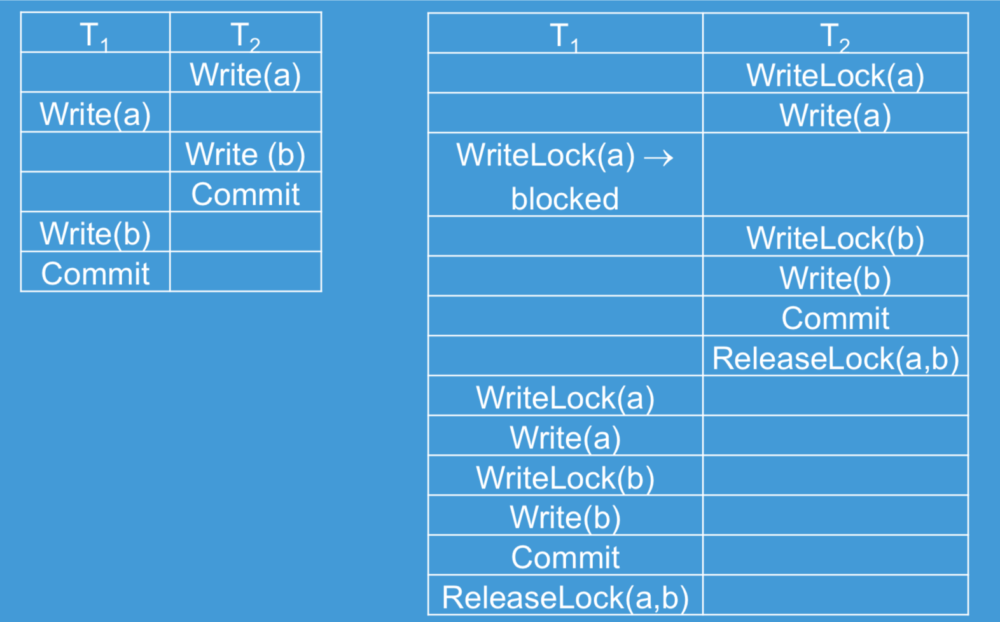
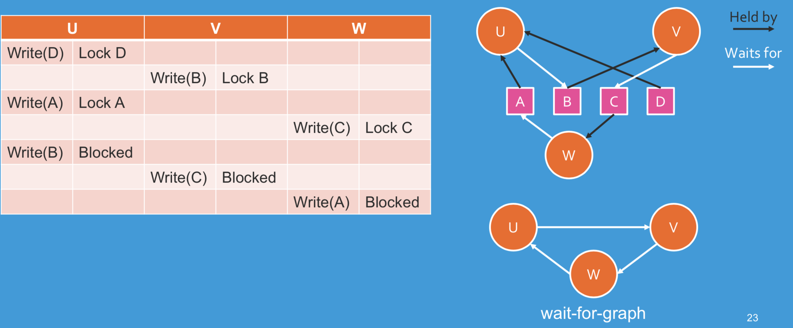
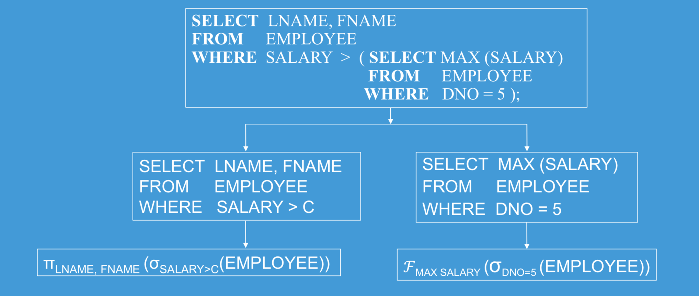
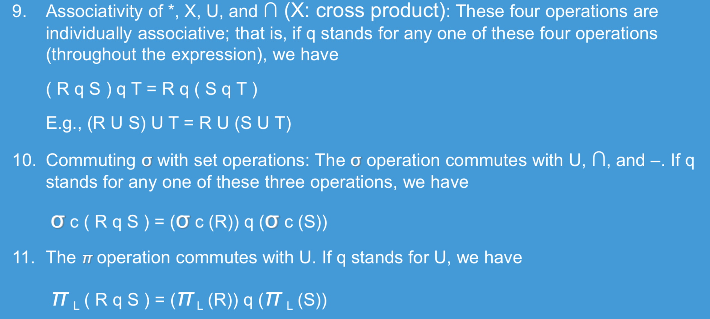

# 6 Lecture 6 — Functional Dependency & Normalization

## 6.1 Functional Dependency

Functional Dependency is a constraint between two sets of attributes from the database. For example, deptno and dname in DEPARTMENT, if you know the department number, you know the department name.

A functional dependency denoted by $X\rightarrow Y$ specifies a constraint on the possible tuples between two sets of attributes X and Y that are subsets of a relation R that can form a relation state r of R.

- The constraint is that, for any two tuples $t_1$ and $t_2$ in $r$ that have $t_1[X]=t_2[X]$, they must also have $t_1[Y]=t_2[Y]$
- The values of the $Y$ component of a tuple in $r$ depends on, or are determined by the values of the $X$ component


### 6.1.1 Formal Definition

Let $R$ be a relation scheme, and $\alpha \subseteq R, \beta \subseteq R$. We say $\alpha \rightarrow \beta$, if in any relation instance $r(R)$, for all pairs of tuples $t_1$ and $t_2$ in $r$, we have $(t_1[\alpha]=t_2[\alpha])\rightarrow (t_1[\beta]=t_2[\beta])$

Consider the Movie(title, year, length, type, studioName, starName) relation. It has a functional dependency $\text{{title,year,starName}}\rightarrow \text{{length,type,studioName}}$

- Attributes $\text{{title,year,starName}}$ form a key for the relation Movie, as discussed in Lecture 5
- If two tuples agree on these three attributes, title, year, and starName, they must agree on the other attributes, length, type and studioName
- No proper subset of $\text{{title,year,starName}}$ functionally determines all other attributes


### 6.1.2 Candidate Key

Candidate key (key):

- If a constraint in $R$ states $X$ is a candidate key of $R$, then $X\rightarrow Y$ for any subset of attributes $Y$ of $R$
- A candidate key uniquely identifies a tuple
- The values of all remaining attributes are determined

If $X\rightarrow Y$ in $R$, this does not say whether or not $Y\rightarrow X$ in $R$. A functional dependency is property of the semantics of the attributes


### 6.1.3 Inference Rules for FDs

Given a set of FDs F, we can infer additional FDs that hold whenever the FDs in F hold


#### 6.1.3.1 Trivial Function Dependency

Some functional dependencies are "trivial", since they are always satisfied by all relations:

- e.g., $A\rightarrow A, AB\rightarrow A$, $\text{{Ename,Salary}}\rightarrow \text{Ename}$

A functional dependency is trivial if and only if the right-hand side (the dependent) is a subset of the left-hand side (the determinant)


#### 6.1.3.2 Armstrong's Inference Rules

- IR1. (reflexivity) If $Y\subseteq X$, then $X\rightarrow Y$ (trivial)
- IR2. (augmentation) If $X\rightarrow Y$, then $XZ\rightarrow YZ$
- IR3. (transtivity) If $X\rightarrow Y$ and $Y\rightarrow Z$, then $X\rightarrow Z$

Notice that IR1, IR2 and IR3 form a sound and complete set of inference rules

- Sound: These rules are true
- Complete: All the rules that are true can be deduced from these rules


#### 6.1.3.3 Rules Based on Armstrong's Axiom

Some additional inference rules that are useful:

- **Decomposition:** If $X\rightarrow YZ$, then $X\rightarrow Y$ and $X\rightarrow Z$
- **Union**: If $X\rightarrow Y$ and $X\rightarrow Z$, then $X\rightarrow YZ$
- **Pseudo transitivity**: If $X\rightarrow Y$ and $YW\rightarrow Z$, then $XW\rightarrow Z$


Example: Suppose we are given a schema R with attributes A, B, C, D, E, F and the FDs are:

$A\rightarrow BC$, $B\rightarrow E$, $CD\rightarrow EF$. Show that FD: $AD\rightarrow F$ holds

Proof:

1. $A\rightarrow BC$ (given)
2. $A\rightarrow C$ (decomposition from 1)
3. $AD\rightarrow CD$ (union from 2)
4. $CD\rightarrow EF$ (given)
5. $AD\rightarrow EF$ (transitivity from 3 and 4)
6. $AD\rightarrow F$ (decomposition from 5)


### 6.1.4 Closure of a Set of FDs

From section 6.1.3, we know that given a set of FDs F, there are certain other FDs that are logically implied by F based on inference rules. The set of all FDs logically implied by F is the closure of F, denoted by $F^+$.

Two sets of FDs  $F$ and $G$ are equivalent if $F^+=G^+$

The closure of $X$ under $F$ (denoted by $X^+$) is the set of attributes that are functionally determined by $X$ under $F$ ($X$ and $X^+$ are a set of attributes):
$$
X\rightarrow Y \text{ in }F^+ \leftrightarrow Y\subseteq X^+
$$
If $X^+$ consists of all attributes of $R$, $X$ is a superkey for $R$. From the value of $X$, we can determine the values of the whole tuple.


#### 6.1.4.1 Algorithm to Find Closure of Attribute Sets

Input:

- $R$: a relation schema
- $F$: a set of FDs
- $X\subset R$: the set of attributes for computing the closure

Output:

- $X^+$ is the closure of $X$ with respect to $F$

$$
X_0=X\\
\text{Repeat:}\\
X_{i+1}=X_i\cup Z, \text{where }Z \text{ is the set of attributes such that }Y\rightarrow Z \text{ in } F \text{ and } Y\subset X_i\\
\text{Until } X_{i+1}=X\\
\text{return } X_{i+1}
$$


Example: Given the following schema
$$
R=\left\{A,B,C,D,E,F\right\}, F=\left\{A\rightarrow B,B\rightarrow E,E\rightarrow CF, CD\rightarrow EF \right\}, X=\left\{A \right\}
$$
Find $X^+$

(See slide 17, lecture 6 for solution)


## 6.2 Normalization

### 6.2.1 Overview

In a logical/conceptual DB design, when we consider the schema, we ask ourselves two questions:

1. What relations (tables) are needed?
2. What their attributes should be?

What is a bad DB design?

- Repetition of data/information
- Potential inconsistency
- Inability to represent certain information
- Loss of data/information


Normalization was proposed to take a relation schema through a series of tests to certify whether it satisfies a certain normal form

Analyzing the relation schema based on FD and primary key to achieve

- Minimizing redundancy
- Minimizing the insertion, deletion and update anomalies


Normalization requires two properties

- Non-additive or lossless join
  - decomposition is reversible and no information is loss
  - no spurious tuples (tuples that should not exist) should be generated by doing a natural-join of any relations
- Preservation of the functional dependencies
  - Ensure each functional dependency is represented in some individual relation (sometimes can be sacrificed)


### 6.2.2 First Normal Form

First normal form (1NF)

- Disallow multivalued attributes, composite attributes and their combination
- Disallow multivalued attributes that are themselves composite
- The domain of an attribute must be atomic (simple and indivisible) values
- No repeating groups in a relation (no nested relations)


### 6.2.3 Second Normal Form

Full functional dependency

- If removal of any attribute A from X means that the dependency does not hold any more

Partial functional dependency

- If some attributes A belonging to X can be removed from X and the dependency still holds


A relation schema R is in 2NF if every non-prime attributes A in R is fully functional dependent on the primary key of R.

An attribute of R is called prime attribute of R if it is a member of some candidate key of R. Otherwise it is non-prime.

If a relation schema is not in 2NF, it can be 2NF normalized into a number of 2NF relations in which non-prime attributes are associated only with the part of the primary key on which they are fully functional dependent.


### 6.2.4 Third Normal Form

A relation schema $R$ is in 3NF if whenever a non-trivial FD: $X\rightarrow A$ holds in $R$, either

- $X$ is a superkey of $R$
- $A$ is a prime attribute of $R$

3NF is based on the concept of transitive dependency. A functional dependency $X\rightarrow Y$ in a relation schema $R$ is transitive dependency if there exists a set of attributes $Z$ in $R$ that is neither a candidate key nor a subset of any key of $R$, and both $X\rightarrow Z$ and $Z\rightarrow Y$ hold.

According to Codd's original definition, a relation $R$ is in 3NF if it satisfies 2NF and no non-prime attribute of $R$ is transitively dependent on primary key.


### 6.2.5 Boyce-Codd Normal Form

BCNF was proposed as a simpler form of 3NF, but it was found to be stricter than 3NF

- Every relation in BCNF is also in 3NF
- But relation in 3NF is not necessarily in BCNF

A relation schema R is in BCNF if whenever a non-trivial functional dependency $X\rightarrow A$ holds in R, then X is a superkey of R.

For example, the relation schema below is in 3NF but not in BCNF.


#### 6.2.5.1 Algorithm for BCNF Decomposition

Try to practice using the given example and another example [here](<https://courses.cs.washington.edu/courses/cse344/11au/sections/section10/final-practice-solution.pdf>)

***

Let R be the initial table with FDs F and S={R}

Until all relation schemes in S are in BCNF

for each R in S

​	for each FD:$X\rightarrow Y$ that violates BCNF for R

​	$S=(S-\left\{R\right\})\cup(R-Y)\cup(X\cup Y)$

End until

***

Literally, when we find a table R with BCNF violation $X\rightarrow Y$, we:

- Remove R from S
- Add a table that contains the same attributes as R except for Y
- Add a second table that contains the attributes in X and Y


Example:

Consider the relation scheme $R=\left\{A,B,C,D,E \right\}$ and the FDs: $\left\{A \right\}\rightarrow \left\{B,E\right\}, \left\{C\right\}\rightarrow \left\{D \right\}$. Candidate key AC. Find one BCNF for R.

Solution:

Both functional dependencies violate BCNF because the LHS is not a candidate key.

Pick the first FD, and R can be decomposited into $R_1=\left\{A,C,D\right\}, R_2=\left\{A,B,E\right\}$


# 7 Lecture 7 — Files and Hash Files

## 7.1 Storage Medium for Databases

Memory Hierarchy:

- CPU cache, main memory, flash memory/phase change memory, magnetic disks/optical disks
- Slower in access delay but larger in memory size (less expensive)

Primary storage (volatile):

- The storage media that can be operated directly by the CPU
- Include main memory and cache memory

Secondary and tertiary storage (non-volatile)

- Slower in access
- Include magnetic disks, optical disks and flash memory

A database could be huge in size (several hundred GB or even higher). It needs to be resided in secondary/tertiary storage


### 7.1.1 Disks

Division and properties of disk storage devices:

- Preferred secondary storage device for high storage capacity and low cost
- Data are stored as magnetized areas on magnetic disk surfaces
- A disk pack contains several magnetic disks connected to a rotating spindle
- Disks are divided into concentric circular tracks on each disk surface
  - Track capacities vary typically from 4 to 50 Kbytes or more
- A track is divided into fixed size sectors and then into blocks
  - Typical block sizes range from B=512 bytes to B=4096 bytes
  - Whole blocks are transferred between disk and main memory for processing


A read-write head moves to the track that contains the block to be transferred. Disk rotation moves the block under the read-write head for reading and writing.

To access a physical disk block, we need:

- The identified track number (seek time 3 to 8ms)
- The block number (within the cylinder) (rotational delay 2ms)
- Get the block data (transfer delay)

Therefore, disk access delay = seek time + rotational delay + transfer delay. We can see that accessing a disk consumes plenty of time. Double buffering to be introduced in the next section can be used to speed up the transfer of contiguous disk blocks


### 7.1.2 Double Buffering

Suppose we have a file with a sequence of n blocks, B1, B2, …, Bn and we have a program that processes B1, B2, …, Bn. Let R be the time to read 1 block to buffer and P be the time to process 1 block. Assume P>R.

In a single buffer solution, we need to spend n(R+P) to access all n blocks. However, we can use the double buffer solution to read and process together, which gives R+np as result time.


## 7.2 Database System Management

### 7.2.1 Simplified Database System Environment

- DBMS is a collection of programs that enables users to create and maintain database
- DBMS is a general-purpose software that facilitates the process of defining, constructing and manipulating databases for various applications
- Database System = DMBS software + Database


### 7.2.2 Database Records

- Database: data file (records) + metadata
- Fixed and variable length records
- Records contain fields (attributes)
- Fields may be fixed length or variable length (e.g., varchar)
- Variable length fields can be mixed into one record. Separator characters or length fields are needed so that the record can be parsed




#### 7.2.2.1 Blocking

There is a technique called blocking which refers to storing a number of records into one block on the disk. Blocking factor ($bfr$) refers to the number of records per block. There may be empty space in a block if an integral number of records do not fit into one block.

Suppose the block size is $B$. For fixed-length records of size $R$ with $B \ge R$,

- $bfr = floor(B/R)$
- Unused space in each block = $B-(bfr\times R)$ bytes


#### 7.2.2.2 Files of Records

- A file (e.g., a table) is a sequence of records (e.g., tuples), where each record is a collection of data values (fields)
- A file can have fixed-length records or variable-length records
- A file descriptor (or file header) includes information that describes the file, such as the field names and their data types, and the addresses of the file blocks on disk
- File records are stored on disk blocks


The physical disk blocks that are allocated to hold the records of a file can be contiguous (one by one), linked (using pointers), or indexed (a table to describe their locations)

File records can be unspanned or spanned

- Unspanned: no record can span two blocks
- Spanned: a record can be stored in more than one block


In a file of fixed-length records, all records have the same format. Usually, unspanned blocking is used. File of variable-length records require additional information to be stored in each record, such as separator characters. Usually spanned blocking is used with such files.


### 7.2.3 Typical operations on files

| Operation Name | Content                                                      |
| -------------- | ------------------------------------------------------------ |
| OPEN           | Makes the file ready for access, and associates a pointer that will refer to a current file record at each point in time |
| FIND           | Search for the first file record that satisfies a certain condition and makes it the current file record |
| FINDNEXT       | Search for the next file record (from the current record) that satisfies a certain condition, and makes it the current file record |
| READ           | Reads the current file record into a program variable        |
| INSERT         | Inserts a new record into the file and makes it the current file record |
| DELETE         | Removes the current file record from the file, usually by marking the record to indicate that it is no longer valid |
| MODIFY         | Changes the values of some fields of the current file record |
| CLOSE          | Terminates access to the file                                |
| REORGANIZE     | Reorganizes the file records. For example, the reocrds marked "deleted" are physically removed from the file or a new organisation of the file records is created |
| READ_ORDERED   | Reads the file blocks in order of a specific field of the file |


### 7.2.4 Unordered Files

- Also called a heap file (records are unordered)
- New records are inserted at the end of a file and arranged in their insertion sequence
- A linear search through the file records is necessary to search for a record $O(n)$
- Record insertion is efficient (add to the end) $O(1)$
- Reading the records in order of a particular field requires sorting the file records


### 7.2.5 Ordered Files

- Also called a sequential file (records are ordered)
- File records are kept sorted by the values of an ordering field
- Insertion is expensive: records must be inserted in the correct order
  - It is common to keep a seperate unordered overflow file for new records to improve insertion efficiency; this is periodically merged with the main ordered file
- Binary search can be used to search for a record on its ordering field value
- Reading the records in order of the ordering field is quite efficient


## 7.3 Static Hashed Files

### 7.3.1 Overview of Static Hashing

- Hashing for disk files is called external hashing (files on disk)
- The file blocks are divided into M equal-sized buckets, numbered $bucket_0,bucket_1,…,bucket_{M-1}$
- One of the file fields is designated to be the hash key of the file
- Suppose there is a hash function that takes a hash key as an argument to compute an integer in range 0 and B-1 where B is the number of buckets
- A bucket array (an array index) from 0 to B-1 holds the headers of B lists, one for each bucket of the array
- If a record has search key K, we store the record by linking it to the bucket list for the bucket numbered h(K) where h is the hash function
  - $h:\mathbb{R}\rightarrow \left\{0,1,…,B-1\right\}$



Once the bucket numbers are determined, one can efficiently find the position of a file block.


- To reduce the number of overflow, a hash file is typically kept 70-80% full.

- The hash function h should distribute the records uniformly among the buckets
  - Otherwise, search time will be increased because many overflow records will exist
  - Searching overflow records are more expensive
- Main disadvantages of static external hashing:
  - Fixed number of buckets M is a problem if the number of records in the file grows or shrinks
  - Ordered access on the hash key is quite inefficient (requires sorting the records)


### 7.3.2 Collision Resolution

Consider the following situation: $bucket_1$ of a hash table is already full. However, a new record with key $g$ where $h(g)=1$ comes. Collision occurs. We have several ways to resolve or avoid collision.


#### 7.3.2.1 Open Addressing

Proceeding from the occupied position specified by the hash address, the program checks the subsequent positions in order until an unused (empty) position is found.

- Linear Probing: If collide, try $bucket_{i+1},bucket_{i+2},…bucket_{i+n}$

- Quadratic Probing: If collide, try $bucket_{i+1},bucket_{i+4},…bucket_{i+n^2}$


#### 7.3.2.2 Chaining

- For this method, various overflow locations are kept, usually by extending the array with a number of overflow positions
- In addition, a pointer field is added to each bucket
- A collision is resolved by placing the new record in an unused overflow bucket and setting the pointer of the occupied hash address bucket to the address of that overflow bucket


#### 7.3.2.3 Multiple Hashing

- The program applies a second hash function if the first results in a collision
- If another collision results, the program uses open addressing or applies a third hash function and then uses open addressing if necessary


## 7.4 Extendible and Dynamic Hashing

### 7.4.1 Overview

Dynamic and Extendible Hashing Techniques:

- Hashing techniques are extended to allow dynamic growth and shrinking of the number of file records
- These techniques include the following: dynamic hashing and extendible hashing

Both dynamic and extendible hashing use the binary representation (e.g., 1100…) of the hash value $h(K)$ in order to access a directory

- In dynamic hashing the directory is a binary tree
- In extendible hashing the directory is an array of size $2^d$ where $d$ is called the global depth


The directories can be stored on disk, and they expand or shrink dynamically

- Directory entries point to the disk blocks that contain the stored records

An insertion in a disk block that is full causes the block to split into two blocks and the records are redistributed among the two blocks so that the directory is updated properly


### 7.4.2 Extendible Hashing

- A directory consisting of an array of $2^d$ bucket addresses is maintained
- $d$ is called the global depth of the directory
- The integer value corresponding to the first (high-order) d bits of a hash value is used as an index to the array to determine a directory entry and the address in that entry determines the bucket storing the records
- A location $d'$ (called, local depth stored with each bucket) specifies the number of bits on which the bucket contents are based
- The value of $d'$ can be increased or decreased by one at a time to handle overflow or underflow respectively


- Suppose $d=4$. i.e., the hash function produces a sequence of four bits
- At the moment, only one of these bits is used as illustrated by $d'=1$ in the box above the bucket array

- The bucket array therefore has only two entries and points to two blocks
  - The first holds all the current records whose search keys hash to a bit sequence beginning with 0
  - The second holds all those whose search keys hash to a sequence beginning with 1
- Suppose we insert a record whose key hash to the sequence 1010
- Since the first bit is 1, it belongs to the second block
- However, the second block is full. It needs to be split by setting $d'$ to 2



- The two entries beginning with 0 each point to the block for records whose hashed keys begin with 0 and the block still has the integer 1 in its "nub" to indicate that only the first bit determines membership in the block
- The blocks for records beginning with 1 needs to be split into 10 and 11

**Correction:** The "1001" in the second diagram should be 1101 and placed in the third bucket


### 7.4.2 Dynamic Hashing

- Dynamic and extendible hashing do not require an overflow area in general
- Dynamic hashing maintains tree-structured directory with two types of nodes
  - Internal nodes that have two pointers: the left pointer corresponding to the 0 bit (in the hash address) and a right pointer corresponding to the 1 bit
  - Leaf nodes: these hold a pointer to the actual bucket with records


# 9 Lecture 9 — Transaction

## 9.1 Overview

### 9.1.1 ACID Properties

- Atomicity: A transaction is an atomic unit of processing. It is either performed completely or not performed at all (all or nothing)
- Consistency: A correct execution of a transaction must take the database from one consistent state to another (correctness)
- Isolation: A transaction should not make its updates visible to other transactions until it is committed (no partial results)
- Durability: Once a transaction changes the database state and the changes are committed, these changes must never be lost because of subsequent failure (committed and permanent results)


### 9.1.2 What is a Transaction?

The execution of a program/application on behalf of the user to perform a specific user function by accessing data items maintained in a database management system. E.g., use of ATM and buy online tickets

Transactions are processes and created by a DBMS and work within its environment and work within its environment.

A logical unit of database processing (a particular functional request from the user) that includes one or more database access operations (read, write, insert, delete)

Structurally, each transaction is a process and consists of atomic steps. Each atomic step is called an operation.

A transaction = database operations + transaction operations


Database operations: read and write operations on a database

- Read operation: to read the value of a data item or a group of items, e.g., SELECT
- Write operation: to create a new value for a data item or a group of items, e.g., UPDATE
- In between the read/write operations, there may be computation

Transaction operations: a begin operation and an end operation (commit or abort)

- For transaction management (where to start and where to finish)
- The new values from a transaction will become permanently only if the transaction is committed successfully
- Partial results are not allowed and is considered to be incorrect
- Atomicity: all or nothing
- Example: T1: Begin; A:=R(a); B:=R(b); C:=A+B; W(c):=C; End


- The whole transaction is considered as an atomic unit
- Multiple steps (operations) $ \rightarrow$ single user application


## 9.2 Operations and Performance

### 9.2.1 Read and Write Operations

- Data are resided on disk and the basic unit of data transferring from the disk to the main memory is one disk block

- In general, a data item (what is read or written) will be the field/fields of some records in the database (in a disk block)

- `read_item(X)` command includes the following steps:

  - Find the address of the disk block that contains item X
  - Copy that disk block into a buffer in main memory (if that disk block is not already in some main memory buffer)
  - Search for the required value in the buffer
  - Copy item X from the buffer to the program variable named X

- `write_item(X)` command includes the following steps:

  - Find the address of the disk block that contains item X

  - Copy that disk block into a buffer in main memory (if that disk block is not already in some main memory buffer)

  - Search for the required value in the buffer

  - Copy item X from the program variable named X into its correct location in the buffer

  - Store the updated block from the buffer back to the disk (either immediately or at some later point in time)

  - Note that we DO NOT need to read an item before update it

    


### 9.2.2 Transaction Processing Performance

- Fast CPU in accessing buffered data (in main memory)
- Slow disk data access performance (use of buffer to improve the performance)
- Long transactions $\rightarrow$ many database operations
- Undo and redo of transactions to maintain atomicity in cases of failures

For multiuser systems,

- Many users (transactions) can access the database concurrently at the same time (concurrent execution)
- Interleaved processing
  - Concurrent execution of processes/transactions are interleaved in a single CPU system (e.g., use the CPU while waiting for disk block)
- Parallel processing
  - Processes/transactions are concurrently executed in multiple CPUs system

Higher concurrency results in better performance but ACID properties may be hard to maintain.


## 9.3 Transaction Schedule

Transaction schedule

- When transactions are executing concurrently in an interleaved fashion or serially, the order of execution of operations from the transactions forms a transaction schedule

A schedule S of n transactions $T_1, T_2, …, T_n$ is an ordering of the operations of the transactions subject to the constraint

- For each transaction $T_i$ that participates in $S$, the operations of $T_i$ in $S$ must appear in the same order as in $T_i$ (operations from other transactions $T_j$ can be interleaved with the operations of $T_i$ in $S$)

A **concurrent schedule**: a new transaction starts BEFORE the completion of the current transaction

A **serial schedule**: a new transaction only starts AFTER the current transaction is completed


### 9.3.1 Consistency Problems

Lost update problem (write/write conflicts)

- When two transactions that access the same database items have their operations interleaved in a way that makes the value of some database item incorrect

Inconsistent retrieval problem (read/write conflicts)

- If a transaction is calculating an aggregate summary function on a number of records while other transactions are updating some of these records, the aggregate function may calculate some values before they are updated and others after they are updated


### 9.3.2 Serializability

#### 9.3.2.1 Schedules Classified on Serializability

**Serializable schedule**

- A concurrent schedule S which is equivalent to a serial schedule
- Can guarantee the database consistency with better performance

A serially equivalent schedule means that the results from the schedule is equivalent to a serial schedule, i.e., execute one after one

Conflict rules

| Operation1 | Operation2 | Conflict | Reason                                                       |
| ---------- | ---------- | -------- | ------------------------------------------------------------ |
| Read       | Read       | No       | Because the effect of a pair of read operations does not depend on the order in which they are executed |
| Read       | Write      | Yes      | Because the effect of a read and a write operation depends on the order of their execution |
| Write      | Write      | Yes      | Because the effect of a pair of write executions depends on the order of their execution |

**Conflict equivalent schedule**

- Two schedules are said to be conflict equivalent if the order of any two conflicting operations (RW, WW) is the same in both schedule


A schedule S is said to be conflict serialisable if it is conflict equivalent to some serial schedule S'. In the above exmple, S1 is conflict equivalent to S2. Therefore it is conflict serialisable.


#### 9.3.2.2 Serialization Graphs

- The determination of a conflict serialisable schedule can be done by the use of serialization graph (SG) or called precedence graph
- A serialization graph tells the effective execution order of a set of transactions
- The set of edges consists of all edges $T_i\rightarrow T_j$ for which one of the following three conditions holds:
  - W/R conflict: $T_i$ executes write(x) before $T_j$ executes read(x)
  - R/W conflict: $T_i$ executes read(x) before $T_j$ executes write(x)
  - W/W conflict: $T_i$ executes write(x) before $T_j$ executes write(x)
- Each edge $T_i\rightarrow T_j$ in a SG means that at least one of $T_i$'s operations precded and conflict with one of $T_j$'s operations
- Serializability theorem: A schedule is serialisable if and only if the SG is acyclic


### 9.3.3 Recoverability

Recoverable schedule:

- If a transaction is aborted, all its effects have to be undone
- Rollback of a transaction: undo those processed operations of an aborted transaction
- Why needs to be rollback $\rightarrow$ maintaining consistency and all or nothing property

A schedule S is **recoverable** if for all $T_i$ and $T_j$ where $T_i$ read an item written by $T_j$, $T_j$ commits before $T_i$

Cascaded rollback:

- A single rollback leads to a series of rollback
- All uncomitted transactions that read data items from a failed (aborted) transaction must be rolled back


To ensure recoverability (undo to previous database state):

1. No dirty read: reading uncommitted data items
2. No premature write: no update on a data item if another transaction has updated it and the transaction has not committed
3. Strict execution: delay the reading and updating of a data item until the previous transaction that has updated the same data item has committed/aborted


Why is recovery needed?

1. Computer failure (system crash)
   - A hardware or software error occurs in the computer system during transaction execution
   - If the hardware crashes, the contents of the computer's internal memory may be lost
2. A transaction error
   - Some operation in the transaction may cause it to fail, such as integer overflow or division by zero
   - Transaction failure may also occur because of erroroneous parameter values or because of logical programming error. In addition, the user may interrupt the transaction during its execution.
3. Local errors or exception conditions detected by the transaction
   - Certain conditions necessitate cancellation of the transaction. For example, data for the transaction may not be found
4. Concurrency control enforcement
   - The concurrency control method may decide to abort the transaction, to be restarted later, because it violates serialisability or because several transactions are in a state of deadlock
5. Disk failure
   - Some disk blocks may lose their data because of a read or write malfunction or becuase of a disk read/write head crash. This may happen during a read or a write operation of the transaction
6. Physical problems and catastrophes
   - This refers to an endless list of problems that includes power or air-conditioning failure, fire, theft, overwriting disks


## 9.4 Recovery of Transaction States

### 9.4.1 Transaction State

A transaction is an atomic unit of work that is either completed in its entirety or not done at all (atomicity). For recovery purposes, the system needs to keep track of when a transaction starts, terminates, and commits or aborts.


### 9.4.2 Primitive Operations of Transactions

- `INPUT(X)`: copy the disk block containing database element X to a memory buffer (Disk to buffer)
- `READ(X, t):` copy the database element X to the transaction's local variable t. If the block containing database element X is not in a memory buffer, first `INPUT(X)`. Next, assign the value of X to a local variable t. (Buffer to program)
- `WRITE(X, t)`: copy the value of local variable t to database element X in a memory buffer. If the block containing database element is not in a memory buffer, execute `INPUT(X)`. Next copy the value of t to X in the buffer. (Program to buffer)
- `OUTPUT(X)`: copy the block containing X from its buffer to disk. (Buffer to disk)

Consider the following transaction:


### 9.4.3 Logs of Transactions

A log is a file of log records, each telling something about what some transaction has done. As transactions execute, the log manager records in the log each important event (e.g., write operations).

Logs are initially created in **main memory** and are allocated by the buffer manager. Logs are copied to disk by "flush-log" operation.

If log records appear in nonvolatile storage (disk), we can use them to restore the database to a consistent state after a system crash. After a system failure, all data in volatile storage (memory) will lose but the data in nonvolatile storage remain.

Here are some types of log records:

- `<START T>`: This indicates that transaction T has begun
- `<COMMIT T>`: Transaction T has completed successfully and will make no more changes to database. Because we cannot control when the buffer manager chooses to copy blocks from memory to disk, we cannot be sure that the changes are already on disk when we see `<COMMIT T>`
- `<ABORT T>:` Transaction T could not complete successfully. If transaction T aborts, no change it made can be copied to disk, and it is the job of the transaction manager to make sure that such changes never appear on disk.


### 9.4.4 Undo-Logging

#### 9.4.4.1 Undo-Logging Rules

- U1: If transaction T modifies database element X (current value is v), the log record of the form `<T, X, v>` must be written to the disk **before** the new value of X is written to disk.
- U2: If a transaction commits, its COMMIT log record must be written to disk **only after** all database elements changed by the transaction have been written to disk.

Therefore, a transaction must be written to disk in the following order

1. The log records indicating changed database elements
2. The changed database elements themselves
3. The COMMIT log record




#### 9.4.4.2 Recovery Using Undo-Logging

Suppose a system failure occurs while a transaction is committing. It is possible certain changes made by the transaction were written to disk while other changes never reached the disk. It is recovery manager's job to **remove** the partial changes of a transaction.

If there is a log record `<COMMIT T>` by undo rule U2, all changes made by T were previously written to disk. If we find `<START T>` on the log but no `<COMMIT T>` record, T may be incomplete and must be undone. Rule U1 assures that if T changed X oon disk before the crash, there will be a `<T, X, v>` record on the log, and that record will have been copied to disk before the crash. During recovery, we must write the value v for X.

The recovery manager scans the log from the end and remembers all those transactions T for which it has a `<COMMIT T>` record or an `<ABORT T>` record.

If it sees a record `<T, X, v>`:

- If T is a transaction whose COMMIT record has been seen, do nothing. T is committed and must not be undone
- Otherwise, T is an incomplete transaction, or an aborted transaction. The recovery manager must change the value of X in the database to v in case X had been altered just before the crash.
- After making the changes, the recovery manager must write a log record `<ABORT T>` for each incomplete transaction that was not previously aborted and flush the log


### 9.4.5 Redo Logging

#### 9.4.5.1 Undo and Redo

Undo logging has a potential problem that we cannot commit a transaction without first writing all changed data to disk (flush $\rightarrow$ commit)

Differences between redo and undo logging

- While undo logging cancels the effect of incomplete transactions and ignores committed ones during recovery, redo logging ignores incomplete transactions and repeats the changes made by committed transactions
- While undo logging requires us to write changed database elements to disk before the COMMIT log records reaches disk, redo logging requires that the COMMIT record appears on disk before any changed values reach disk

Undo: Log $\rightarrow$ change $\rightarrow$ COMMIT

Redo: Log $\rightarrow$ COMMIT $\rightarrow$ change


#### 9.4.5.2 Redo Logging Rules

- R1: Before modifying any database element X on disk, it is necessary that all log records pertaining to this modification of X, including both the update record `<T, X, v>` (v is the new value) and `<COMMIT T>` record, must appear on disk.
- The order in which material associated with one transaction gets to written to disk is:
  1. The log record indicating changed database elements
  2. The COMMIT log record
  3. The changed database elements themselves


#### 9.4.5.3 Recovery Using Redo-Logging

To recover using a redo log, after a system crash:

- Identify the committed transactions
- Scan the log forward from beginning. For each log `<T, X, v>` encountered:
  - If T is not a committed transaction, do nothing
  - If T is a committed transaction, write value v for database element X
- For each incomplete transaction T, write an `<ABORT T>` record to the log and flush the log


# 10 Lecture 10 — Concurrency Control

- Purpose of concurrency control
  - To preserve database consistency to ensure all schedules are serializable
  - To maximize the system performance (higher concurrency)
- Example: In concurrent execution environment, if $T_1$ conflicts with $T_2$ over a data item A, then the existing concurrency control decides whether $T_1$ or $T_2$ should get the A and whether the other transaction is rolled-back or waits


## 10.1 Two-Phase Locking Techniques

Locking is an operation which secures:

- permission to read a data item for a transaction
- permission to write (update) a data item for a transaction
- Example: `Lock(X)` - data item X is locked **on behalf of the requesting transaction**

Unlocking is an operation which removes these permissions from the data item

- Example: `Unlock(X)`  - data item X is made available to **all other transactions**

Lock and Unlock are atomic operations


### 10.1.1 Basic Two Phase Locking (B2PL)

- Each data item has a lock associated with it, e.g., a lock entry in the lock table
- The scheduler creates a lock operation $ol_i[x]$ for each received operation $o_i[x]$
- Rules
  - When the scheduler receives an operation $p_i[x]$, it tests if $pl_i[x]$ conflicts with some $ql_j[x]$ that is already set. If so, it delays $p_i[x]$, forcing $T_i$ to wait until it can set the lock it needs. If not, the scheduler sets $pl_i[x]$, and sends $p_i[x]$ to the DM (data manager)
  - Once the scheduler has released a lock for a transaction, it may not subsequently obtain more locks for that transaction (on any data item)

B2PL contains growing phase and shrinking phase. It can guarantee that all pairs of conflicting operations of two transactions are scheduled in the same order. That is, $T_2$ cannot do operation on the item again after releasing locks. So that it won't come to the item after $T_1$ has done operations on the item.




### 10.1.2 Conservative Two Phase Locking (C2PL)

- Avoid deadlocks and abort of transactions by requiring each transaction to obtain all of its lock before any of its operations are submitted to the DM
- Each transaction pre-declares its read-set and write-set of data items to the scheduler
  - What are the locks (data items) to be accessed by the transaction?
- The scheduler tries to set all of the locks needed by the transaction all at once
- Set lock of a transaction in one step and lock release in another step
- If all the locks can be set, the operations will be submitted to the DM for processing
- After the DM acknowledges the processing of $T_i$'s last database operation, the scheduler may release all of $T_i$'s locks
- If any of the blocks requested in $T_i$'s conflicts with locks presently held by other transactions in conflicting mode, the scheduler does not grant any of $T_i$'s lock
- The scheduler insesrts $T_i$ along with its lock requests into a waiting queue
- Every time the scheduler releases the locks of a complete transaction, it examines the waiting queue to see if it can **grant all the lock requests** of any waiting transactions
- In C2PL, if a transaction $T_i$ is waiting for a lock held by $T_j$, $T_i$ is holding no locks.

Example:


### 10.1.3 Strict Two Phase Locking (S2PL)

- B2PL only defines the earliest time when the schedule may release a lock for a transaction
- In S2PL, it requires the scheduler to release all of a transaction's lock together
- $T_i$'s locks are released after the DM acknowledges the processing of $c_i$(commit) or $a_i$(abort)
- Compared with B2PL, the lock holding time may be longer and the concurrency may be lower
- Compared with C2PL, the lock holding time may be shorter and the concurrency may be higher
- It may have the problem of deadlock but all schedules are recoverable


Lock obtaining diagram


Example:




## 10.2 Issues in Concurrency Control

### 10.2.1 Performance Issues

1. S2PL is better than C2PL when the transaction workload is not heavy since the lock holding time is shorter in S2PL
2. When the transaction is heavy, C2PL is better than S2PL since deadlock may occur in S2PL


### 10.2.2 Implementation Issue

#### 10.2.2.1 Essential Components

Assume there are two lock modes:

- Shared (read): More than one transaction can apply shared lock on X for reading its value but no write lock can be applied on X by any other transaction
- Exclusive (write): Only one write lock on X can exist at any time and no shared lock can be applied by any other transaction on X


Lock Manager: Managing locks on data items

Lock table:

- An array to show the lock entry for each data item
- Each entry of the array stores the identify of transaction that has set a lock on the data item including the mode

We have the question: How big should the lock table be? One entry for one database? One record? One field? (Size of X) That's the problem of **lock granularity**. (coarse granularity vs. fine granularity). Larger granularity -> higher conflict probability but lower locking overhead, vice versa.

Another question is how to detect conflict for insertion operations from a transaction?

- A transaction reads all data items and another one inserts a new item.


#### 10.2.2.2 Implementation Detail

##### 10.2.2.2.1 All Operations are Exclusive

Lock Operation:

```pseudocode
if LOCK(X) = 0 // item is unlocked
then LOCK(X) = 1 // lock the item
else begin
	wait until LOCK(X) = 0 and the lock manager wakes up the transaction
	go to line 1
end;
```


Unlock operation:

```pseudocode
LOCK(X) = 0
if any transactions are waiting then wake up one of the waiting transactions
```


##### 10.2.2.2.2 Read is Shared and Write is Exclusive

Write lock operation:

```pseudocode
if LOCK(X) = "unlocked" then
	LOCK(X) = "write-locked"
else begin
	wait(until LOCK(X) = "unlocked" and the lock manager wakes up the transaction)
	go to line 1
end;
```


Read lock operation:

```pseudocode
if LOCK(X) = "unlocked" then
	begin
		LOCK(X) = "read-locked"
		no_of_reads(X) = 1
	end;
else if LOCK(X) = "read-locked" then
	no_of_reads(X)++
else begin
	wait(until LOCK(X) = "unlocked" and the lock manager wakes up the transaction)
	go to line 1
end;
```


Unlock operation:

```pseudocode
if LOCK(X) = "write-locked" then
	begin
		LOCK(X) = "unlocked"
		wakes up one of the transactions, if any;
	end;
else if LOCK(X) = "read-locked" then
	begin
		no_of_reads(X) = no_of_reads(X) - 1
		if no_of_reads(X) = 0 then
			begin
				LOCK(X) = "unlocked"
				wake up one of the transactions, if any;
			end;
	end;
```


#### 10.2.2.3 Lock Conversion

When a transaction holding a read lock wants to write, or a transaction holding a write lock wants to read, Lock conversion is needed.

1. Lock upgrade: existing read lock to write lock. Must ensure that no other transaction is holding **either read lock or write lock**.

   ```pseudocode
   if T[i] has a read_lock(X) and T[j] has no read_lock(X) (i != j) then
   	convert read_lock(X) to write_lock(X)
   else
   	force T[i] to wait until T[j] unblocks X;
   ```

2. Lock downgrade: existing write lock to read lock

   ```pseudocode
   if T[i] has a write_lock(X) // no transaction can have any lock on X as write lock is exclusive
   	convert write_lock(X) to read_lock(X);
   ```


## 10.3 Deadlock

### 10.3.1 Overview (Refer to CS3103 Lecture 5)

Conditions of deadlock:

- Hold and wait
- Cyclic wait

Prevention:

- A transaction locks all data items it refers to before it begins execution
- This way of locking prevents deadlock since a transaction never waits for a data item.
- Used by C2PL
- No hold and wait

Detection: In some approaches, deadlocks are allowed to happen (S2PL). The scheduler maintains a wait-for-graph for detecting cycle. If a cycle exists, then one transaction involved in the cycle is selected (victim) and rolled-back.

Resolution: A wait-for-graph is created using the lock table. As soon as a transaction is blocked, it is added to the graph. When a chain like: $T_i$ waits for $T_j$, $T_j$ waits for $T_k$ and $T_k$ waits for $T_i$ happens, this created a cycle. One of the transactions will be chosen to abort.


Example:




### 10.3.2 Timestamp Method

#### 10.3.2.1 Starvation

- Starvation occurs when a particular transaction consistently waits or restarts and never gets a chance to proceed further
- In a deadlock detection it is possible that the same transaction may consistently be selected as victim and rolled back


#### 10.3.2.2 Deadlock Prevention Using Timestamp

Deadlock prevention: prevent potential deadlock to become deadlock

Each transaction is assigned a unique timestamp, e.g., its creation time (distributed databases: creation time + site ID)

Wait-die rule (non-preemptive):

- If $T_i$ requests a lock that is already locked by $T_j$, $T_i$ is permitted to wait if and only if $T_i$ is older than $T_j$ ($T_i$'s timestamp is smaller than that of $T_j$)
- If $T_i$ is younger than $T_j$, $T_i$ is restarted with the same timestamp
- When $T_i$ requests access to the same lock in the second time, $T_j$ may already have finished its execution

Wound-wait rule (preemptive):

- If $T_i$ requests a lock that is already locked by $T_j$, $T_i$ is permitted to wait if and only if $T_i$ is younger than $T_j$
- Otherwise, $T_j$ is restarted (with the same timestamp) and the lock is granted to $T_i$


#### 10.3.2.3 Deadlock Avoidance Using Timestamp

- If $TS(T_i)<TS(T_j)$, $T_i$ waits, else $T_i$ dies (wait-die)
- If $TS(T_i)<TS(T_j)$, $T_j$ wounds, else $T_j$ waits (wound-wait)
- Note a smaller TS means the transaction is older
- Note both methods restart the younger transaction
- Both methods prevent cyclic wait:
  - Consider the deadlock cycle: $T_1\rightarrow T_2\rightarrow …\rightarrow T_n\rightarrow T_1$.
  - It is impossible since $T_n$ is not allowed to wait for $T_1$
  - Wait-die: Older transaction is allowed to wait
  - Wound-wait: Older transaction is allowed to get the lock


# 11 Query Optimization

Query optimization is the process of choosing a suitable execution strategy for processing a query. It may not be optimal but is a resonably efficient strategy (better)

A query, e.g., a SQL, first be scanned, parsed, and validated

- The scanner identifies the query tokens, e.g., the keywrods, attribute names and relation names
- Tha parser checks the query syntax
- The validation checks that all attributes and relation names are valid

There are two internal representations of a query: Query Tree and Query Graph.

Code can be executed directly (interpreted mode) or stored and executed later whenever needed (compiled mode).

Typical steps when processing a high-level query:


## 11.1 Translating SQL Queries into Relational Algebra

- Query block is the basic unit that can be translated into the algebraic operators
- A query block contains a single SELECT-FROM-WHERE expression, as well as GROUP BY and HAVING clause if these are part of the block
- Nested queries or sub-queries within a query are identified as **seperate** query blocks




## 11.2 Select Operation

### 11.2.1 Implementing SELECT Operation

1. Simple SELECT statement:
   - (OP1): $\sigma_{SSN='123456789'}(EMPLOYEE)$
   - (OP2): $\sigma_{DNUMBER>5}(DEPARTMENT)$
   - (OP3): $\sigma_{DNO=5}(EMPLOYEE)$
2. Conjunctive SELECT:
   - (OP4): $\sigma_{DNUMBER=5\text{ AND }SALARY>30000\text{ AND } SEX=5}(DEPARTMENT)$
   - (OP5): $\sigma_{ESSN='123456789'\text{ AND }PNO=10}(WORKSON)$
3. Disjunctive SELECT:
   - (OP4'): $\sigma_{DNUMBER=5\text{ OR }SALARY>30000\text{ OR } SEX=5}(DEPARTMENT)$


### 11.2.2 Search Methods for Selection

#### 11.2.2.1 S1: Linear Search

Applied on unordered file.

- Retrieve every record in the file sequentially
- Test whether its attribute value satisfies the selection condition
- Each disk block is read into a main memory buffer and then a search through the records within the main memory buffer


#### 11.2.2.2 S2: Binary Search

Applied on ordered file.

- Condition: the selection condition involves an equality comparison on a key attribute on which the file is ordered.
- The records of the file are sorted according to the value of the key
- We can apply S2 on OP1 if ssn is the ordering attribute for the employee file


#### 11.2.2.3 S3: Using a Primary Index or Hash Key to Retrieve a Single Record

- The index/hash function tells the locations of the records
- Condition: the selection condition involves an **equality comparison** on a key attribute with a primary index (or a hash key)
- We can use primary index (or the hash key) to directly retrieve the record in OP1


#### 11.2.2.4 S4: Using a Primary Index to Retrieve Multiple Records

- The index tells the locations of the records (a sparse index on an ordered file)
- Condition: the comparision condition is $\gt, \ge, \lt, or \le$ on a key field with a primary index
- For example, the condition in OP2. Use the index to find the record satisfying the corresponding equality condition (dnumber=5); then retrieve all subsequent records in the (ordered) file


#### 11.2.2.5 S5: Using a Clustering Index to Retrieve Multiple Records

- Clustering Index: the file records are physically ordered on a non-key field (duplicated values)
- The index tells the locations of the records
- Condition: the selection condition involves an equality comparison on a non-key attribute with a clustering index
- For example, $dno=5$ in OP3. Note $dno$ is not a key for EMPLOYEE. We may use clustering index to retrieve all the records satisfying the selection condition


#### 11.2.2.6 S6: Using a Secondary Index or B+ Tree

- The secondary index may be created on a field that is a candidate key and has a unique value in every record, or a non-key field with duplicated values
- The index tells the location of the records
- We can retrieve records on range queries (conditions involving inequalities)


#### 11.2.2.7 S7: Conjunctive Selection

- A conjunctive condition contains several simple conditions connected with AND
- Condition: An attribute has an access path that permits the use of one of the methods S2 to S6
- Use the condition to retrieve the records and then check whether each retrieved record satisfies the remaining simple conditions in the conjunctive condition


#### 11.2.2.8 S8: Conjunctive Selection Using a Composite Index

- E.g., if an index has been created on the composite key (Essn, Pno) of the WORK_ON file
- Condition: two or more attributes are involved in equality conditions in the conjunctive condition and a composite index exists on the combined fields
- If an index has been created on the composite key (essn, pno) of the WORK_ON file, we can use the index directly


#### 11.2.2.9 S9: Conjunctive Selection By Intersection of Record Pointers

- Condition: Secondary indexes are available on all (or some of) the fields involved in equality comparison conditions in the conjunctive condition and the indexes include record pointers (rather than block pointers)
- Index pointing to records (dense index)
- Method:
  - Each index can be used to retrieve the record pointers that satisfy the individual condition
  - The intersection (common) of these sets of record pointers gives the record pointers that satisfy the conjunctive condition
  - If only some of the conditions have secondary indexes, each retrieved record is further tested to determine whether it satisfies the remaining conditions


### 11.2.3 Selection Optimization

In choosing between multiple simple conditions in a conjunctive select condition, it is important to consider the selectivity of each condition

- Defined as the ratio of the number of records (tuples) that satisfy the condition to the total number of records (tuples) in the file (relation)
- Smaller selectivity is more desirable


A disjunctive condition is much harder to process and optimize. We do have some guidelines though:

- If any one of the conditions does not have an access path, we have to use the brute force linear search approach
- If an access path exists on every condition, we can optimize the selection by retrieving the records satisfying each condition and then applying the union operation to remove duplicate records
- If the appropriate access paths that provide record pointers exist for every condition, we can union record pointers instead of records


## 11.3 Join Operation

The JOIN operation is one of the most time-consuming operations in query processing

- Two-way JOIN: $R\Join_{A=B}S$
- Multi-way JOIN: $R\Join_{A=B} S\Join_{C=D}T$

Example operations:

- (OP6): $EMPLOYEE\Join_{DNO=DNUMBER}DEPARTMENT$
- (OP7): $DEPARTMENT\Join_{MGRSSN=SSN}EMPLOYEE$


### 11.3.1 Implementing the Join Operation

J1: Nested (inner-outer) loop approach (brute force)

- For each record $t$ in $R$ (outer loop), retrieve every record $s$ from $S$ (inner loop) and test whether the two records satisfy the join condition


J2: Using an access structure to retrieve the matching record(s)

- If an index exists for one of the two join attributes, say, $B$ of $S$, retrieve each record $t$ in $R$, one at a time, and,
- Then use the access structure to directly retrieve all matching records $s$ from $S$ that satisfy $s[B]=t[A]$


J3: Sort-merge join

- Condition: the records of $R$ and $S$ are physically sorted (ordered) by value of the join attributes A and B, respectively
- Method:
  - Both files are scanned in order of the join attributes, matching the records that have the same values for A and B
  - In this method, if the joining attribute is sorted, the records of each file are scanned only once for each matching with the other file
  - Otherwise, sort the records first before matching. Sort cost = $O(nlogn)$.


J4: Hash join

The records of files $R$ and $S$ are hashed using the same hash function on the join attributes $A$ of $R$ and $B$ of $S$.

- Step 1 (partitioning phase). A single pass through the file with fewer records (say, $R$) hashes its records to the hash file buckets.
- Step 2 (probing phase). A single pass through the other file ($S$) then hashes each of its records to the appropriate bucket, where the record is combined with all matching records from $R$.


### 11.3.2 Evaluation

#### 11.3.2.1 Choice of Outer-Loop

We discuss the situation where J1 is applied to OP6. Number of buffers in main memory $n_B=7$ blocks. DEPARTMENT file consists of $r_D=50$ records in $b_D=10$ blocks. EMPLOYEE file consists of $r_E=6000$ records in $b_E=2000$ blocks. Read one block at a time for the inner-loop file and use its records to check the outer-loop blocks that are in main memory for matching (5 memory blocks). An extra block in main memory is needed to contain the results (1 memory block).

If we choose EMPLOYEE is chosen for the outer-loop and each block of EMPLOYEE is read once and the entire DEPARTMENT file is read once for each time we read in ($n_B-2$) blocks of EMPLOYEE file. Total number of blocks accessed for outer-loop file = $b_E$. Number of times $(n_B-2)$ blocks of outer file are loaded into main memory = $b_E/(n_B-2)$.

Therefore, total number of blocks accessed for inner-loop file = $b_D\cdot b_E/(n_B-2)$. Total number of block read access $b_E+b_D\cdot b_E/(n_B-2)=2000+10\times2000/5=6000$

On the contrary, if DEPARTMENT is chosen for the outer-loop, then there are $b_D+b_E\cdot b_D/(n_B-2)=10+2000\times10/5=4010$ block accesses.

Conclusion: **Choose the table with fewer blocks**


#### 11.3.2.2 Join Selection Factor

Join selection factor: The fraction of records in a file that will be joined with records in the other file

We discuss OP7. Suppose the secondary indexes exist on both the attributes Ssn of EMPLOYEE and Mgr_ssn of DEPARTMENT with the number of index levels $X_{ssn}=4$ and $X_{\text{mgr_ssn}}=2$ (Different number of records, different levels)

First retrieves each EMPLOYEE record and uses the index on Mgr_ssn of DEPARTMENT to find a matching DEPARTMENT record. The number of block accesses = $b_E+(r_E\cdot(X_{\text{mgr_ssn}}+1))=20000$ block accesses.

On the other hand, retrieves each DEPARTMENT record and uses the index on ssn of EMPLOYEE to find a matching record. The number of block accesses = $b_D+(r_D\cdot(X_{\text{ssn}}+1))=10+(50\times5)=260$.

Join selection factor of Ssn=Mgr_ssn is 1.


## 11.4 Aggregate Operation

### 11.4.1 SUM, COUNT and AVG

Methods:

- For a dense index: apply the computation to the values in index
- For a non-dense index: actual number of records associated with each index entry are used for computation (multiple records indexed by an index entry)

### 11.4.2 GROUP BY

This operator is applied to subsets of a table. Employee relation is hashed or sorted to partition the file into groups such that each group has the same grouping attribute.

With clustering index on the group attribute, records are already partitioned (grouped) on that attribute.


## 11.5 Heuristics Optimization

### 11.5.1 Query Tree

- A query tree is a tree data structure that corresponds to a relational algebra expression
- The query as leaf nodes represents the input relations
- The order of the execution of operations starts at the leaf nodes and ends at the root node.

Example: for every project located in "Stafford", retrieve the project number, the controlling department number, and the manager's last name, address and birthdate.

SQL query:

```sql
SELECT P.NUMBER, E.LNAME, E.ADDRESS, E.BDATE
FROM PROJECT AS P, DEPARTMENT AS D, EMPLOYEE AS E
WHERE P.DNUM = D.DNUMBER AND D.MGRSSN = E.SSN AND P.PLOCATION='STAFFORD';
```


### 11.5.2 Using Hueristics in Query Optimization

Heuristic rule may be applied to modify the internal representation of a query (e.g., a query tree) to improve performance.

Process for heuristics optimization:

1. The parser generates an initial internal representation
2. Apply heuristics rules to optimize the internal representation
3. A query execution plan is generated to execute groups of operations based on the access paths available on the files involved in the query

The main heuristic is to apply the operations that reduce the size of intermediate results first

- e.g., SELECT and PROJECT before JOIN or other binary operations
- The size of the resulting file from a binary operation (e.g., JOIN) is usually a multiplicative function of the sizes of the input files
- The SELECT and PROJECT operations reduce the size of the file


### 11.5.3 Rules for Heuristic Optimization

General transformation rules for relational algebra operations:

- There are many rules for transforming relational algebra operations into equivalent ones. (Here we are interested in the meaning of the operations and the resulting relations. Hence, if two relations have the same set of attributes in a different order but the two relations represent the same information, we consider the relations equivalent)

I use screenshots of lecture notes to save typing time.





### 11.5.4 Outline of a Heuristic Algebraic Optimization Algorithm

1. Using rule 1, break up any SELECT operations with conjunctive conditions into a cascade of SELECT operations
   - This permits a greater degree of freedom in moving select operations down different branches of the tree
2. Using rules 2, 4, 6, and 10 concerning the commutativity of SELECT with other operations, move each SELECT operation as far down the query tree as is permitted by the attributes involved in the select condition
3. Using rule 9 concerning the associativity of binary operations, rearrange the leaf nodes of the tree so that the leaf node relations with the most restrictive SELECT operations are executed first in the query tree representation
4. Combine a cross product operation with a subsequent select operation whose condition represents a join condition into a join operation
5. Using rules 3, 4, 8, and 11 concerning the cascading of PROJECT and the commuting of PROJECT with other operations, break down and move lists of projection attributes down the tree as far as possible by creating new PROJECT operations as needed
6. Identify subtrees that represent groups of operations that can be executed by a single algorithm

Refer to Slide 43 to 46 for an example.