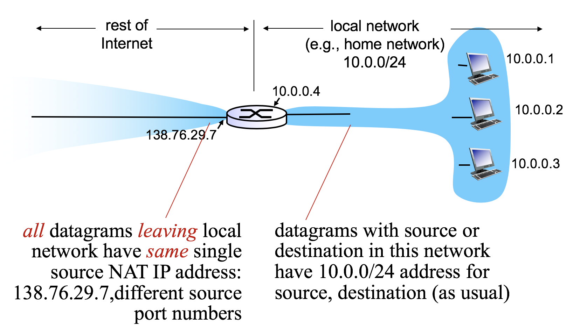
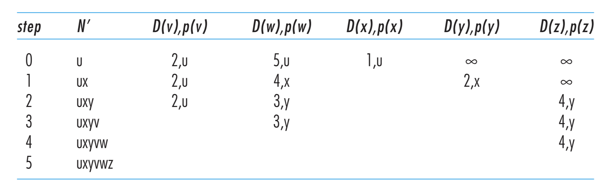
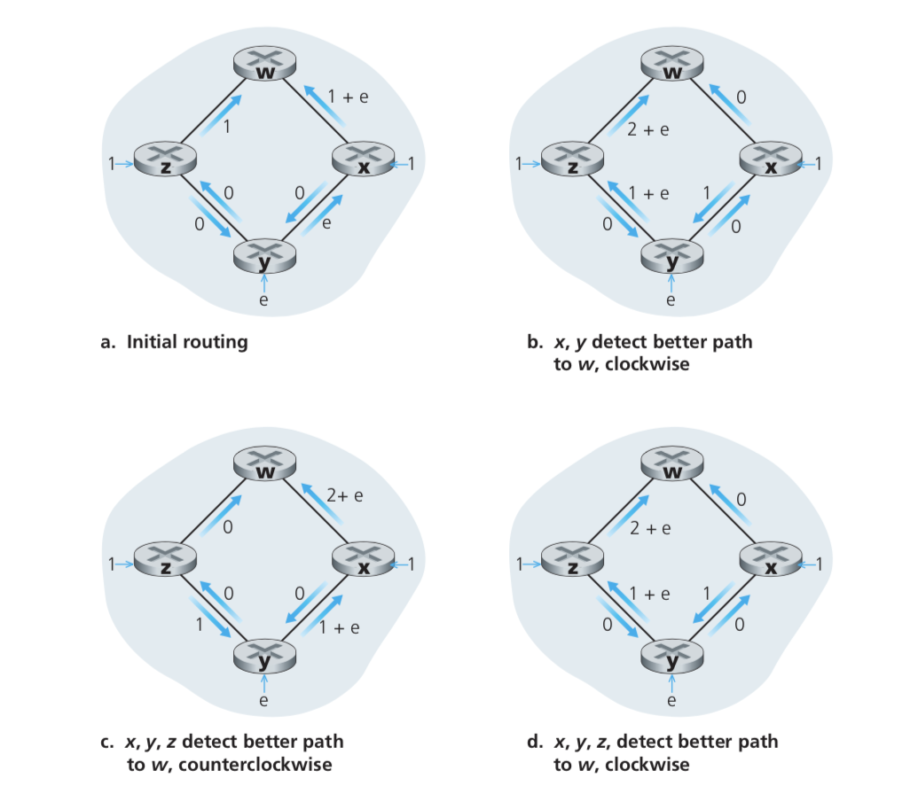
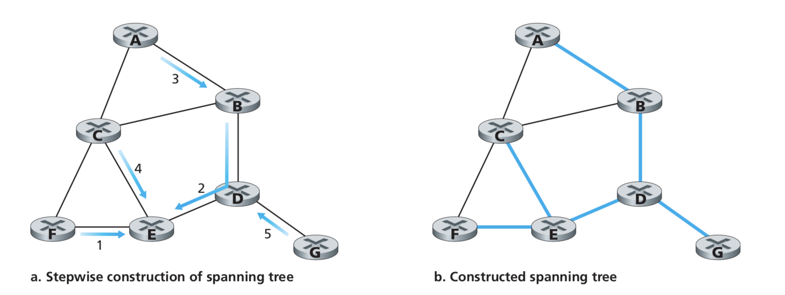
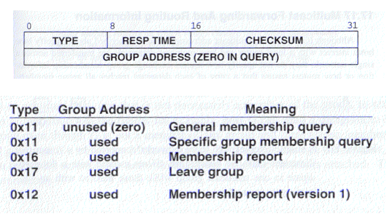

# Week 6 -- Network Layer Part 1

Network Layer protocols are in every host and router (except for switches). Routers examine header files in all IP diagrams passing through it.


**Routing and forwarding**

- Forwarding: Move packets from the router's input to appropriate router output.

- Routing: Determine route taken by packets from source to destination. Implemented by routing algorithms.


## Datagram forwarding table

There are over 4 billion IP addresses, therefore, rather than listing all IP addresses and determine the output interface, the router lists a range of addresses. This is called a *datagram forwarding table*. The table is  constructed by the control plane (routing process) and carried out by data plane (forwarding process).


### Longest prefix matching rule

When looking for forwarding table entry for given destination address, use **longest address prefix** that matches destination address.


For example if we have 11001000 00010111 00011000 00111101, the datagram will be mapped to interface 1.


## Router Architecture

### Overview

There are two key router functions:

1. Run routing algorithms
2. Forwwarding datagrams from incoming to outgoing link


### Input port functions


- Block 1: Implements physical layer bit-layer reception

- Block 2: Runs data link layer protocols

- Block 3: Decentralized swtiching:
  - Given datagram destination, lookup output port using forwarding table in input port memory
  - Goal: Complete input port processing
  - Queueing: If datagrams arrive faster than forwarding table rate into switch fabric, queueing may happen
- An concrete example of Match-plus-action abstraction


### Output port functions


- Buffering required when datagrams arrive from fabric faster than the transmission rate.
- Scheduling discipline chooses among queued datagrams for transmission


## IP datagram format


1. Version: version number. IPv4 or IPv6
2. Header length: Determine where data really starts (because there are options in a IP datagram).

3. Type of service: real-time datagrams and non-real-time traffic
4. Datagram length: total length of datagram
5. Identifier, flags, offset: For fragmentation/reassembly
6. Time-to-live: Ensure that the datagram will not circuit forever due to a routing loop
7. Upper-layer protocol: Upper layer protocol to deliver payload to
8. Header checksum: Same procedure as UDP and TCP checksum. Must be recomputed and modified in each router.
9. Source and Destination IP address
10. Options: Rarely used. May contain timestamp, record route taken, specify list of routers to visit
11. Data (payload): Typically a TCP or UDP segment


## Basic addressing

IP addresses are written in a dotted-decimal format where four sections are seperated by dots and each sections contains a number between 0 to 255. Each device on a network is assigned an IP address


Each IP address has two fundamental parts:

- *Network* portion: Describes the physical wire the device is attached to.
- *Host* portion: Identifies the host on that wire


### Network mask

An important question is: How can we tell the difference between the two sections?

Answer: Network mask


The network mask shows us where to split the network and host sections. Each place there is a 1 in the network mask, that binary digit belongs to the network portion of the address, while each place there is a 0 in the network mask, that binary digit belongs to the host portion of the address. Another terminology is the total count of the number of 1's in the subnet mask.

In the above example, the network mask is 10.1.1.1/24.


### Working with address

- The network address is the IP address with all 0's in the host bits.

- The broadcast address is the IP address with all 1's in the host bits.
- Packets sent to either address will be delivered to all the hosts connected to the wire.

When dealing with IP addresses, two of the most common questions are:

1. What's the network?
2. What's the host?

Human can deal with this manually very easily. Computers require certain bit operations. The following two figures show that procedure.


## Getting addresses

### How to get one?

Network get subnet part of IP addresses by getting allocated portion of its provider ISP's address space.


A host gets IP address in two ways:

- Hard-coded by system admin in a file
- DHCP: Dynamic Host Configuration Protocol. Dynamically get address from as server.


### How to get a block?

An ISP get block of addresses from ICANN whose job contains allocating addresses, managing DNS, assigning domain names and resolving disputes.


## NAT: Network Address Translation

NAT deals with the situation of managing a small range of network devices (in SOHO network, etc.)

Advantages:

- Range of addresses not needed from ISP: just one IP address for all devices
- Can change addresses of devices in local network without notifying outside world
- Can change ISP without changing addresses of devices in local network
- Devices inside local net not explicitly addressable, visible by outside world




### Translation

- For outgoing datagrams: replace `(source IP address, port #)` of every outgoing datagram with `(NAT IP address, new port #)`
- Remember (in NAT translation table) every tuple's mapping
- Incoming datagrams: replace `(NAT IP address, new port #)` of every incoming datagram with `(source IP address, port #)`.


# Week 8-9 -- Network Layer Part 2

Recall that routing algorithm determines end-to-end path through network while forwarding table determines local forwarding at this router. This part deal with the issues in control plane.


## Graph Abstraction


### Graph Terminologies

Graph: $G=(N,E)$

$N=$ set of routers = $ \left \{ u,v,w,x,y,z \right \} $

$E=\text{set of links}=\left \{(u,v), (u,x), (v,x), (v,w), (x,w), (x,y), (w,y), (w,z), (y,z)\right \}$

### Cost

Cost could always be 1 and inversely related to bandwith.

Cost of a link is denoted as $c(x,x')$. e.g., $c(w,z)=5$

Cost of a path $(x_1,x_2,...,x_p)=c(x_1,x_2)+c(x_2,x_3)+...+c(x_{p-1},x_p)$

The routing algorithm aims at finding the least-cost path.


## Routing algorithms

### Classification

#### Global or Decentralized information?

- Global information: all routers have complete topology and link state info. They are called link-state algorithms
- Decentralized:
  - Router knows physically connected neighbours, link costs to neighbours
  - Iterative process of computation, exchange of info with neighbors
  - Called distance-vector algorithms

#### Static or Dynamic?

- Static: routes change slowly over time
- Dynamic: routes change more quickly with periodic update in response to link cost changes


### Dijkstra's algorithm

#### Overview and notations

- A link-state algorithm: all nodes have same info about the whole net topology
- Computes least cost paths from one node ("source") to all other nodes that gives forwarding table for taht node
- Iterative: after k iterations, know least cost path to k destinations

Notations:

- $c(x,y)$: link cost from node x to y, $=\infty$ if not direct neighbors
- $D(v)$: *current* smallest value of cost of path from source to dest v.
- $p(v)$: predecessor node along path from source to v.
- $N'$: set of nodes whose least cost path

#### Pseudo code

```pseudocode
Initialization:
	N = {u}
	for all nodes v
		if v is adjacent to u
			D(v) = c(u, v)
		else D(v) = INFTY

Loop:
	find w not in N such that D(w) is a minimum
	add w to N
	update D(v) for all v adjacent to w and not in N
	D(v) = min(D(v), D(w) + c(w,v))
	// new cost to v is either the old cost to v or known shortest path
	// cost to w plus cost from w to v
until all nodes in N
```

For the previous figure, we can construct such a table



Therefore the forwarding table can be attained by tracing back all the paths


#### Discussions

If there are n nodes, we need to check all nodes w not in N. Therefore there are $n(n+1) \over 2$ comparisons and the complexity is $O(n^2)$. With better implementation, it can be optimized to $O(nlogn)$.

Oscillation



Oscillation may occur if several nodes are initiating traffic at the same time. However, research found that routers in the internet can self-sychronize among themselves.


### Distance Vector Algorithm

#### Bellman-Ford Equation

Let $d_x(y):=\text {cost of least-cost path from x to y}$. Then $d_x(y)=\min_v \left \{c(x,v)+d_v(y) \right \}$, where $c(x,v)$ is the cost from x to neighbour v and $d_v(y)$ is the cost from neighbour v to destination y. And the result is the minimum taken over all neighbours v of x.

#### Algorithm Overview

- Information: $D_x(y)=$estimate of least cost from x to y. x maintains distance vector $\vec{D_x}=[D_x(y): y \in N]$. For node x, it knows the cost to each neighbour v: $c(x,v)$ and maintains its neighbors' distance vectors. For each neighbor v, x maintains $\vec{D_v}=[D_v(y): y \in N]$

- From time to time, each node sends its own distance vector estimate to neighbours. When x receives new DV estimate from neighbour, it updates its own DV using B-F equation:

  $$\vec{D_x}(y)\leftarrow \min_v\left \{c(x,v)+\vec{D_v}(y)\right \}$$

- Iterative, asynchronous: Each local iteration caused by local link cost change or DV update message from neighbor

- Distributed: Each node notifies neighbors only when its DV changes: neighbors then notify their neighbours if necessary

#### Pseudo code

At each node $x$:

```pseudocode
Initialization:
	for all destinations y in N:
		D_x(y) = c(x, y)	// set to infinite if x and y are not connected
	for each neighbor w:	// maintain the coloumns of distance vector
		D_w(y) = ? for all destinations y in N
	for each neighbor w:
		send distance vector of x to w

loop
	wait until I see a link cost change to some neighbor w or until I receive a distance vector 		from some neighbor w
    
    for each y in N:
    	update the distance vector of x according to B-F equation
    
    if D_x(y) changed for any destination y
    	send distance vector to all neighbors
```


Let's consider a case for a simple graph of three nodes and its corresponding solution algorithm.


#### Link Cost Changes

According to the distance vector algorithm, when link cost changes, node detects local link cost change, updates the distance vector table and sends the change to all its neighbors.


When the link change from large to small, the update will be immediately processed by B-F equation. 

However, on the other hand, when link change from small to large, the node will still compute the minimum cost according to B-F equation. In the above example, that is, $$D_y(x)=\min \left \{c(x,y),c(y,z)+D_z(x)\right \}=\min \left \{60,1+5 \right \}=6$$. This then leads to an infinite loop, which will be a "count to infinity problem". This can be solved using a technique called *poisoned reverse*. Omitted here.


### Comparison of LS and DV algorithms

Message complexity:

- LS: with n nodes and E links, $O(nE)$ messages are sent.
- DV: exchange between neighbors only so that convergence time varies

Speed of convergence

- LS: $O(n^2)$ algorithm and may have oscillations
- DV: convergence time varies and may be routing loops

Robustness: What happens if router malfunctions?

- LS:
  - Node can advertise incorrect **link** cost
  - Each node computes only its own table
- DV:
  - Node can advertise incorrect **path** cost
  - Each node's table used by others
  - Error propagate through network

### Hierarchical Routing

Two practical problems

1. Scale: we cannot store all destinations in routing tables because their are over 600 million destinations. Also, routing table exchange would swamp links.
2. Administrative autonomy: Each network administrator may want to control routing its own network.


#### Autonomous Systems

Both problems can be solved by organizing autonomous systems (**AS**). Each AS is within an ISP while one ISP may consist of one or more ASes.

Routers in same AS run same routing protocol which is called intra-AS routing protocol. Routers in different AS can run different intra-AS routing protocol.

There are gateway routers at "edge" of its own AS which have link to router in another AS and are responsible for forwarding packets to destinations outside AS.


#### Interconnected ASes

Forwarding table configured by both intra- and inter-AS routing algorithm:

- Intra-AS sets entries for internal destinations
- Inter-AS & Intra-AS sets entries for external dests


Inter-AS routing job: suppose router in AS1 reveives datagram destined outside of AS1, it needs to learn which gateway to forward packets to. Therefore, AS1 must learn which destinations are reachable through AS2, which through AS3 and propogate this reachablility information to all routers in AS1.

When an AS has multiple gateways, each router inside the AS will have to determine which gateway it needs to forward the packets to through **hot-potato routing**.


## Routing in the Internet

An intra-AS routing protocol is used to determine how routing is performed *within* an autonomous system (AS). It is also known as interior gateway protocols (IGP). Two major intra-AS routing protocols are RIP and OSPF.

### RIP: Routing Information Protocol

- Included in BSD-UNIX distribution in 1982.
- Uses DV algorithm
  - Distance metric: # hops (max = 15), each link has cost 1.
  - DVs exchanged with neighbors every 30s in response message (called RIP advertisement)
  - Each advertisement list of up 25 destination subnets


Each node maintains an RIP forwarding table which includes 3 columns.

If no advertisement heard after 180s, the neibor and the corresponding link is declared dead. Link failure information will propogate to the entire net.

Also, RIP routing tables are managed by application-level process called route-d (daemon). Advertisements are sent in UDP packets periodically repeated.


### OSPF: Open Shortest Path First

- Open: publicly available
- Uses LS algorithm
  - LS packet dissemination
  - topology map at each node
  - route computation using Dijkstra's algorithm
- OSPF advertisement carries one entry per neighbor


### Internet inter-AS routing: BGP

BGP session: two BGP routers peers exchange BGP messages: advertising paths to different destination network prefixes.

Suppose when AS3 advertises a prefix to AS1, it promises it will forward datagrams towards that prefix and can aggregate prefixes in its advertisement.


### Why Different Intra, Inter-AS Routing Protocol?

Policy:

- inter-AS: admin wants control over how its traffic routed, who routes through its net.
- intra-AS: single admin, so no policy decisions needed

Scale: Hierarchical routing saves table size, reduced update traffic

Performance

- intra-AS: can focus on performance
- Inter-AS: policy may dominate over performance


## Unicast, Broadcast, and Multicast

Unicast

- One-to-one
- Destination - unique receiver host address

Broadcast

- One-to-all
- Destination - address of network

Multicast

- One-to-many
- Multicast group must be identified
- Destination - address of group


### Broadcast Routing

Deliver packets from source to all other nodes. However, sourvce duplication (all N-way unicasting) is not efficient. Therefore, some techniques to avoid this situation is introduced.


#### In-network Duplication

Uncontrolled flooding:

- When node receives broadcast packet, sends copy to all neighbors.

- Problem: Cycles & broadcast storm

Controlled flooding:

- Node only broadcasts a packet if it hasn't broadcast the same packet before.
- Nodes keeps track of packet ids already broadcasted
- OR: reverse path forwarding (RPF): Only forward a packet if it arrived on the shortest path between node and source.


#### Spanning Tree

Using a spanning tree can ensure that every host will only receive one copy of the broadcasted packet.


To create a spanning tree, two steps are needed:

1. Determine the centre node
2. For each node in the graph, send a unicast message to the centre node which forwards until it arrives at a node already belonging to spanning tree.




### Multicast

#### Overview: Internet Group Management Protocol (IGMP)

- IETF standard for managing multicast groups
- IGMP allows a host to communicate with local multicast router
- Using IGMP, a host can dynamically
  - join a multicast group
  - leave a multicast group
- IGMP is part of IP
- There are four types of IGMP messages
  - Joining a group: membership report
  - Leaving a group: leave report
  - Maintenance: query, membership report 



#### IGMP: Joining a Group

- An application process sends group id to IGMP module within host

- Host sends a membership report meesgae if this is the first entry for this group
- Local routers adds this group if it was not in database of a active groups and propagates approriate messages to other routers


#### IGMP: Leaving a group

- If no process is interested in a specific group, host sends a leave report
- Router cannot immediately purge group as there may be other interested hosts. Therefore, router sends a special query message and purge group if there's no response within a response time


#### IGMP: Membership Monitoring

If there is only one host in a group and the group died, there is no way for that group to send a leave message to routers. Therefore, router periodically sends general query message and expects response for each group.


To reduce unnecessary traffic, hosts wait for a random time between zero and maximum response time. If it sees another response while waiting, it does not send response.


#### IP multicasting routing

Purpose: share a group information among routers, to implement a better routing for data distribution. Source tree or shared tree is used.

- Source distribution tree

  

  A tree consists of shortest paths from the source to each receiver

  It needs $O(GS)$ memory in routers and stores optimal path from source to receiver and minimizes delay. It's good for small number of senders, many receivers such as radio broadcasting application.

- Shared distribution tree

  

Every node unicasts the traffic to the centre node, shared root. Shared root then sends traffic to the multicast tree rooted at the shared root.

It requires less memory $O(G)$. However, it may result in extra traffic and duplicate data transfer. It's good for the case of more senders with low bandwith and environment such as most part of the share tree is identical to the source tree.