# 1 Lecture 1 -- Computer System & OS Overview

Based on Chapter 1 and 2 in textbook.

## 1.1 Basic Elements

The basic elements are processor, main memory, I/O modules and system bus.

### 1.1.1 Processor

- Referred to as the Central Processing Unit (CPU).
- Two internal components:
  - Control Unit
  - Arithmetic & Logic Unit (ALU)
- Controls operation and performs data processing
- Works repeatedly and continuounsly in cycles to execute instructions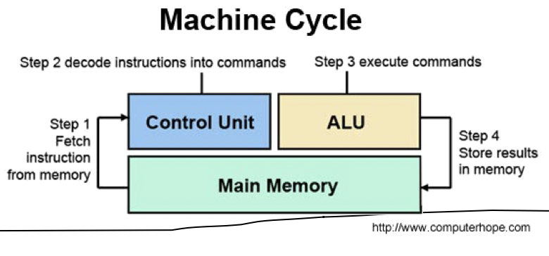


### 1.1.2 Main Memory

- Referred to as primary memory or simply RAM.
- Consists of a set of locations defined by sequentially numbered addresses
- Stores data and programs
- Volatile
  - Contents of the memory is lost when the computer is shut down


### 1.1.3 I/O Modules

- **Moves data** between the computer and the external environment such as:
  - Storage (e.g. hard drive)
  - Communication equipment
  - Terminals


### 1.1.4 System Bus

- Provides for communications among processors, main memory and I/O modules

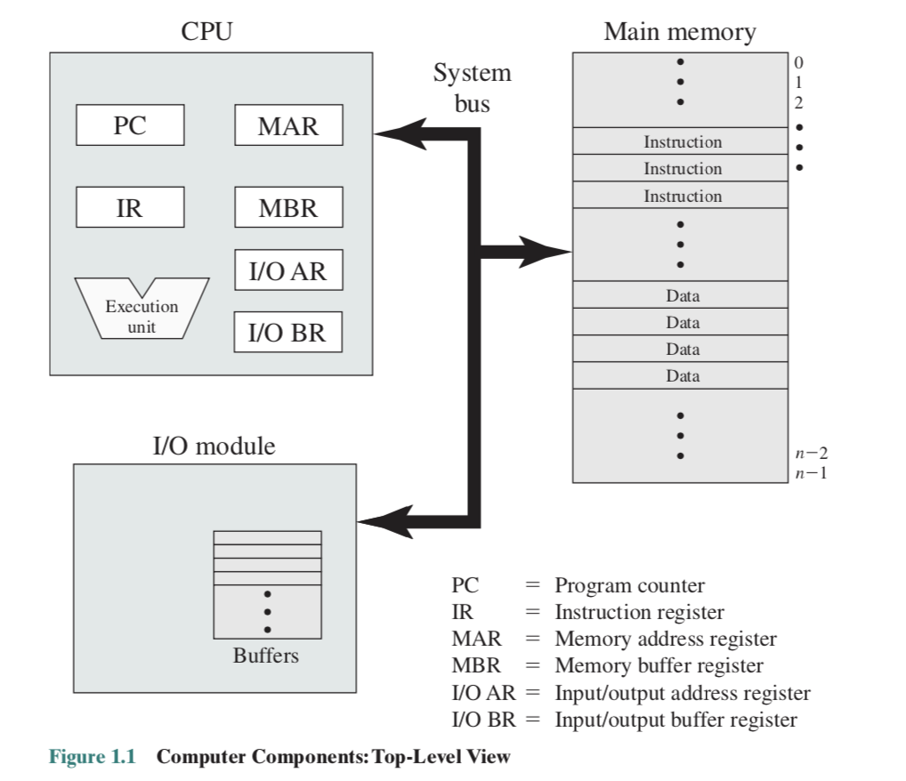


## 1.2 Instruction Execution

- A program consists of a set of instructions stored in main memory.

- 4 steps in a machine cycle

  - Processor reads (fetches) an instruction from memory
  - Processor interprets (decodes) the current instruction
  - Processor executes the instruction
  - Processor stores the result back to memory

- Registers: special memory locations inside the processor that can be accessed very fast

  - Program Counter (PC) holds address of the instruction to be fetched next. PC is incremented after each fetch.
  - Fetched instruction loaded into Instruction Register (IR).
  - Execution result stored in Accumulator (AC) temporarily.
  - Program Status Word (PSW) contains execution status information. (Flags in Assembly Language)

- Each instruction contains bits (opcode) specifying whtat action the CPU needs to take

  - Processor-memory
  - processor-IO
  - data processing
  - Contol

  


Consider the example above, the first digit in an instruction is the opcode (4 bits, 16 operations).

- 0001: Load AC from memory
- 0010: Store AC to memory
- 0101: Add memory to AC


## 1.3 Interrupts

An interrupt means other modules could interrupt the normal sequencing of the processor.

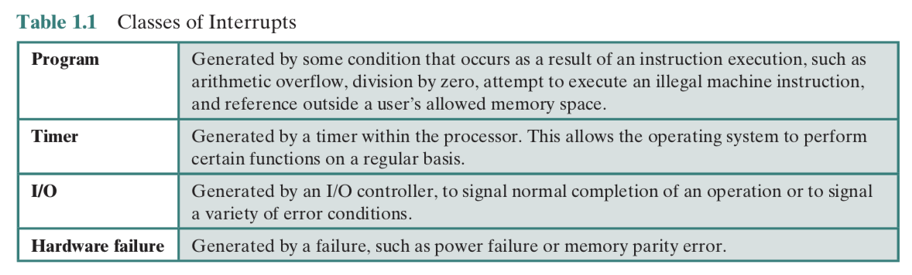

Interrupts are provided to improve processor utilization. Since most peripheral modules are slower than the processor, if the processor pauses to wait for device, there will be a wasteful use of it.

Consider the following example showing the difference between no interruption, short I/O wait and long I/O wait.


Case 1: No interrupts. When the technique is not used, the processor has to wait for the whole I/O operation to be completed. As the I/O operation takes time longer than the processor in million times order, it wastes the use of the processor a lot.

Case 2: Interrupts with shor I/O wait. The processor will proceed to the next operation while letting the I/O module execute the order itself. In this case, the I/O command will finish before the processor completes the next instruction. Therefore, it issues an interruption to let processor deal with the I/O operations, which takes only a short period of time.

Case 3: As in case 2, the processor lets the I/O module execute the I/O command. However, after it completes the next instruction, it may needs to wait for the I/O module to finish the command.


To process the interrupt, the processor needs to find the way to store the current processing states (PC, PSW, and values in other registers). Program stack is used.


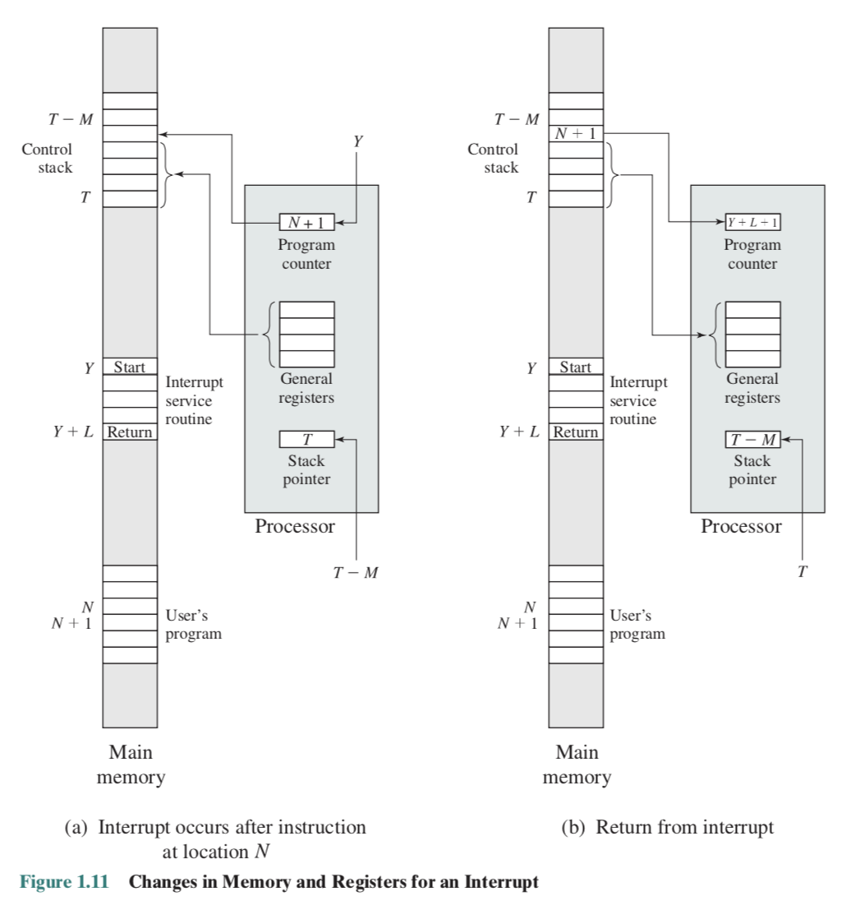


## 1.4 Uniprogramming and Multiprogramming

- Uniprogramming: only one program is running at a given time.

  The processor spends a certain amount of time executing. until it reaches an I/O instruction. It must then wait until that I/O instruction conclues before proceeding.

- Multiprogramming: processor has more than one program to execute.

  When one job needs to wait for I/O, the processor can switch to the other job.

(More notes about how it is different from multiprocessing will be added later on)


With uniprogramming, there is gross underutilisation of all resources. The improvement of average resource utilisation, throughput and response times is evident if multiprogramming is used.


### 1.4.1 Difference Between Terminologies

- A multiprogramming system runs more than one program "simultaneously" on one processor. The system attempts to keep several **programs** resident in main memory and **switches the processor rapidly between them**. Multiprogramming was developed to improve processor I/O and resource utilization.
- A multiprocessor is a computer system with **more than one processor**. Multiprocessing was developed in an effort to increase processing speeds by allowing truly parallel computation.


## 1.5 The Memory Hierarchy

The memory hierarchy is designed to meet the constraints on a computer's memory. That is, how much?, how fast?, ane how expensive?

Going from top to down along the hierarchy, we shall observe

- Decreasing cost per bit
- Increasing capcity
- Increasing access time 
- Decreasing frequency of access to the memory by the processor


### 1.5.1 Cache Memory

We know that the processor must access memory at least once per instruction cycle. Thus processor execution is limited by memory cycle time. buy processor speed is much faster than memory access speed.

The solution to this performance gap could be copying information in use from slower to faster (but smaller) storage temporarily. The storage is exactly cache.

Cache is checked first to determine if information is there.

- If it is, information is used directly from the cache.
- If not, data is copied to cache and used there.

Note that if the *hit ratio* is low, the time penalty for an idle cache access will make this design even more inefficient than the design without cache memory.

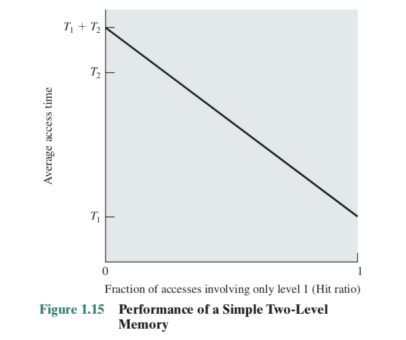

By analysing a simple two-level memory, we shall find that the relationship is linear.

#### 1.5.1.1 Principle of Locality

Data which is required soon is often close to the current data. If data is accessed, then it's neighbors might also be accessed in the near future.

**Spatial locality** refers to the tendency of execution to involve a number of memory locations that are clustered while **temporal locality** refers to the tendency for a processor to access memory locations that have been used recently.


### 1.5.2 Secondary Memory

Secondary Memories are also known as storage devices

- Extension of main meory that provides large non-volatile storage capacity
- Used to store program and data files
- Most commonly used: magnetic disks
  - Disk surface is logically divided into tracks, which are subdivided into sectors
  - The disk controller determines the logical interaction between the device and the computer


## 1.6 I/O Communication Techniques

When the processor encounters an instruction related to I/O, it executes that instruction by using a command to the appropriate I/O module. There are three techniques possible for I/O operations:

- Programmed I/O
- Interrupt-driven I/O
- Direct memory access (DMA)

### 1.6.1 Programmed I/O

- CPU issues a read command to I/O module to read a word of data from an external device into memory.
- I/O module performs the requested action
  - then sets the appropriate bits in the I/O status register (but takes no further action to alert CPU)
- CPU periodically checks the status of I/O module until it determines the instruction is completed.
- The performance is poor.


### 1.6.2 Interrupt-Driven I/O

- CPU issues a read command to I/O module and then goes on to do some other useful work
- I/O module will then interrupt CPU to request service when it is ready to exchange data with CPU.
- CPU executes the data transfer and then resumes its former processing
- More efficient than programmed I/O because there is no needless waiting. However, interrupt-driven I/O requires active intervention of CPU to perform data transfer


### 1.6.3 Direct Memory Access

- Performed by a seperate module.
- When CPU wishes to read/write, it issues a command to DMA module containing
  - Whether a read or write is requested
  - The address of the I/O device involved
  - The starting location in memory to read/write
  - The number of words to be read/written
- DMA module transfers the entire block of data directly to and from memory without going through CPU.
- More efficient than interrupt-driven I/O

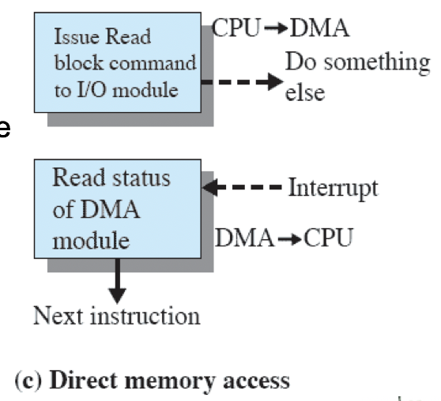


## 1.7 Operating System Objectives & Functions

OS is a program that controls the execution of application programs. It acts as an interface between applications and hardware.

Main objectives:

- *Convenience*: making a computer more convenient to use
- *Efficiency*: allowing computer resources to be used efficiently
- *Ability to involve*: permitting effective development, testing and introduction of new system functions such as hardware upgrade, new hardware, new services, and fixes.


### 1.7.1 OS as a User/Computer Interface

- End user views a computer system in terms of a set of applications and is not concerned with the details of computer hardware.

- Programme makes use of a set of system programs (utilities) in developing an application and a running application invokes the utilities to perform certain functions
- The most important collection of system programs comprises the OS.


### 1.7.2 OS Services

- Program development

  OS provides a variety of facilities and services, such as editors and debuggers, to assist the programmer in creating programs.

- Program execution

  OS handles steps need to be performed to execute a program.

- Access I/O devices

  OS provides a uniform interface so that programmers can access I/O devices using simple reads and writes.

- Controlled access to files

  In the case of a system with multiple users, OS provides protection mechanisms to control access to the files

- System access

  For shared or public systems, OS controls access to the system as a whole and to specific system resources in order to provide protection of resources and data from unauthorized users and resolve conflicts for resource contention.

- Error detection and response

  A variety of errors can occur while a computer system is running. OS must provide a response that clears the error condition with the least impact on running applications.

- Accounting

  A good OS will collect usage statistics for various resources and monitor performance parameters such as response time.


### 1.7.3 OS as Resource Manager


- A computer is a set of resources for the movement, storage, and processing of data
- The OS is responsible for managing these resources
  - determines how much processor time is to be devoted to the execution of a particular user program
  - controls the allocation of main memory
  - decides when an I/O device can be used by a program in execution
  - controls access to and use of files


# 2 Lecture 2 -- Process Desctiption and Control

## 2.1 How are processes represented and controlled by the OS?

### 2.1.1 The Concept of Process

All modern OS rely on a model in which the execution of an application corresponds to the existence of one or more processes.

Process:

- A program in execution
- An instance of a program running on a computer
- The entity that can be assigned to and executed on a processor
- A unit of activity characterised by the execution of a sequence of instructions, a current state, and an associated set of system resources

A process is comprised of:

- Program code
- Associated data needed by the program
- Execution context of the program. containing all information the OS needs to manage the process


### 2.1.2 Requirements of an OS

- Fundamental task: **process management**
- The operating system must:
  - Interleave the execution of multiple processes
  - Allocate resources to processes and protect the resources of each process from other processes
  - Enable processes to share and exchange information
  - Enable synchronisation among processes


Example: Interleaved Execution of Processes

Omitted. See lecture notes and the textbook.


## 2.2 Process States

### 2.2.1 Two-State Process Model

- OS creates a new process and enters it into the system
- Process may be in one of two states
  - Running
  - Not running


- Processes that are not running are kept in some sort of queue, waiting for their turn to execute. Processes moved by the dispatcher of the OS to the CPU then back to the queue until the task is completed.


### 2.2.2 Five-State Process Model

While some processes in the Not Running state are ready to execute, others may be blocked (e.g., waiting for an I/O operation to complete)


- Running: The process that is currently being executed.
- Ready: A process that is prepared to execute when given the opportunity
- New: A process that has just been created but has not yet been admitted to the pool of executable processes by the OS. Typically, a new process has not yet been loaded into main memory, although its process control block has been created.

- Blocked: A process that cannot execute until some event occurs, such as the completion of an I/O operation
- Exit: A process that has been released from the pool of executable processes by the OS, either because it halted or because it aborted for some reason.


We can either use two queues - one `READY_QUEUE` and another `BLOCKED QUEUE`, or use multiple blocked queues, which seperates the events of blocking.

### 2.2.3 Suspended Processes

- Processor is faster than I/O so all processes could be waiting for I/O. Therefore, processor could be idle most of the time.
- As a result, when none of the processes in the main memory is in the ready state, OS swaps one of the blocked processes out **on to disk** to free up more memory and use processor on othger processes.
- Blocked state becomes **suspend** state when swapped to disk.


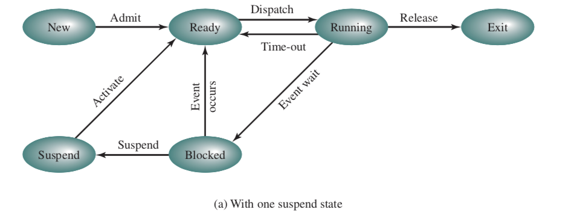

However, it does no good to activate a suspended process in blocked state. For this reason, a model of two states `Blocked/Suspend` and `Ready/Suspend` is introduced.


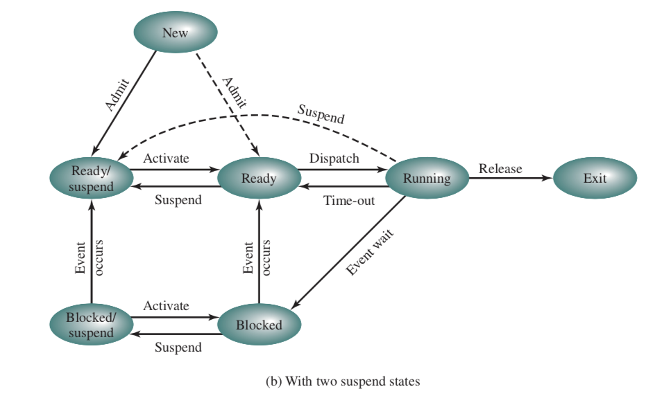

Here, we summarize the reason for process suspension:

| Reason                   | Comment                                                      |
| ------------------------ | ------------------------------------------------------------ |
| Swapping                 | The OS needs to release sufficient main memory to bring in a process that is ready to execute |
| Other OS Reasons         | OS suspects process of causing a problem                     |
| Interactive User Request | User may wish to suspend execution of a program for purpose of debugging |
| Timing                   | A process may be executed periodically (e.g., an accounting or system monitoring process) and may be suspended while waiting for the next time |
| Parent Process Request   | A parent process may wish to suspend execution of a descendent to examine or modify the suspended process, or to coordinate the activity of various descendents. |


## 2.3 Data Structures Used to Manage Processes

OS manages the use of system resource by processes.


In this snapshot, process $P_1$ is running and it has 2 I/O devices; $P_2$ is blocked waiting in memory for an I/O device allocated to $P_1$; $P_n$ has been swapped out and is suspended.


### 2.3.1 Operating System Control Structures

- For the OS to manage processes and resources, it must have information about the current status of each process and resource
- Tables are constructed for each entity the OS manages.


### 2.3.2 Memory Tables

- Memory tables are used to keep track of both main (real) and secondary (virtual) memory.
- The following information must be included:
  - Allocation of main memory to processes
  - Allocation of secondary memory to processes
  - Protection attributes of blocks of main or virtual memory such as which processes may access certain shared memory regions
  - Information needed to manage virtual memory


### 2.3.3 I/O Tables

- Used by the OS to manage the I/O devices and channels of the computer
- At any given time, an I/O device may be available or assigned to a particular process
- If an I/O operation is in process, the OS needs to know:
  - The status of the I/O operation
  - The location in main memory being used as the source or the destination of the I/O transfer


### 2.3.4 File Tables

- These tables provide information about:
  - Existence of files
  - Location on secondary memory
  - Current status
  - Other attributes
- Sometimes this information is maintained by a file management system.


### 2.3.5 Process Table

- To manage and control a process, there is one entry for each process in the process table.
- Each entry points to a *process image* containing:
  - **User Data**: The modifiable part of the user space. May include program data, a user stack area, and programs that may be modified.
  - **User Program**: The program to be executed.
  - **Stack**: Each process has one or more LIFO stacks associated with it. A stack is used to store parameters and calling addresses for procedure and system calls.
  - **Process Control Block**: Data needed by the OS to control the process


#### 2.3.5.1 Process Control Block

- Each process has associated with it a number of attributes that are used by the OS for process control.
- The attributes are stored in a data structure called a process control block (PCB), created and managed by the OS.
- PCB contains sufficient information so that it is possible to interrupt a running process and later resume its execution.
- Information stored in PCB can grouped into three categories:
  - Process identification
  - Process state information
  - Process control information


##### 2.3.5.1.1 Process Identification

Each process is assigned a unique numeric identifier. Use:

- Many of the tables controlled by the OS may use process identifiers to cross-reference process tables.

  Example: Memory tables may be organized to provide a map of main memory of an indication of which process is assigned to which region.

- When processes communicate with one another, the process identifier informs the OS of the destination of a particular communication.

- When processes are allowed to create other processes, identifiers indicate the parent and descendents of each process.


##### 2.3.5.1.2 Process State Information

- Consists of processor registers' content
  - User-visible registers
  - Control and status registers
    - Program counter: address of next instruction
    - Program status word (PSW):
      - Condition codes: result of the most recent arithmetic or logical operation
      - Status information: e.g., interrupt enabled/disabled flags, execution mode
  - Stack pointers


##### 2.3.5.1.3 Process Control Information

- The additional information needed by the OS to control and coordinate the various active processes
  - Process state
  - Priority
  - Scheduling-related info
  - Waiting event
  - Data structuring
  - ... (See table 5, page 130 in textbook)


#### 2.3.5.2 Process List Structures

The queuing structure could be implemented as linked lists of PCBs in which pointers can be stored in the PCBs (structuring information).

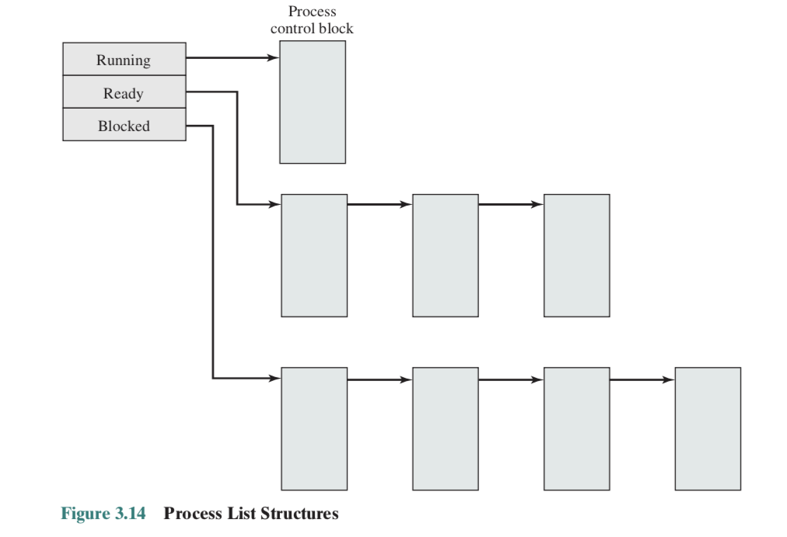


#### 2.3.5.3 Structure of Process Images in Virtual Memory


#### 2.3.5.4 Role of the Process Control Block

- PCB is the most important data structure in an OS
  - Contains all of the information about a process that is needed by the OS
  - Read and/or modified by virtually every module in the OS such as scheduling, resource allocation, interrupt processing and performance monitoring
  - Defines the state of the OS
- PCB requires protection, which is difficult
  - A faulty routine could damage PCBs, which could destroy the OS's ability to manage the affected processes.
  - Any design change to the PCB could affect many modules of the OS


## 2.4 Process Control

### 2.4.1 Modes of Execution

Most processors support at least two modes of execution to protect the OS and key OS tables from interference by user programs.

User mode:

- Less-privileged mode
- User programs typically execute in this mode

System mode (control mode or kernel mode):

- More-privileged mode
- **Kernel** of the operating system (central module of an OS)
  - Loads first when the system starts
  - Resides in memory (in a protected area) all the time


### 2.4.2 Functions of an OS kernel

1. Process management
   - Process creation and termination
   - Process scheduling and dispatching
   - Process switching
   - Process sychronization and support for interprocess communication
   - Management of process control blocks
2. Memory management
   - Allocation of address space to processes
   - Swapping
   - Page and segment management
3. I/O management
   - Buffer management
   - Allocation of I/O channels and devices to processes
4. Support Functions
   - Interrupt handling
   - Accounting
   - Monitoring


### 2.4.3 Process Creation

Once the OS decides to create a new process, it

- Assigns a unique process identifier and adds a new entry to the process table
- Allocates space for the processes (process image)
- Initializes process control block
- Sets up appropriate linkages such as putting the new process in the Ready List
- Creates or expands other data structures such as an accounting file for performance assessment


### 2.4.4 Process Switching

A process switch may occur any time that the OS has gained control from the currently running process. When CPU switches to another process, the system must have the state of the old process and load the saved state for the new process (to be described).

Process-switch time is considered as overhead, so several issues are important

- What events triggers the switch?
- What must the OS do to the various data structures to achieve such a process switch?


Possible events giving OS control are:

| Mechanism                         | Cause                                                        | Use                                            |
| --------------------------------- | ------------------------------------------------------------ | ---------------------------------------------- |
| Interrupt                         | External to the execution of the current instruction. e.g., clock interrupt, I/O interrupt | Reaction to an asynchronus external event      |
| Trap                              | Associated with the execution of the current instruction, e.g., illegal file access | Handling of an error or an exception condition |
| System call (for supervisor call) | Explicit request, e.g., file open                            | Call to an operating system function           |


Steps:

1. Save the context of processor including program counter and other registers
2. Update the PCB of the process currently in the running state
3. Move the PCB of this process to appropriate queue - ready or blocked or ready/suspend
4. Select another process for execution
5. Update the PCB of the process selected
6. Update memory management data structures
7. Restore context of the processor to that which existed at the time the selected process was last switched out.


### 2.4.5 Mode Switching

- The occurrence of an interrupt does not necessarily mean a process switch
- It is possible that, after the processor switches from user mode to kernel mode in order to execute the interrupt handler (which may include privileged instructions), the currently running process will resume its execution.
- In such a mode switching case, only need to save and restore processor state information.


## 2.5 Process Management in UNIX

### 2.5.1 UNIX Overview

System process run in kernel mode

- executes operating system code to perform administrative and housekeeping functions

User processes

- operate in user mode to execute user programs and utilities
- operate in kernel mode to execute instructions that belong to the kernel
- enter kernel mode by issuing a system call, when an exception is generated or when an interrupt occurs


### 2.5.2 UNIX Process States

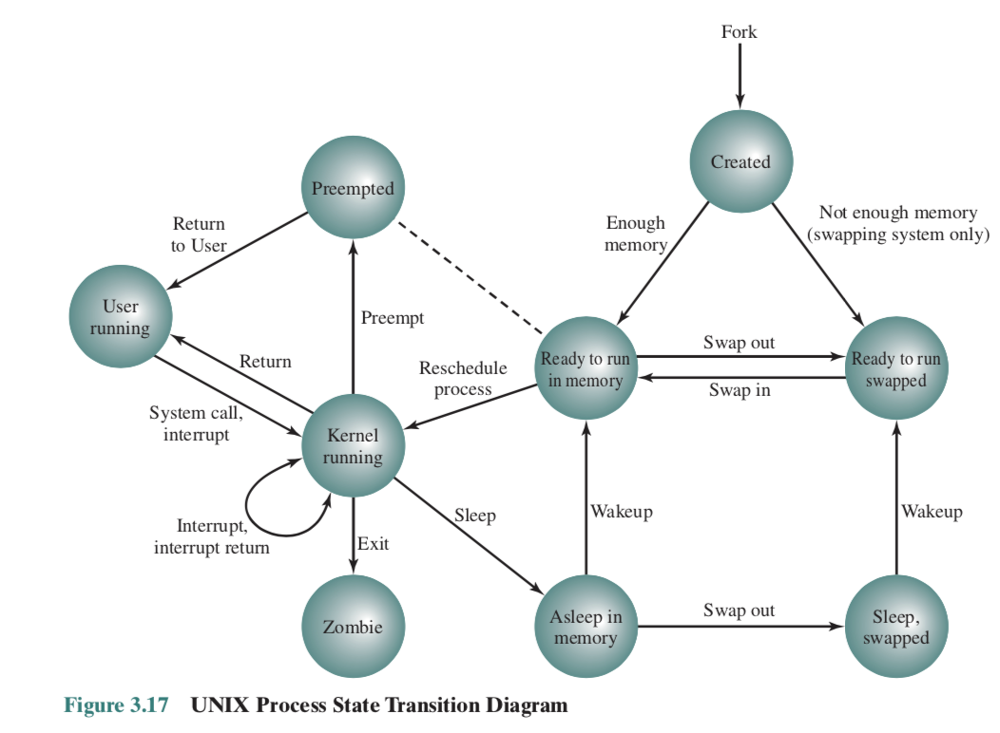

- **User running**: Executing in user mode
- **Kernel running**: Executing in kernel mode
- **Asleep in memory:** Unable to execute until an event occurs; process is in main memory (block state)
- **Ready to run in memory**: Ready to run as soon as the kernel schedules it
- **Ready to run, swapped**: Process is ready to run, but the swapper must swap the process into main memory before the kernel can schedule it to execute
- **Sleeping, swapped**: The process is awaiting an event and has been swapped to secondary storage
- **Preempted**: Process is returning from kernel to user mode, but the kernel preempts it and does a process switch to schedule another process (overhead)
- **Created**: Process is newly created and not yet ready to run
- **Zombie**: Process no longer exists, but it leaves a record for its parent process to collect


### 2.5.3 Case study: What happens when you call `fork()`?

This causes the OS, in kernel mode, to:

1. Allocate a slot in the process table for the new process.
2. Assign a unique process ID to the child process.
3. Make a copy of the process image of the parent, with the exception of any shared memory
4. Increment counters for any files owned by the parent, to reflect that an additional process now also owns these files
5. Assign the child process to the Ready to Run state
6. Return the ID number of the child to the parent process, and a 0 value to the child process


After creating the process, the kernel can do one of the following, as part of the dispatcher routine:

- Stay in the parent process
  - Control returns to user mode at the point of the fork call of the parent
- Transfer control to the child process
  - The child process begins executing at the same point in the code as the parent, namely at the return from the fork call
- Transfer control to another process
  - Both parent and child are left in the Ready to Run state


# 3 Lecture 3 -- Threads

## 3.1 Threads: Resource Ownership and Execution

We know that processes have two characteristics:

- Resource ownership
  - A process is allocated ownership of resources including a virtual address space to hold the process image
  - The OS performs a protection function to prevent unwanted interference between processes with respect to resources
- Dispatching, Scheduling, Execution
  - The execution of a process follows an execution path that may be interleaved with other processes.
  - A process has an execution state and a dispatching priority, and is the entity that is scheduled and dispatched by the OS.


<!--more-->

These two characteristics can be treated independently by OS.

Dispatching: Thread

Resource Ownership: Process

**Multithreading** is the ability of an OS to support multiple, concurrent paths of execution within a single process


### 3.1.1 Single-threaded Approaches

A single thread of execution per process, in which the concept of a thread is not recognised.

- MS-DOS supports a single-user process and a single thread
- Some variants of UNIX support multiple user processes but only support one thread per process


### 3.1.2 Multi-threaded Approaches

- A Java run-time environment is a system of one process with several threads
- The use of multiple processes, each of which supports multiple threads are found in Windows, Solaris, and many modern versions of UNIX.


### 3.1.3 Process VS Thread

- In an OS, a process is
  - A unit of resource allocation, a virtual address space that holds the process image
  - A unit of protection: protected access to processors, other processes (for inter-process communication), files, I/O resources
- In a process, each thread has
  - An execution state (running, ready, etc.)
  - A saved thread context when not running
  - An execution stack
  - Some per-thread static storage for local variables
  - Access to the memory and resources of its process, shared by all threads in that process
- One way to view a thread is as an independent program counter operating within a process

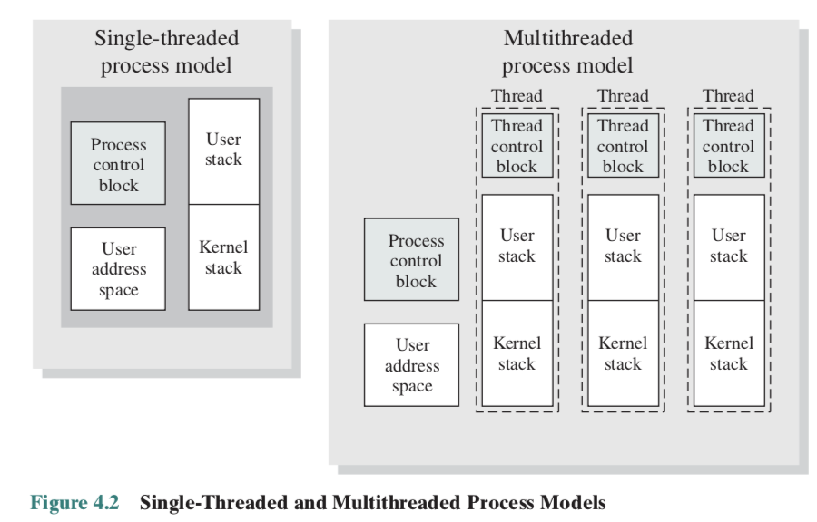

As shown in the figure above, threads in the process has different stacks and control blocks to store register values, priority and other thread state-related state information. However, all of the reside in the same address space and share the same data.


### 3.1.4 Activities Similar to Processes

Similar to processes, threads have **execution states** and need to **synchronize** with one another.

- Execution states:
  - In an OS that supports threads, scheduling and dispatching is done on a thread basis
  - Most of the state information dealing with execution is maintained in thread-level data structures
  - The key states for a thread are: Running, ready, blocked
  - Suspending and Termination state are at process-level
- Threads need to synchronize with one another so that they don't interfere with each other or corrupt data structures
  - All threads of a process share the same address space and other resources
  - Any alternation of a resource by one thread affects the other threads in the same process


### 3.1.5 Multithreading on a Uniprocessor

Multiprogramming enables the interleaving of multiple threads within multiple processes.

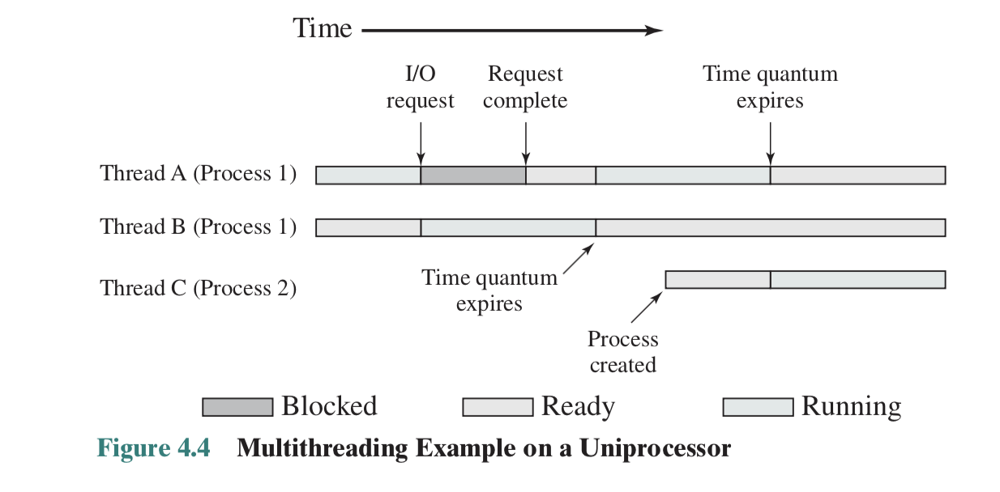

Execution passes from one thread to another either when the currently running thread is blocked or its time slice is exhausted.


### 3.1.6 Benefits of Threads

If an application is implemented as a set of related units of execution, it is far more efficient to do so as a collection of threads rather than a collection of separate processes. Reasons include:

- Takes less time to create a new thread than a process
- Less time to terminate a thread than a process
- Switching between two threads takes less time then switching between processes
- Threads enhance efficiency in communication because threads within the same process share memory and files, they can communicate with each other without invoking the kernel


## 3.2 Categories of Thread Implementation

### 3.2.1 User-Level Threads

All thread management is done within the application by calling a threads library.

- The application and its threads are allocated to a single process managed by the kernel.
- The kernel is not aware of the existence of threads.
- Kernel scheduling is done on a process basis.

GNU portable threads is an application of ULT.


Pros:

- Process does not switch to the kernel mode to do thread management, therefore saves the overhead of two mode switches
- Scheduling can be application specific
- Can run on any OS because the threads library is a set of application-level functions

Cons:

- Only a single thread within a process can execute at a time, therefore a muiltithreaded application cannot take advantage of multiprocessing
- When a ULT executes a blocking system call, all of the threads within the process are blocked


### 3.2.2 Kernel-Level Threads

Thread management is done by the kernel.

- No thread management done by application, just an API to the kernel thread facility
- Each user-level thread is mapped to a kernel-level thread
- Kernel maintains context information for the whole process and individual threads within the process
- Scheduling is done on a thread basis

Example: Windows, Linux


Pros:

- The kernel can simultaneously schedule multiple threads from the same process onto multiple processors
- If one thread in a process is blocked, the kernel can schedule another thread of the same process
- Kernel routines themselves can be multithreaded

Cons:

- The transfer of control from one thread to another within the same process requires a mode switch to the kernel
- Managing the KLTs is slower than ULTs
- KLT implementation needs OS support


### 3.2.3 Combined Approach

m-to-n mapping hybrid implementation

- Application creates m ULTs and OS provides a pool of n KLTs
- Multiple threads within the same application can run in parallel on multiple processors
- A blocking system call need not block the entire process

Example: solaris


# 4 Lecture 4  — Concurrency, Mutual Exclusion and Synchronization

## 4.1 Principles of Concurrency

OS design is concerned with the management of processes and threads in different systems.

- Multiprogramming
  - Multiple processes, one core
- Multiprocessing
  - Multiple processes, multiple cores (shared memory)
- Distributed processing
  - Multiple processes, multiple nodes (distributed memories)

In uniprocessors, processes may be interleaved. However, in multiple-processors, processes can be not only interleaved but also overlapped.


### 4.1.1 Difficulties for Concurrency

- **Interleaving** and **overlapping** can be viewed as examples of concurrent processing and present the same problems.
- The relative speed of execution of processes cannot be predicted
  - depends on activities of other processes
  - the way the OS handles interrupts
  - scheduling policies of the OS
- Sharing of global resources (like global variables)
- Difficult for the OS to manage the allocation of resources optimally
  - Multiple processes may request use of the same resource
- Difficult to locate programming errors
  - Results are not deterministic and reproducible


### 4.1.2 Race Condition and OS Concerns

- A race condition occurs when multiple processes or threads read and write shared data items
  - The final result depends on how the execution of instructions in the multiple processes interleaves
  - The loser of the race is the process that updates last and will determine the final value of the variable

- The OS must
  - Keep track of various processes
  - allocate and de-allocate resources for each active process; multiple processes want access to the same resource
  - protect the data and physical resources of each process against interference by other processes
  - ensure that a process and its output must be independent of the speed at which its execution is carried out relative to the speed of other concurrent processes


### 4.1.3 Resource Competition

- Concurrent processes come into conflict when they are competing for use of the same resource such as I/O devices, memory, and processor time
- In the case of competing processes, three control problems must be faced
  - Need for mutual exclusion
  - Deadlock
  - Starvation


## 4.2 Mutual Exclusion

- The problem concerns a group of processes which need access to some resource that cannot be used simultaneously by more than one single process.
- Control of competition involves the OS because it is the OS that allocates resources
- The processes themselves also need to be able to express the requirement for mutual exclusion
- **Critical Section**: The piece of code within a process that accesses a shared resource (data structure or device) that must not be concurrently accessed by other processes
- It is important that only one program at a time be allowed in its critical section

```c++
int ra;
void P()
{
    while (true)
    {
        // preceding code
        entercritical(ra);
        // critical section code
        exitcritical(ra);
    }
}
```

Any process that attempts to enter its critical section while another process is in its critical section is made to wait


### 4.2.1 Requirements for Mutual Exclusion

Any facility that is to provide support for mutual exclusion should meet the following requirements:

- Mutual exclusion must be enforced: only one process at a time is allowed into its critical section, among all processes that have critical sections for the same resource
- A process that halts in its noncritical section must do so without interfering with other processes
- No deadlock or starvation
- When no process is in a critical section, any process that request entry to its critical section must be permitted to enter without delay
- No assumptions are made about relative process speeds or number of processes
- A process remains inside its critical section for a finite time only


### 4.2.2 Hardware Support Methods

#### 4.2.2.1 Disabling Interrupts

Since uniprocessors only allow interleaving, no overlapping, to guarantee mutual exclusion, it is sufficient to prevent a process from being interrupted while it is in the critical section

```c++
while (true)
{
    // disable interrupts
    // critical section
    // enable interrupts
}
```

However, it does not work for multiprocessors since processes may be overlapped.


#### 4.2.2.2 Compare-and-Swap

- A compare is made between a memory value and a test value
- If the values are the same, a swap occurs

```c++
int cas(int *word, int testval, int newval)
{
    int oldval = *word;
    if (oldval == testval)
        *word = newval;
    return oldval;
}
```

```c++
// program mutual exclusion
const int n =; // number of processes;
int bolt;
void P(int i)
{
    while (true)
    {
        while (cas(bolt, 0, 1) == 1); // do nothing
        // critical section
        bolt = 0;
        // remainder
    }
}

int main()
{
    bolt = 0;
    parbegin(P(0), P(1), P(2), ... ,P(n));
}
```

In this example, only the first process can get a return value 0 for `cas()` and it will enter its critical section. Other processes go into a **busy waiting** mode.


Advantages:

- Applicable to any number of processes on either a single processor or multiple processors sharing main memory
- Simple and easy to verify
- It can be used to support multiple critical sections, each critical section can be defined by its own variable


Disadvantages:

- Busy-waiting mode consumes processor time
- Starvation is possible. When a process leaves a critical section and more than one process is waiting, the selection of a waiting process is arbitrary; some process could indefinitely be denied access.
- Deadlock is possible.
  - P1 enters its critical section and is then preempted by a higher-priority P2
  - P2 attempts to use the same resource as P1 but is denied access because of the mutual exclusion mechanism
  - P2 goes into a busy waiting loop
  - The lower-priority P1 will never be dispatched


## 4.3 Semaphores

### 4.3.1 Principles of Semaphores

Fundamental principle: multiple processes can cooperate by means of simple signals such that a process can be forced to stop at a specified place until it has received a specific signal.

Semaphore: an integer value used for signalling among processes

Three operations on a semaphore are all atomic:

- Initialize to a non-negative integer value
- semWait decrements the semaphore value: to receive a signal
- semSignal increments the semaphore value: to transmit a signal


The semaphore is initialized to zero or a positive value. When the value is positive, that value equals the number of processes that can issue a wait and immediately continue to execute.

When the value is zero, the next process to issue a wait is blocked, and the semaphore value goes negative.

- Each subsequent wait further decrements the value
- The negative value equals the number of processes waiting to be unblocked.

Each signal unblocks one of the waiting processes, if any.

See lecture note for semaphore primitives and binary semaphore primitives.


Example:

```c++
const int n = number of processes;
semaphore s = 1;
void P(int i)
{
    while (true)
    {
        semWait(s);
        // critical section
        semSignal(s);
        // remainder
    }
}
void main()
{
    parbegin(P(1), P(2), ..., P(n));
}
```

In this example, the first process will be able to enter the critical section immediately, setting the value of s to 0. Any other processes attempting to enter the critical section will be blocked, s is decremented. When the first process departs, s is incremented and one of the blocked processes (if any) becomes ready.


### 4.3.2 Mutex

- A concept related to the binary semaphore is the mutex.
- Two operations for mutex: `lock()` and `unlock()`
- When a process tries to lock a mutex
  - It may require the lock if the mutex is not being locked
  - Or it may fail and enter in a waiting mode if the mutex is being locked
- When a process tries to unlock a mutex
  - It releases the lock and makes the mutex available for another process to lock

- A key difference between binary semaphore and mutex is that the process that locks the mutex must be the one to unlock it: i.e., a process cannot unlock a mutex that is not locked by itself


### 4.3.3 Strong/Weak Semaphore

- A queue is used to hold processes waiting on the semaphore
  - In what order are processes removed from the queue?
- Strong semaphores use FIFO: the process that has been blocked the logest is released from the queue first.
- Weak semaphores do not specify the order of removal from the queue


### 4.3.4 Producer/Consumer Problem

- General Statement:
  - One or more producers are generating data and placing these in a buffer
  - A single consumer is taking items out of the buffer one at time
  - Only one producer or consumer may access the buffer at any one time
- The problem
  - We need to ensure that the producer can't add data into full buffer and consumer can't remove data from empty buffer

We first consider a buffer of infinite size. The idea is to let consumer be blocked when removing from empty buffer (i.e., ZERO item in the buffer), and unblocked when an item is inserted by the producer (>0 number of items in the buffer)

A semaphore, n = number of items in the buffer, can be used to implement the idea

```c++
// program producer and consumer with infinite buffer size
semaphore n = 0, s = 1; // n is equal to the number of items in the buffer
void producer()
{
    while (true)
    {
        produce();
        semWait(s);
        append();
        semSignal(s);
        semSignal(n);
    }
}

void consumer()
{
    while (true)
    {
        semWait(n);
        semWait(s);
        take();
        semSignal(s);
        consume();
    }
}
```


Now let's consider a buffer with a bounded size.

| Block on                           | Unblock on              |
| ---------------------------------- | ----------------------- |
| Producer: Insert in full buffer    | Consumer: Item inserted |
| Consumer: remove from empty buffer | Producer: Item removed  |

Create another semaphore e = number of empty spaces in the buffer, can be used to implemented the block and unblock condition. Same idea as creating n.


```c++
// program producer and consumer with infinite buffer size
semaphore n = 0, s = 1, e = sizeof buffer // n is equal to the number of items in the buffer
void producer()
{
    while (true)
    {
        produce();
        semWait(e);
        semWait(s);
        append();
        semSignal(s);
        semSignal(n);
    }
}


void consumer()
{
    while (true)
    {
        semWait(n);
        semWait(s);
        take();
        semSignal(s);
        semSignal(e);
        consume();
    }
}
```


## 4.4 Message Passing

- When processes interact with one another, they may need to specify two fundamental requirements:

  - Synchronization: to enforce mutual exclusion
  - Communication: to exchange information

- Message passing is one approach to providing both of these functions

- The actual function is normally procided in the form of a pair of primitives

  `send(dest, message)`, `receive(source, message)`

- If P1 and P2 wish to communicate, they must send messages to and receive messages from each other

  - A communication link must exist between them


### 4.4.1 Direct Communication

- Processes must name each other explicitly:
  - `send(P1, message)` - send a message to process P1
  - `receive(P2, message)` - receive a message from process P2
- Properties of communication link
  - The processes need to know each other's identity to communicate
  - A link is associated with exactly two processes
  - Between each pair of processes, there exists exactly one link


### 4.4.2 Indirect Communication

- Messages are directed to and received from mailboxes (also referred to as ports)
  - `boxid = mailbox_create(IDENTIFIER)`
  - `send(boxid, message)`
  - `receive(boxid, message)`
- One process sends a message to the mailbox and the other process picks up the message from the mailbox
- Properties of communication link
  - A link is established between a pair of processes only if they have a shared mailbox
  - A link may be associated with many processes
  - Each pair of processes may have several links, each link corresponds to one mailbox


- One-to-one relationship
  - allows a private communication link to be set up between two processes
- Many-to-one relationship
  - useful for client/server interaction, one process provides service to a number of other processes
  - the mailbox is often referred to as a port
- One-to-many relationship
  - allows for one sender and multiple receivers
  - useful for applications where a message is to be broadcast to a set of processes
- Many-to-many relationship
  - allows multiple server processes to provide concurrent service to multiple clients


### 4.4.3 Synchronization

- Message passing may be either blocking or non-blocking
- Blocking is considered synchronous
  - Blocking send: the sender is blocked until the message is received
  - Blocking receive: the receiver is blocked until a message arrives
- Non-blocking is considered asynchronous
  - Non-blocking send: the sender sends the message and continues
  - Non-blocking receive: the receiver receives the message or abandons the attempt to receive and continues


We can use messages to achieve mutual exclusion

```c++
const int n = ; // number of processes
void P(int i)
{
    message msg;
    while (true)
    {
        receive(box, msg); // blocking receive
        // critical section
        send(box, msg);	// non-blocking send
        // remainder
    }
}

void main()
{
    create mailbox(box);
    send(box, null);
    parbegin(P(1), P(2), ... , P(n));
}
```


Messages can also be used to solve producer/consumer problem

```c++
const int capacity = ; // buffering capacity
const int null = ; // empty message
int i;
void producer()
{
    message pmsg;
    while (true)
    {
        receive(mayproduce, pmsg);
        pmsg = produce();
        send(mayconsume, pmsg);
    }
}

void consumer()
{
    message cmsg;
    while (true)
    {
        receive(mayconsume, cmsg);
        consume(cmsg);
        send(mayproduce, null);
    }
}

int main()
{
    create_mailbox(mayproduce);
    create_mailbox(mayconsume);
    for (int i = 1; i <= capacity; i++) send(mayproduce, null);
    parbegin(producer, consumer);
}
```


## 4.5 Readers/Writers Problem

### 4.5.1 Problem Description

A data area is shared among many processes. Some processes only read the data area (headers), some only write to data area (writers)

Conditions to satisfy:

1. Any number of readers may simultaneously read the file
2. Only one writer at a time may write to the file
3. If a writer is writing to a file, no reader may read it


### 4.5.2 Solution with Readers having Priority (Writer Starvation)

```c++
// program readerandwriters
int readcount;
semaphore x = 1, wsem = 1;
void reader()
{
    while (true)
    {
        semWait(x);
        readcount++;
        if (readcount == 1) semWait(wsem);
        semSignal(x);
        READUNIT();
        semWait(x);
        readcount--;
        if (readcount == 1) semSignal(wsem);
        semSignal(x);
    }
}

void writer()
{
    while (true)
    {
        semWait(wsem);
        WRITEUNIT();
        semSignal(wsem);
    }
}

void main()
{
    readcount = 0;
    parbegin(reader, writer);
}
```

However, this solution only allows writers to write when there is no reader. Writers are subject to starvation.


### 4.5.3 Solution with Writers having Priority

An alternative solution will be: no new readers are allowed access to the data area once at least one writer wants to write.

```c++
int readcount, writecount;
semaphore x = 1, y = 1, z = 1, wsem = 1, rsem = 1;

void writer()
{
    whlie (true)
    {
        semWait(y);	// y controls the updating of writecount, which may only be 0 or 1
        writecount++;
        if (writecount == 1) semWait(rsem);	// rsem inhibits all readers while there is
        // at least one writer desiring access to the data area
        semWait(wsem);
        WRITEUNIT();
        semSignal(wsem);
        semWait(y);
        writecount--;
        if (writecount == 0) semSignal(rsem);
        semSignal(y);
    }
}

void reader()
{
    whlie (true)
    {
        semWait(z);	// only one reader is allowed to queue on rsem, with any 
        // additional readers queuing on z
        	semWait(rsem);
        		semWait(x);
        			readcount++;
        			if (readcount == 1) semWait(wsem);
        		semSignal(x);
        	semSignal(rsem);
        semSignal(z);
        READUNIT();
        semWait(x);
        	readcount--;
        	if (readcount == 0) semSignal(wsem);
        semSignal(x);
    }
}

void main()
{
    readcount = writecount = 0;
    parbegin(reader, writer);
}
```


This figure illustrates different R/W conditions and the program's action to them


### 4.5.4 Solution with Message Passing

```c++
void reader(int i)
{
    message rmsg;
    while (true)
    {
        rmsg = i;
        send(readrequest, rmsg);
        receive(mbox[i], rmsg);
        READUNIT();
        rmsg = i;
        send(finished, rmsg);
    }
}

void writer()
{
    message rmsg;
    while (true)
    {
        rmsg = j;
        send(writerequest, rmsg);
        receive(mbox[i], rmsg);
        WRITEUNIT();
        rmsg = j;
        send(finished, rmsg);
    }
}

// count is set to the number of simultaneous readers (100 here)
void controller()
{
    whlie (true)
    {
        if (count > 0)
        {
            if (!empty(finished))
            {
                receive(finished, msg); // does not block since the mailbox finished is not empty
                count++;
            }
            else if (!empty(writerequest))
            {
                receive(writerequest, rmsg);
                write_id = msg.id;
                count = count - 100;
            }
            else if (!empty(readrequest))
            {
                receive(readrequest, msg);
                count--;
                send(msg.id, "OK");
            }
        }
        if (count == 0)
        {
            send(writer_id, "OK");
            receive(finished, msg);
            count = 100;
        }
        while (count < 0)
        {
            receive(finished, msg); // blocks because of no condition check
            count++;
        }
    }
}
```

**Explanation to the Program**

Process wishing to access the data area send a request message to the controller

- Granted access with an "OK" reply message
- Completion of access with a "finished" message

Use of the variable `count`

- Initialized to 100
- `count > 0`: no writer is waiting, clear active readers first, then service write requests and then read requests
- `count = 0`: the only request outstanding is a write request
- `count < 0`: a writer has made a request and is being made to wait to clear all active readers

Writers have priority

- The controller services write requests before read requests

Readers only and readers can read simultaneously

- After receiving a read request, the controller sends "OK" and does not block to receive "finished" `(count > 0)`. Other read requests can also be received

Writers only and only one writer can write at a time

- After receiving a write request, the controller sends "OK" and blocks to receive "finished" `(count == 0)`. Cannot continue until the writer finishes.

Both readers and writers and read first (i.e., a writer arrives while the first reader is reading)

- The controller receives the write request and makes the writer to wait until receiving "finished" from the first reader `(count < 0)`
- When the first reader finishes, the controller sends "OK" to the writer and blocks to receive finished `(count == 0)`

Both readers and writers and write first (i.e., a reader arrives while the first writer is writing)

- The controller blocks to receive "finished" while the first writer is writing `(count == 0)`
- When the first writer finishes, the controller receives the read request and send "OK" to the reader `(count > 0)`

 

# 5 Lecture 5 — Concurrency, Deadlock and Starvation

## 5.1 Principles of Deadlock

**Deadlock** is the permanent blocking of a set of processes that either compete for system resources or communicate with each other.

A set of processes is deadlocked when each process in the set is blocked awaiting an event that can only be triggered by another blocked process in the set. Typically, the event is the freeing up of some requested and obtained resources. There is *no* efficient solution.


### 5.1.1 Deadlock in Different Resource Categories

There are two general categories of resources:

1. Reusable resources
   - Can be safely used by only one process at a time and is not depleted by that use
   - Examples: processors, main memory, storage space, devices, and data structures such as files, databases, and semaphores
2. Consumable resources
   - One that can be created (produced) and destroyed (consumed)
   - Examples: interrupts, signals, messages, and information in I/O buffers


#### 5.1.1.1 Deadlock in Reusable Resources

Example 1: Consider two processes that compete for exclusive access to a disk file D and a tape drive T. Deadlock occurs if each process holds one resource and requests the other, e.g., execution of $p_0, p_1, q_0, q_1,p_2,q_2$.

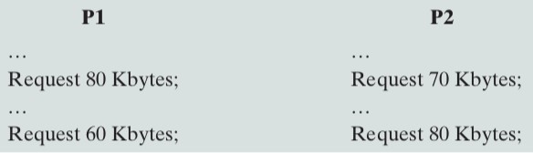

Deadlock occurs if both processes progress to their second request.


#### 5.1.1.2 Deadlock in Consumable Resources

Example: Consider a pair of processes, in which each process attempts to receive a message from the other process and then send a message to the other process. Deadlock occurs if the Receive is blocking (i.e., the receiving process is blocked until the message is received).


Some design errors are often embedded in complex program logic, making it difficult to detect.


### 5.1.2 Resource Allocation Graphs

Resource allocation graph is a useful tool that characterizes the allocation of resources to processes. Directed graph that depicts a state of the system of resources and processes.


### 5.1.3 Conditions for Possible Deadlock

1. Mutual exclusion
   - Only one process may use a resource at a time
   - No process may access a resource unit that has been allocated to another process
2. Hold-and-wait
   - A process may hold allocated resources while awaiting assignment of others
3. No pre-emption
   - No resource can be forcibly removed from a process holding it
4. Circular wait
   - A closed chain of processes exists, such that each process holds at least one resource needed by the next process in the chain
   - This is in fact the definition of deadlock


### 5.1.4 Dealing with Deadlock

Three general approaches exist for dealing with deadlock.

- Deadlock prevention

  Disallow one of the three necessary conditions for deadlock occurrence, or prevent circular wait condition from happening

- Deadlock avoidance

  Do not grant a resource request if this allocation might lead to deadlock

- Deadlock detection

  Grant resource requests when possible, but periodically check for the presence of deadlock and take action to recover


## 5.2 Deadlock Prevention

The main idea of deadlock prevention is to design a system in such a way that the possibility of deadlock is excluded.

Two main methods:

- Indirect - prevent the occurrence of one of the three necessary conditions
- Direct - prevent the occurrence of a circular wait

1. Mutual exclusion
   - If access to a resource requires mutual exclusion, then it must be supported by the OS
2. Hold and wait
   - Require a process request all of its required resources at one time and OS will block the process until all requests can be granted simultaneously
   - Inefficient and may be impractical
3. No preemption
   - If a process hold certain resources is denied a further request, that process must release its original resources and request them again
   - If a process requests a resource that is currently held by another process, the OS may preempt the second process and require it to release its resources
   - Practical only for resources whose state can be easily saved and restored later

4. Circular wait
   - Define a **linear ordering** of resource types: If a process has been allocated resources of type R, then it may subsequently request only those resources of types following R in the ordering
   - Inefficient, slowing down processes and denying resource access unnecessarily


## 5.3 Deadlock Avoidance

A decision is made **dynamically** whether the current resource allocation resource will, **if granted**, potentially lead to a deadlock

- Allows more concurrency than prevention
- Requires knowledge of future process requests

Two types denials:

- Process initiation denial: Do not start a process if its demands might lead to deadlock
- Resource allocation denial: Do not grant an incremental resource request to a process if this allocation might lead to deadlock


### 5.3.1 Process Initiation Denial

A process is only started if the maximum denial (maximum requirement for each resource) of all current processes plus those of the new process can be met by the total amount of resources in the system.

This approach is not optimal because it assumes the worst case that all processes will make their maximum claims together. 


### 5.3.2 Resource Allocation Denial: Banker's Algorithm

Resource allocation denial is referred to as the banker's algorithm, which is a strategy of resource allocation denial.

Consider a system with a fixed number of resources:

- State of the system is the current allocation of resources to processes
- Safe state is one in which there is at least one sequence of resource allocations to processes that does not result in deadlock, i.e., all processes can be run to completion
- Unsafe state is a state that is not safe


Banker's algorithm is used when a process requests for some resources. It tests whether it is a safe state or not provided that this piece of resource is guaranteed.

We need the following variables

1. Claim matrix: $C_{m\times n}$, where $m$ is the number of processes and $n$ is the number of types of resources, representing requirement of process $i$ for resource $j$.
2. Allocation matrix $A_{m\times n}$ representing the current allocation to process $i$ of resource $j$.
3. Resource vector $R$ representing total amount of each resource.
4. Available vector $V$ representing amount of each resource available for allocation.


To determine whether process $i$ can run to completion, we need to know if the resources allocated to it plus remaining resources it needs will still be less than the avaliable resources, that is:
$$
C_{ij}-A_{ij}\le V_j, \text{for all }j
$$
Consider the following example:

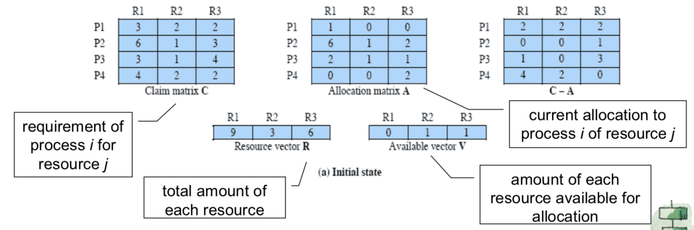

P2 can run to completion, followed by P1, P3, and P4. This is a sequence that the all processes will run to completion. Therefore, it is a safe state.

 

When a process makes a request for a set of resources, OS assumes that the request is granted and update the system state accordingly. Then it determines if the result is a safe state. If so, grant the request. If not, it blocks the process until it is safe to grant the request.


Advantages:

1. Less restrictive than deadlock prevention
2. Not necessary to preempt and rollback processes as in deadlock detection

Restrictions:

1. Maximum resource requirement for each process must be stated in advance
2. Processes under consideration must be independent and with no synchronisation requirements
3. There must be a fixed number of resources to allocate
4. No process may exit while holding resources


## 5.4 Deadlock Detection

While deadlock prevention strategies which limit access to resources and impose restrictions on processes are very conservative, deadlock detection strategies do the opposite, it:

- Resource requests are granted whenever possible
- Regularly check for deadlock


### 5.4.1 A Common Detection Algorithm

Main idea:

- Find and mark a process whose resource requests can be satisfied with the available resources
- Assume that those resources are granted and that the process runs to completion and releases all its resources
- Look for another process to satisfy
- A deadlock exists if and only if there are unmarked processes at the end


We use an allocation matrix and available vector as in the Banker's Algorithm. We also use a request matrix $Q_{m\times n}$, where $Q_{ij}$ indicates that an amount of resource $j$ is requested by process $i$

```pseudocode
unmark all processes
vector(1*n) w = Available
loop until all no process is marked
	for all unmarked process i
		t = w - Q[i,:]
		if all t[j] >= 0
			mark process j
			w = w + A[j]	// A is the allocation matrix
if exists unmarked process
	return deadlocked
```


#### 5.4.1.1 Related Issues

##### 5.4.1.1.1 Timing

A check for deadlock can be made

- As frequently as each resource request
  - Leads to early detection
  - The algorithm is relatively simple
  - Frequent checks consume considerable processor time
- Or check it less frequently, depending on how likely it is for a deadlock to occur


##### 5.4.1.1.2 Recovery Strategies

1. Abort all deadlocked processes
2. Backup (rollback) each deadlocked process to some previously defined checkpoint, and restart all processes. This approach has a risk of deadlock recurring
3. Successively abort deadlocked processes until deadlock no longer exists
4. Successively preempt resources and rollback the preempted process until deadlock no longer exists


## 5.5 Dining Philosophers Problem

This part is omitted.