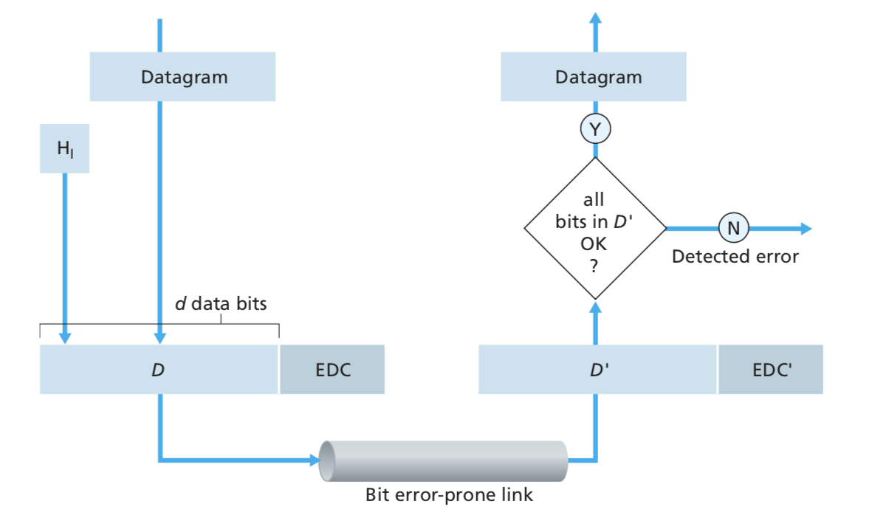
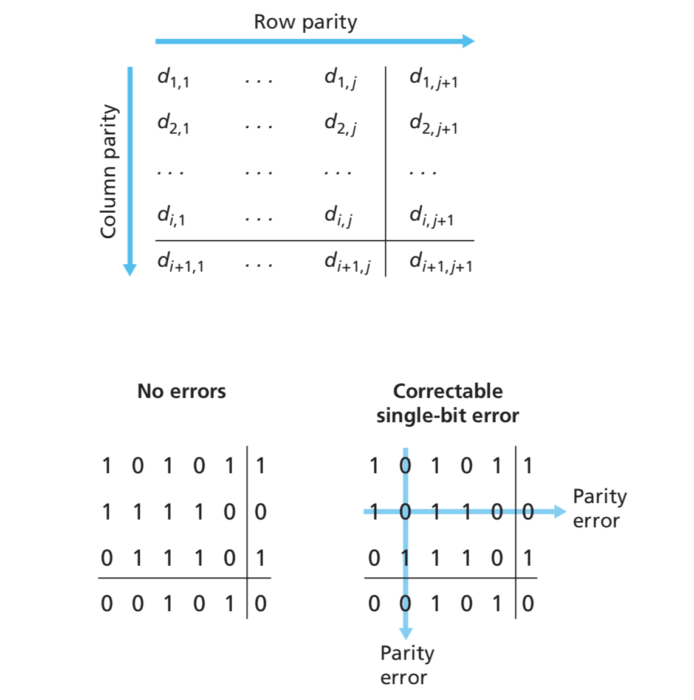
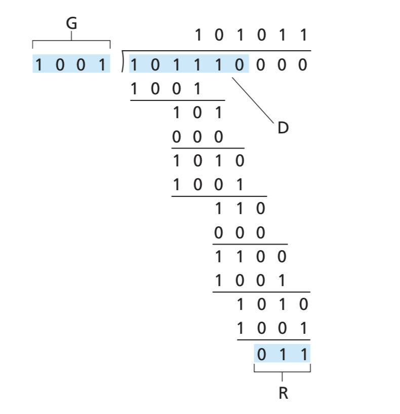
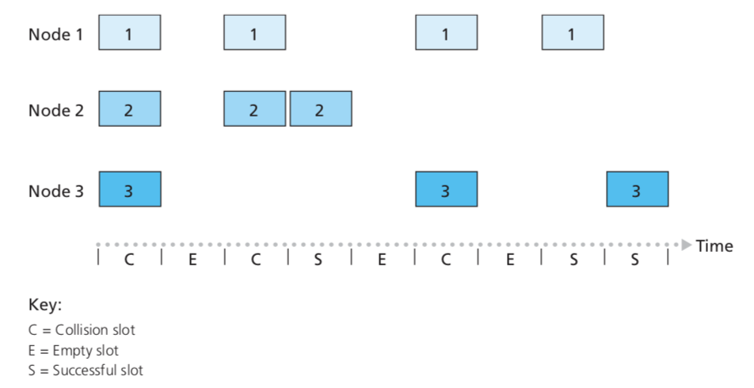

# Week 11-12 -- Link Layer

## Introduction

Links: Communication channels that connect adjacent nodes along communication path. There are wired links and wireless links.

Layer-2 packet: frame, encapsulates diagram

Link layer has responsibility of transferring datagram from one node to a physically adjacent node over a link.

Duties:

- Packetizing
- Addressing
- Error control
- Flow control
- Access control

Link layer is implemented in every network device. It's inside adapters (aka network interface card NIC) or on a chip.

## Error Detection

In the above diagram, EDC = Error Detection and Correction bits (redundancy) and D = Data protected by error checking which may include header files.

Methods: checksum (discussed in UDP), parity check, cyclic redundancy check (CRC).

### Parity checking

#### One-dimensional parity checking

If there are n bits of data. We add an extra redundant bit to let the whole bitstream subject to some parity.

- Even parity: total number of 1 must be even
- Odd parity: total number of 1 must be odd

For example, consider a bitstream 110011, we add an extra bit 0 to make number of 1 even. What will be actually sent out is 110011**0**. If the receiver receives 1100010, the total number of 1 is 3, thus odd. Then the receiver knows that this piece of data is corrupted, it simply discard it.

However, one-dimensional parity checking can neither locate where exactly the error takes place and correct it nor detect even number of errors. Therefore, two-dimensional parity checking is introduced.

#### Two-dimensional parity checking

$d$ bits are divided into $i$ rows and $j$ columns. There will be $i+j+1$ parity bits.

For one-bit error, the error can be corrected; for two-bit error, the error can be detected but cannot be corrected.

### Cyclic Redundancy Check

CRC is a more powerful error-detection coding method. It views data bits $D$ as a binary number. Then, it chooses *r+1* bit pattern as the generator $D$. The goal is to choose r CRC bits $R$ such that $<D,R>$ is divisible by $G$. If the remainder calculated by the reicever is not 0, error will be detected. This method can detect all burst errors less than r+1 bits and is widely used in practice.

Let $P =<D,R>=(D<<r)\oplus R $, if $P$ is divisible by $G$, then $P=nG$, thus $D<<r=nG \oplus R$. This means that the CRC bits $R$ is exactly the remainder of the **XOR division** result of $D<<r$ and $G$. Therefore, if we do the XOR division operation on $D<<r$ and $G$, the remainder is the CRC bits.

Note that the generator is always given by a polynomial, $G=x^7+x^5+x^2+1$ is equivalent with 10100111.

## Multiple Access Links and Protocols

When two or more simultaneous transmissions by nodes is happening, collision will happen if node receives two or more signals at the same time.

Multiple Access Control Protocol: Distributed algorithm that determines how nodes share channel, i.e., determine when nodes can transmit.

There are three broad classes:

1. Channel partitioning
   - Divide channel into smaller "pieces" (time slots, frequency, or code)
   - Allocate a piece to a node for exclusive use
2. Random access
   - Channels are not divided, collisions are allowed
   - Devices can recover from collisions
3. Take turns
   - Nodes take turns, but nodes with more to send can take longer turns

### Channel Partitioning Protocols

1. TDMA: Time Division Multiple Access
   - Access to channel in rounds
   - Each station gets **fixed** length slot in each round
   - Unused slots go idle
2. FDMA: Frequency division multiple access
   - Channel spectrum divided into frequency bands
   - Each station assigned **fixed** frequency band
   - Unused transmission time in frequency bands go idle

### Random Access Protocols

This type of protocols allows nodes to randomly select time to send frames. When a node has packet to send, it transmit at full channel data rate. There is no priori coordination among nodes.

When two or more nodes transmit at the same time, collision happens

Random Access MAC protocol specifies:

- How to detect collisions
- How to recover from collisions

#### Slotted ALOHA

Assumptions:

- All frames have the same size
- Time is divided into equal size slots (time to transmit one frame)
- Nodes start to transmit only at the beginning of a slot
- Nodes are synchronized
- If 2 or more nodes transmit in a slot, all nodes detect collision

Operation:

- When node obtains fresh frame, it transmits in the beginning of the next slot.
- At the end of each slot,
  - if no collision, successful
  - if collision, node retransmits the frame in each subsequent slot with probability $P$ until it's successful

Pros:

- Single active node can continuously transmit at full rate of channel
- Highly decentralised: only slots in nodes need to be synchronized
- Simple

Cons:

- Collisions cause wasted slots
- Idle slots
- Nodes may be able to detect collision earlier than the time to transmit packet
- Clock synchronization

#### Pure ALOHA

Whenever a user has a frame to send, it simply transmits the frame. If data doesn't get through (receiver sends ACK), then retransmit after a random delay. In this way, collision probability will increase.

#### Carrier Sense Multiple Access (CSMA)

Procedure:

- Listen to medium and wait until it is free (no one else is talking)
- Wait a random back off time then start talking

Advantages:

- Fairly simple to implement
- Functional scheme that works

Disadvantages:

- Did not detect collision
- Even if collision happens, the ongoing transmission still keeps going until the transmission finishes. This causes inefficient waste of medium time

#### CSMA/CD (Collision Detection)

- Collisions can be detected within short time.
- Each node listens to the channel while transmitting.
- Colliding transmissions are aborted, thus reducing channel wastage.

The Ethernet CSMA/CD algorithm

1. If NIC senses channel idle, it starts frame transmission. Otherwise, it waits until channel idle and then transmits.
2. If NIC transmits entire frame without detecting another transmission, NIC is done with frame
3. If NIC detects another transmission while transmitting, it aborts and sends jam signal
4. After aborting, NIC enters binary (exponential) backoff.
5. After $m-$th collision, NIC chooses K at random from $\left \{0,1,2,...,2^m-1 \right \}$. NIC waits for K **slots** and returns to Step 1.

Minimum ethernet frame size:

In order that the sender can receive the jam signal before the receiver receives the whole message, a frame must have enough bits to last twice the propagation delay.

IEEE 802.3: The standard minimum frame size is 64 bytes long.

#### MAC Protocols for Wireless Networks

Wireless hosts may be laptop, PDA, IP phone, etc. They run applications and may be stationary (non-mobile) or mobile. Wireless does not always mean mobility.

Base stations are typically connected to **wired network**. They are responsible for sending packets between wired network and wireless hosts in its area.

Wireless links typically used to connect mobiles to base station. Multiple access protocol coordinates link access.

##### Multi-transmitter Interference Problems

- Two transmitting stations will interfere with each other at the receiver if they send data simultaneously.
- The receiver will hear the sum of the two signal (interference)
- Protocols are required to coordinate access (transmitters must take turns)

In wireless networks, collision is hard to detect because transmitted signal is much stronger than received signal due to high path loss in the wireless environment (up to 100dB). Also transmitter may not even have much of a signal to detect due to geometry.

- Hidden station problem: if we apply CSMA, $A\rightarrow B$ and $C\rightarrow B$ simultaneously is possible because A is beyond the area of C. Collision would happen.

  

- Exposed station problem: if we apply CSMA directly, efficiency may not be high. When $B\rightarrow A$, C hears B, C won't send to D. Efficiency will be reduced.

##### Solution: CSMA/CA

Idea: Having a short frame transmitted from both sender and receiver before the actual transfer

1. A sends a short RTS to B with length of L
2. B responds with a CTS to A, whoever hears CTS shall remain silent for the duration of L
3. A sends data to B
4. B sends ACK to A

Advantages:

- Small control frmaes lessen the cost of collisions
- When data is large, the control message overhead to avoid collisions is affordable
- RTS+CTS provide virtual carrier sense which protects against hidden terminal collisions (hidden station problem)

Disadvantages:

- Not as efficient as CSMA/CA

##### Random Contention Access

- Slotted contention period

  - Used by all carrier sense variants
  - Provides random access to the channel

- Operation

  - Each node selects a random back off number $[0, cw]$.
  - If channel stays idle and reaches zero, then transmit
  - If channel becomes active, wait until transmission is over, then start counting again

  

DCF (Distributed coordination Function):

- Random number selected from $[0,cw]$. 
- If $cw$ is too small, there will be large number of collisions with multiple senders (two or more stations reach zero at once)
- If $cw$ is too large, waiting time will be too long
- Optimal $cw$ for known number of contenders & known packet size is computed by minimizing expected time wastage (by both collisions and empty slots)
- When a node fails to receive CTS in response to its RTS, it increases the contention window. In this case, $cw$ is doubled up to an upper bound
- When a node successfully completes a data transfer, it restores $cw$ to $cw_{min}$

### Taking Turns MAC Protocols

While channel partitioning MAC protocols are efficient at high load and random access protocols are efficient at low load (too much collision overhead for high load), taking turns protocols look for best of both sides.

#### Polling:

- Master node invite slave nodes to transmit in turn
- Typically used with dumb slave devices
- Concerns: polling overhead, latency, and failure of master

#### Token Passing

- Control token passed from one node to next sequentially.
- Concerns: Token overhead, latency, and single point of failure (the one with token)

### MAC addresses and ARP

We have learnt 32-bit IP address:

- Network-layer address for interface
- used for layer 3 (network layer) forwarding

MAC (or LAN or physical or Ethernet) address:

- Function: used locally to get frmae from one interface to another physically-connected interface (same network)
- 48 bit MAC address (for most LANs) are burnt in NIC ROM
- Each adapter on LAN has unique LAN address

- MAC address allocation is administered by IEEE
- Manufacturer buys portion of MAC address space to assure uniqueness
- MAC address is portable because one can move LAN card from one LAN to another. However, IP hierarchical address are not portable

#### ARP: Address Resolution Protocol

Question: How to determine interface's MAC address knowing its IP address?

ARP table: each node (host, router) on LAN has a table. IP/MAC address mappings for some LAN nodes are `IP addr, MAC addr, TTL`, where TTL (Time To Live) is the time after which address mapping will be forgotten (typically 20min)

In the same LAN, if A wants to send datagram to B but B's MAC address is not in A's ARP table, A will broadcast an ARP query packet containing B's IP address. In this case, destination MAC address = `FF-FF-FF-FF-FF-FF` and all nodes on LAN receive the ARP query.

Upon receiving ARP packet, B replies (unicast) to A with its MAC address. A saves IP-to-MAC address pair in its ARP table until information becomes old (time out).