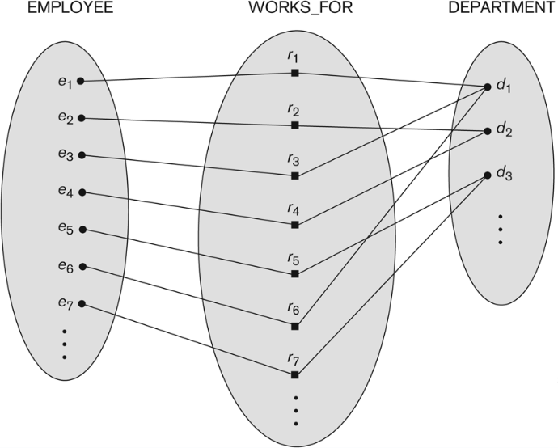
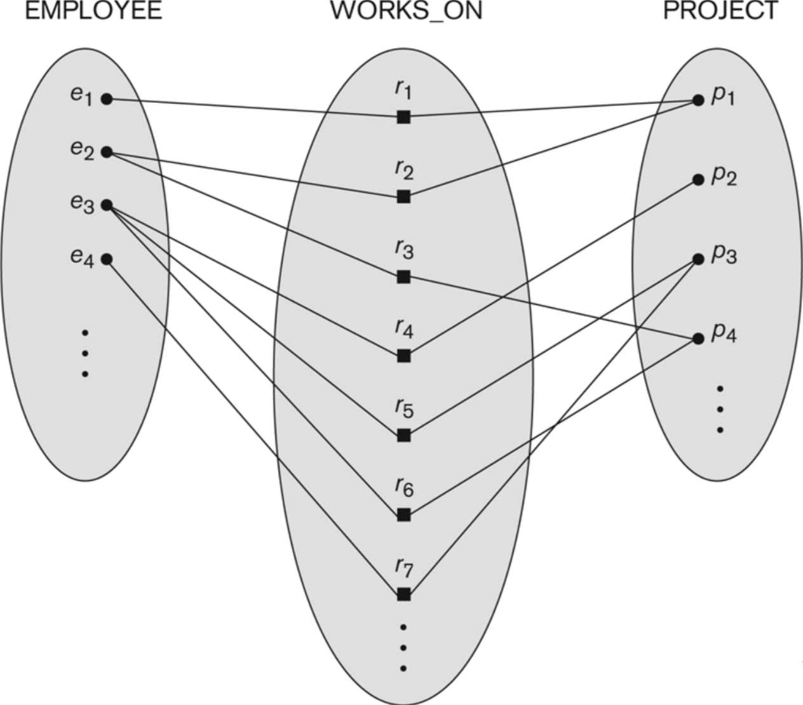
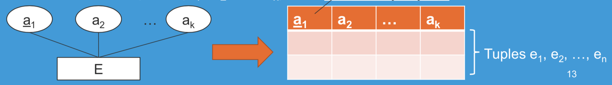
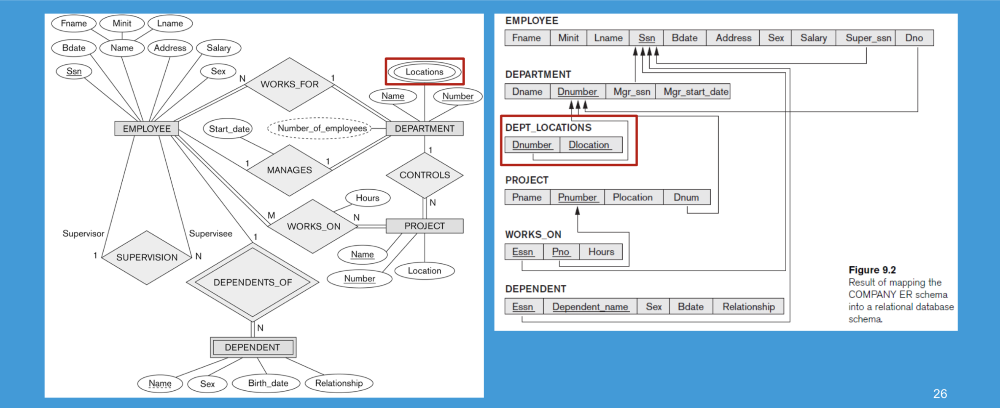

# 1 Lecture 1: Entity-Relationship (ER) Models

## 1.1 Concepts of ER Model

An Entity-Relationship model (ER Model) describes iterrelated things of interest in a specific domain of knowledge.

- A basic ER model is composed of **entity types** (employee/department) and specifies **relationships** that can exist between entities (instances of those entity types).
- An ER model is commonly formed to represent things that a business needs to remember in order to perform business processes.
- Consequently, the ER model becomes an abstract data model, that defines a data or information structure which can be **implemented in a database**, typically a relational database.


## 1.2 Entity, Entity Type and Entity Set

1. Entity: Defined as a thing capable of an independent existence that can be uniquely identified and exists either *physically or logically*.Entities can be thought of as nouns. In relational databases, an entity refers to a single tuple.

   Example: a person exists physically while an order transaction exists logically.

2. Entity type: **defines** a collection of entities that have the same attributes.

3. Entity sets: a set of entities of the same type. In relational databases, an entity set refers to the tuples represented in the same table.


Type is a definition while set is a collection.


## 1.3 Relationship, Relationship Type and Relationship Set

1. Relationship: captures how entities are related to one another. Relationships can be thought of as verbs,  linking two or more nouns.

   Example: a `work_for` relationship between an employee and a department.

2. Relationship type: defines a relationship among entities of certain entity types. Relationship types are useful for capturing or expressing certain business rules.

3. The degree of a relationship type is the number of participating entity types. A binary relationship is a relationship type involving two entity types (degree=2). Ternary (degree=3).

4. Relationship set: a collection of relationships all belonging to one relationship type represented in the database.

   Example: if a relationship type is registration, each enrolment of a student in a course is an instance of registration and appears in the relationship set.

   


## 1.4 Attributes

Both entities and relationships can have attributes. For example, an employee has a Social Security Number (SSN) attribute, while a `work_for` relationship has a start date attribute.

A key attribute is a set of attributes (one or more) that uniquely identify an entity. i.e., no two entities may agree in their values for all of the attributes that constitute a key. For example, SSN is a single key attribute for employees. University ID and student ID are composite attributes to identify a university student in a country because student IDs may not be unique among universities in a country.


### 1.4.1 Types of Attributes

- **A simple attribute** has a single atomic value that does not contain any smaller meaningful components. For example, SSN and gender.

- **A composite attribute** is composed of several components. For example, address contains flat, block, street, city and country. Composition may form a hierarchy where some components are themselves composite.

  

- **A multi-valued attribute** has multiple values. For example, color of a product (red and white) and major of a student (computer science and mathematics).

- Ingeneral, composite and multi-valued attributes may be nested to any number of levels although this is rare. For example, a person can have multiple postal addresses.
- **A derived attribute** is an attribute whose value is calculated from other values. It does not need to be physically stored within the database. Instead, it can be derived by using an algorithm.


### 1.4.2 Value Sets (Domains) of Attributes

Each simple attribute is associated with a value set (or domain).

e.g. 1 data has a value of MM-DD-YYYY, where each letter is an integer.

e.g. 2 course grade has a value of {A+, A, A-, B+, B, B-, C+, C, C-, D, F}.

Value sets are similar to data types (int, double, boolean...) in most programming languages.


## 1.5 Constraints on Relationships

### 1.5.1 Participation Constraints

- Participation constraint indicates the minimum number of relationship instances that an entity can participate in.

- Total participation requires that each entity is involved in the relationship. In other words, an entity must exist related to another entity. In ER model, it is representaed by double lines.

  For example, every employee must work for a department. That is, the participation of employee in `work_for` relationship is total.

- Partial participation means that not all entities are involved in the relationship. Partial participation is represented by single lines in ER model.

  For example, some employees manage departments, i.e., the participation of employee in manage relationship is partial.


### 1.5.2 Cardinality Constraints

Cardinality ratio indicates the maximum number of relationship instances that an entity can participate in:

- A 1:1 relationship from entity type S to entity type T is one in which an entity from S is related to at most one entity from T and vice versa.
- An N:1 relationship from entity type S to entity type T is one in which an entity from T can be related to two or more entities from S.
- An 1:N relationship from entity type S to entity type T is one in which an entity from S can be related to two or more entities from T.
- An N:M relationship from entity type S to entity type T is one in which an entity from S can be related to two or more entities from T, and an entity from T can be related to two or more entities from S.




This is a N:1 relationship between EMPLOYEE and DEPARTMENT because many employees work for the same department.




This is a N:M relationship between EMPLOYEE and PROJECT because many employees work on different projects.


- (min-max) notation for relationship structural constraints:
  - This notation specifies that each entity participates in at least min and at most max relationship instances in a relationship.
  - $0\le min\le max$, $max\ge 1$


One thing we should notice is that for the (min-max) notation, the range is on the side of the object toward the relationship. On the other hand, if we simply put down constraints (1 or N), the side is put in differently. N-1 means that the entity on the left hand side of the relation corresponds to N, which is consistent with the rule of UML diagrams.


## 1.6 Recursive Relationship Type

- A recursive relationship is one in which the same entity participates more than once in the relationship. The relationship should be marked by the role that an entity takes in the participation.
- It is also called a self-referencing relationship type.
- Suppose one employee is assigned the task of supervising the other employees. The supervision relationship is a recursive relationship because the same entity, a particular employee, participates more than once in the relationship, as a supervisor and as a supervisee.


## 1.7 Weak Entity Types

- A weak entity that does not have a key attribute and is identification-dependent on another entity type. It must participate in identifying relationship type with an owner or identifying entity type. In other words, weak entity type must be owned by some owener entity type.
- A weak entity is identified by the combination of: (1) its partial key and (2) the identifying entity type related to the identifying relationship type.
- For example, the EMPLOYEE entity type owns the DEPENDENT entity type.


## 1.8 ER Diagrams

Notations


# 2. Lecture 2: Relational Model

## 2.1 Introduction

- Many database implementations are always based no another approach called the relational model
- A relation looks like a table (row * columns) of values
- A relation contains a set of rows (tuples) and each column (attribute) has a column header that gives an indication of the meaning of the data items in that column
  - Associated with each attribute of a relation is a set of values (domain)
  - Students (SSN: string, Name: string, GPA: double)
- The data elements in each row (tuple) represent certain facts that correspond to a real-world entity or relationship


- The **primary key** uniquely identifies a record in the table and we can have only one primary key in a table, while the **foreign key** is a field in the table that is primary key in another table and we can have more than one forein key in the table.


## 2.2 Basic Structure

- Records
  - Each row/tuple in a relation is a record/tuple (an entity)
  - Each attribute in a relation corresponds to a particular field of a record

In relational model, we will adapt to some terminologies.

| Informal Terms                   | Formal Terms          |
| -------------------------------- | --------------------- |
| Table                            | Relation              |
| Column header                    | Attribute             |
| All possible values for a column | Domain                |
| Row                              | Tuple                 |
| Table definition                 | Schema of a relation  |
| Populated table                  | State of the relation |

 

## 2.3 Relation State

- Each populated relation has many records or tuples in its current relation state
- Whenever the database is changed, a new state arises
- Basic operations for changing the database:
  - Insert -- add a new tuple in a relation
  - Delete -- remove an existing tuple from a relation
  - Update -- modify an attribute of an existing tuple


## 2.4 Characteristics of Relations

- The tuples are not considered to be ordered, even though they appear to be in a tabular form (may have different presentation orders)
- Therefore, the relation state remains the same even if order of tuples is different
- Values in a tuple
  - All values are considered atomic (indivisible): therefore surname and first name should be seperated as two attributes
  - Basic unit for manipulation
- Each value in a tuple must be from the domain (set of values) of the attribute for that column
- A special null value is used to represent values that are unknown or not available or inapplicable in certain tuples


## 2.5 From ER Diagrams to Relations

1. Step 1: Mapping of strong entity types

   - For each regular entity type E, create a relation R that includees all the simple attributes of E, and choose one of the key attributes E as the primary key for R.
   - R is called an entity relation. Each tuple in R represents an entity instance.
   - For example, entity E with k simple attributes $a_1, a_2, ..., a_k$, where $a_1$ is a key attribute, and entity set $\left\{ e_1, e_2, ..., e_k \right\}$.

   


2. Step 2: Mapping of Weak Entity Types

   - For each weak entity type, 
     - create a relation R and includes all the simple attributes of the entity type as the attributes of R (same as in step 1)
     - include the **primary key attribute** of the owner as the foreign key attributes of R
     - the primary key of R is the combination of the **primary key of the owner** and the **partial key of the weak entity type**.

   

3. Step 3: Mapping of Binary 1:1 Relationship Types

   - For each binary 1:1 relationship type, identify relations that correspond to the entity types participating in R.
   - We have three possible approaches
     - Foreign key approach
     - Merged relationship approach
     - Cross reference or relationship relation approach
   - a) Foreign key approach (with relations between S and T)
     - Choose one of the relations S and include the primary key of T as the foreign key in S
     - Include all the simple attributes of the relationship as the attributes of S
   - b) Merged relationship approach
     - Merge the two entity types and the relationship into a single relation
   - Cross reference or relationship relation approach (with relations S and T)
     - Set up a third relation R for the purpose of cross-referencing the primary keys of the two relations S and T representing the entiy types
     - Relation R will include the primary key attributes of S and T as foreign keys to S and T respectively
     - The primary key of R will be one of the two foreign keys
     - Add the simple attributes of the original relationship to R
   - Note that all approaches include the following: **let the primary key of one or both of the entity be a foreign key**, and **add the simple attributes of R to whatever produced**

   

4. Step 4: Mapping of Binary 1:N relationship types

   - Identify relation S that represents participating entity type at **N-side** of relationship type
   - Include the primary key of relation T as the foreign key in S
   - Include the simple attributes of the 1:N relationship type as the attributes of S

   Alternative approach:

   - Use the relationship relation (cross-reference) option as in the third approach for binary 1:1 relationship, but the primary key of R will be two foreign key of **both** involving entities.

   

5. Step 5: Mapping of Binary M:N relationship types

   - Create a new relation R
   - Include as the primary key of the participating entity types as the foriegn key attributes in R
   - The combination of all the foreign key attributes form the primary keys of R
   - Include all the simple attributes of M:N relationship type

   (Same as the alternative approach in step 4)

   

6. Step 6: Mapping of Multivalued Attributes

   - For each multivalued attribute A

     - Create a new relation R
     - Primary key of R is the combination of A and the primary key attribute of the relation that represents the entity type or relationship that has A as a multivalued attribute.
     - If the multivalued attribute is composite, include its simple components

     

7. Step 7: Mapping of N-ary Relationship Types

   - For each n-ary relationship R
     - Create a new relaiton S to represent R
     - Include primary keys of participating entiy types as foreign keys
     - Include all the simple attributes of R as the attributes of S
     - The primary key of S is a **combination of all the foreign keys** that reference the relations representing the participating entity types

- Summary

| ER Model                     | Relational Model                           |
| ---------------------------- | ------------------------------------------ |
| Entity type                  | Entity Relation                            |
| 1:1 or 1:N relationship type | Foreign key (or relaitonship relation)     |
| M:N relationship type        | Relationship relation and two foreign keys |
| N-ary relationship type      | Relationship relation and n foreign keys   |
| Simple attribute             | Attribute                                  |
| Composite attribute          | Set of simple component attributes         |
| Multivalued attribute        | Relation and foreign key                   |
| Value set                    | Domain                                     |
| Key attribute                | Primary key                                |

- Example of a typical conversion

  


# 3 Lecture 3: Structural Query Language (SQL)

Resource for this lecture: [Fundamentals of Database Systems, Chapter 4-5](https://www.amazon.com/Fundamentals-Database-Elmasri-Navathe-Shamkant/dp/933258270X/ref=sr_1_1?ie=UTF8&qid=1548904565&sr=8-1&keywords=fundamentals+of+database+systems.+7th+edition)

Advantages of using SQL:

- Easy conversion among different kinds of database systems
- Provides a higher-level declarative language interface to which users only specifies what the result is to be. The actual optimization and decisions on how to execute the query is left to DBMS.


SQL is a comprehensive database language with:

- Statements for data definitions, queries, and updates
- Facilities for defining views on the database, for specifying security and authorisation, for defining integrity constraints, and for specifying transaction controls
- Rules for embedding SQL statements into a general-purpose programming language

 

<!--more-->

## 3.1 SQL Data Definition and Data Types

### 3.1.1 Schema and Catalog Concepts

An SQL schema is identified by:

- A schema name
- An authorization identifier: indicates the user or account who owns the schema
- Descriptors for each element
- Elements: tables, constraints, views, domains, and other constructs that describes the schema


 A schema is created using `CREATE` statement. Name and authorization identifier must be included.

```mysql
CREATE SCHEMA COMPANY AUTHORIZATION 'Jsmith'
```


### 3.1.2 The CREATE TABLE Command

The `CREATE TABLE` command is used to specify a new relation by giving it a name and specifying its attributes and initial constraints.

The relations declared through this command are called base tables which means that the relation and its tuples are actually created and stored as a file by the DBMS.


Example:

```mysql
CREATE TABLE EMPLOYEE
( Fname VARCHAR(15)
Minit CHAR,
Lname VARCHAR(15) Ssn CHAR(9)
Bdate DATE,
Address VARCHAR(30), Sex CHAR,
Salary DECIMAL(10,2), Super_ssn CHAR(9),
Dno INT
NOT NULL, NOT NULL,
NOT NULL,
NOT NULL,
PRIMARY KEY (Ssn),
FOREIGN KEY (Super_ssn) REFERENCES EMPLOYEE(Ssn), FOREIGN KEY (Dno) REFERENCES DEPARTMENT(Dnumber) );
CREATE TABLE DEPARTMENT
( Dname VARCHAR(15)
Dnumber INT Mgr_ssn CHAR(9) Mgr_start_date DATE,
NOT NULL, NOT NULL, NOT NULL,
PRIMARY KEY (Dnumber),
UNIQUE (Dname),
FOREIGN KEY (Mgr_ssn) REFERENCES EMPLOYEE(Ssn) );
CREATE TABLE DEPT_LOCATIONS
( Dnumber INT NOT NULL,
Dlocation VARCHAR(15) NOT NULL, PRIMARY KEY (Dnumber, Dlocation),
FOREIGN KEY (Dnumber) REFERENCES DEPARTMENT(Dnumber) );
CREATE TABLE PROJECT
( Pname VARCHAR(15)
Pnumber INT
Plocation VARCHAR(15), Dnum INT
NOT NULL, NOT NULL,
NOT NULL,
PRIMARY KEY (Pnumber),
UNIQUE (Pname),
FOREIGN KEY (Dnum) REFERENCES DEPARTMENT(Dnumber) );
CREATE TABLE WORKS_ON ( Essn
Pno
CHAR(9) NOT INT NOT DECIMAL(3,1) NOT
NULL, NULL, NULL,
NULL, NULL,
Hours
PRIMARY KEY (Essn, Pno),
FOREIGN KEY (Essn) REFERENCES EMPLOYEE(Ssn), FOREIGN KEY (Pno) REFERENCES PROJECT(Pnumber) );
CREATE TABLE DEPENDENT ( Essn
Dependent_name Sex
Bdate Relationship
CHAR(9) NOT VARCHAR(15) NOT CHAR,
DATE,
VARCHAR(8), PRIMARY KEY (Essn, Dependent_name),
FOREIGN KEY (Essn) REFERENCES EMPLOYEE(Ssn) );
```


## 3.2 Basic Retrieval Queries in SQL

Important note: SQL allows a table (relation) to have two or more tuples that are identical in all their attribute values. Hence, in general, an SQL table is a **multiset of tuples** instead of a set of tuples.


### 3.2.1 `SELECT-FROM-WHERE` Structure of Basic SQL Queries

Basic format:

```mysql
SELECT <attribute list>
FROM <table list>
WHERE <condition>;
```

where

- attribute list is a list of attribute names whose values are to be retrieved by the query.
- table list is a list of relation names required to process the query.
- condition is a conditional boolean expression that identifies the tuples to be retrieved by the query.


*Query 0*: Retrieve the birth date and address of the employee(s) whose name is 'John B. Smith'.

```mysql
SELECT Bdate, Address
FROM EMPLOYEE
WHERE Fname = 'John' AND Minit = 'B' AND Lname = 'Smith'
```

The query selects the individual EMPLOYEE tuples that satisfy the condition of the WHERE clause, then *projects* the result on the Bdate and Address attributes listed in the SELECT clause.

Therefore, attributes specified by the SELECT clause are called projection attributes and those specified by the `WHERE` clause are called selction condition.


*Query 1*: Retrieve the name and address of all employees who work for the 'Research' department

```mysql
SELECT Fname, Lname, Address
FROM EMPLOYEE, DEPARTMENT
WHERE Dname = 'Research' AND Dnumber = Dno;
```

The condition `Dnumber = Dno` is a join condition because it combines two tuples. A query that involves only selection and join conditions plus projection attributes is known as a select-project-join query.


*Query 2*: For every project located in "Stafford", list the project number, the controlling department number, and the department manager's last name, address, and birth date.

```sql
SELECT Pnumber, Dnum, Lname, Address, Bdate
FROM PROJECT, DEPARTMENT, EMPLOYEE
WHERE Dnum = Dnumber AND Mgr_ssn = Ssn AND Plocation = 'Stafford';
```


### 3.2.2 Ambiguous Attribute Names, Aliasing, Renaming, and Tuple Variables

To prevent naming conflict, we must qualify the attribute name with the relation name when some attributes in different relations have the same name. The process is called prefixing.

Q1A:

```sql
SELECT Fname, EMPLOYEE.Name, Address
FROM EMPLOYEE, DEPARTMENT
WHERE DEPARTMENT.Name = 'Research' AND DEPARTMENT.Dnumber = EMPLOYEE.Dnumber
```

We may define **alias** to save some typing.

*Query 8*: For each employee, retrieve the employee's first and last name and first and last name of his or her immediate supervisor.

```sql
SELECT E.Fname, E.Lname, S.Fname, S.Lname
FROM EMPLOYEE AS E, EMPLOYEE AS S
WHERE E.Super_ssn = S.ssn;
```

Note that we must use prefixing here because the query refers to the same relation twice.

It is also possible to rename the relation attributes within the query in SQL by giving them aliases. For example, if we write 

```sql
EMPLOYEE AS E(Fn, Mi, Ln, Ssn, Bd, Addr, Sex, Sal, Sssn, Dno)


```

in the FROM clause, every attribute will have its own alias.


### 3.2.3 Unspecified WHERE Clause and Use of the Asterisk

A missing WHERE clause indicates no condition on tuple selection -- all tuples of the relation specified in the FROM clause qualify and are selected for the query result.

If more than one relation is specified in the FROM clause and there is no WHERE clause, then the CROSS PRODUCT - all possible tuple combinations - of these relations is selected.


To retrieve all the attribute values of the selected tuples, we do not have to list the attribute names explicitly in SQL; we just specify an asterisk (*), which stands for all the attributes.

Examples:

```sql
SELECT *
FROM EMPLOYEE
Dno = 5;


```

```sql
SELECT *
FROM EMPLOYEE, DEPARTMENT
WHERE Dname = 'Research' AND Dno = Dnumber;


```

```sql
SELECT *
FROM EMPLOYEE, DEPARTMENT;


```


### 3.2.4 Tables as Sets in SQL

Keyword DISTINCT is used in the SELECT clause to remove duplicate tuples from the result of an SQL query, whereas SELECT ALL does not, which is the default option.


*Query 11*: Retrieve the salary of every employee (Q11) and all distinct salary values (Q11A)

Q11

```sql
SELECT ALL Salary
FROM EMPLOYEE;


```

Q11A

```sql
SELECT DISTINCT Salary
FROM EMPLOYEE;


```


We can apply set operations UNION, EXCEPT, INTERSECT to the SELECT statements of SQL queries. Each statement should contain the same set of attributes.


*Query 4*: Make a list of all project numbers for projects that involve an employee whose last name is 'Smith', either as a worker or as a manager of the department that controls the project.

```sql
(SELECT DISTINCT Pnumber
 FROM EMPLOYEE, PROJECT, WORKS_ON
 WHERE Pnumber = Pno AND Essn = Ssn AND Lname = 'Smith')
 UNION
(SELECT DISTINCT Pnumber
 FROM EMPLOYEE, PROJECT, DEPARTMENT
 WHERE Dnumber = Dno AND Mgr_ssn = Ssn AND Lname = 'Smith');


```

SQL has provided corresponding multiset operations: UNION ALL, EXCEPT ALL, INTERSECT ALL, whose results are multisets so that duplicates are not eliminated.


### 3.2.5 Substring Pattern Matching and Arithmetic Operators

LIKE comparison operator is used for pattern matching in SQL:

- % replaces an arbitrary number of zero or more characters
- underscore (_) replaces a single character

*Query 12*: Retrieve all employees whose address is in Houston, Texas

```sql
SELECT Fname, Lname
FROM EMPLOYEE
WHERE Address LIKE '%HOUSTON,TX%';

```

*Query 12A*: Find all employees who were born during the 1950s

```SQL
SELECT Fname, Lname
FROM EMPLOYEE
WHERE Bdate LIKE '__5_______';

```


### 3.2.6 ORDER BY Clause

- The ORDER BY clause is used to sort the records in your result set. The ORDER BY clause can only be used in SELECT statements.

Example 1: List in alphabetic order all customers having a loan at Kowloon branch:

```sql
SELECT DISTINCT cname
FROM Borrow
WHERE bname = "Kowloon"
ORDER BY cname;

```

Example 2: List the entire borrow table in descending order of amount, and if several loans have the same amount, order them in ascending order by loan#:

```sql
SELECT *
FROM Borrow
ORDER BY amount DESC, loan# ASC;

```


### 3.2.7 INSERT Statement

The INSERT statement is used to insert a single record or multiple records into a table.

- Insert a single record using the VALUES keyword

  ```SQL
  INSERT INTO suppliers
  (supplier_id, supplier_name)
  VALUES
  (5000, 'Apple');
  
  ```

- Insert multiple records using a SELECT statement

  ```sql
  INSERT INTO suppliers (supplier_id, supplier_name)
  SELECT account_no, name
  FROM customers
  WHERE customer_id > 5000;
  
  ```

  

### 3.2.8 DELETE Statement

The DELETE statement is used to delete a single record or multiple records from a table.

The syntax is:

```sql
DELETE FROM table
WHERE [conditions];

```

- Table: the table that you wish to delete records from
- WHERE conditions: Optional. The conditions that must be met for the records to be deleted. If no conditions are provided, then all records from the table will be deleted.

Example: Delete all records from the employee table where the first_name is Bob.

```sql
DELETE FROM employee
WHERE first_name = "Bob";

```


### 3.2.9 UPDATE Statement

The UPDATE statement is used to update existing records in a table.

Example 1: Update the last_name to "Bob" in the employee table the employee_id is 123.

```sql
UPDATE employee
SET last_name = "Bob"
WHERE employee_id = 123;

```

Example 2: Increase the payment by 5% to all accounts. It is applied to each tuple exactly once.

```sql
UPDATE deposit
SET balance = balance * 1.5;

```

Example 3: Increase the payment by 6% to all accounts with balance over $10000; all others receive 5% increase

```sql
UPDATE Deposit
SET balance = balance * 1.06 WHERE balance > 10000;
UPDATE Deposit
SET balance = balance * 1.05 WHERE balance <= 10000;

```


## 3.3 Advanced Queries in SQL

### 3.3.1 Nested Queries and Set Comparisons

- Nest queries
  - SELECT-FROM-WHERE blocks WHERE clause of another query
  - For example, some queries require that existing values in the database be fetched and then used in a comparison condition
- Comparison operator IN
  - Compares value v with a set (or multiset) of values V
  - Evaluate to TRUE if v is one of the elements in V

Recall *Query 4*: Make a list of all project numbers for projects that involve an employee whose last name is 'Smith', either as a worker or as a manager of the department that controls the project.

We can use the above syntax to rewrite the same query:

```sql
SELECT DINSTINCT Pnumber
FROM PROJECT
WHERE Pnumber IN
	(SELECT Pnumber
     FROM PROJECT, DEPARTMENT, EMPLOYEE
     WHERE Dnum = Dnumber AND Mgr_ssn = Ssn AND Lname = 'Smith')
    OR
    (SELECT Pno
     FROM WORKS_ON, EMPLOYEE
     WHERE Essn = Ssn AND Lname = 'Smith');

```


Multiple values should be placed within parentheses for comparisons

Example: Select the Essn of all employees who work the same `(project, hours)` as the employee Essn = "123456789"

```sql
SELECT DINSTINCT Essn
FROM WORK_ON
WHERE (Pno, Hours) IN (SELECT Pno, Hours
                       FROM WORKS_ON
                       WHERE Essn = "123456789");

```


Other comparison operators can also be used to compare a single value v.

- = ANY or =SOME returns TRUE if the value v is equal to some value in the set V and is hence equivalent to IN
- =ALL returns TRUE if the value v is equal to all the values in the set V (v is the only element in set V)
- Other operators such as >, >=, <, <=, and <>(not equals) can be combined

Example 1: Find the last name and first name of the employees with salary higher than all the employees in the department with Dno=5

```sql
SELECT Lname, Fname
FROM EMPLOYEE
WHERE Salary > ALL (SELECT salary,
                   	FROM EMPLOYEE,
                   	WHERE Dno = 5);

```


Example 2: Find names of all branches that have higher assets than some branch located in Central

```sql
SELECT bname
FROM Branch
WHERE assets > SOME (SELECT assets
                   	 FROM Branch
                     WHERE b-city = "Central");

```

Alternatively, we can avoid using nested queries by aliasing

```sql
SELECT X.bname
FROM Branch X, Branch Y
WHERE X.assets > Y.assets AND Y.b-city = "Central";

```


Example 3: Find all customers who have an account at some branch in which Jones has an account

```sql
SELECT DISTINCT T.cname
FROM Deposit T
WHERE T.cname != "Jones"
		AND T.bname IN (SELECT S.bname
                       	FROM Deposit S
                       	WHERE S.cname = "Jones");

```


### 3.3.2 EXISTS Condition

- The EXISTS condition is used in combination with a nested query and is considered "to be met" if the nested query returns at least one row.
- The NOT EXISTS condition is used in combination with a nested query and is considered "to be met" if the nested query returns empty result.

Example 1: Find all customers of Central branch who have an account there but no loan there

```sql
SELECT C.name
FROM Customer C
WHERE EXISTS
			(SELECT *
             FROM Deposit D
             WHERE D.cname = C.cname
            	AND D.bname = "Central")
AND NOT EXISTS
			(SELECT *
             FROM Borrow B
             WHERE B.cname = C.cname
            	AND B.bname = "Central");

```


Example 2: Find branches having greater assets than all branches in N.T.

```sql
SELECT X.bname
FROM Branch X
WHERE NOT EXISTS (SELECT *
                  FROM Branch Y
                  WHERE Y.b-city = "N.T."
                 	AND Y.assets >= X.assets);

```


Example 3: Find all customers who have a deposit account at ALL branches located in Kowloon

```sql
SELECT DISTINCT S.cname
FROM Deposit S
WHERE NOT EXISTS ((SELECT bname
                   FROM Branch
                   WHERE b-city = "Kowloon") -- all branches in Kowloon
           		Minus
           		 (SELECT T.bname
                  FROM Deposit T
                  WHERE S.cname = T.cname)); -- branches where S has an account

```


### 3.3.3 Aggregate Functions

- Built-in aggregate functions: COUNT, SUM, MAX, MIN and AVG
- Used to summarize information from multiple tuples into a single tuple

Example 1: Find the sum of the salaries of all employees, the maximum salary, the minimum salary, and the average salary

```sql
SELECT SUM(Salary), MAX(Salary), MIN(Salary), AVG(Salary)
FROM EMPLOYEE;

```


Example 2: Find the sum of the salaries of all employees of the "Research" department, as well as the maximum salary, the minimum salary, and the average salary in this department

```sql
SELECT SUM(Salary), MAX(Salary), MIN(Salary), AVG(Salary)
FROM EMPLOYEE, DEPARTMENT
WHERE Dno = Dnumber AND Dname = "Research";

```


Example 3: Retrieve the total number of employees in the company

```sql
SELECT COUNT(*) -- count(*) returns the number of rows
FROM EMPLOYEE;

```


Example 4: Retrieve the total number of employees in the "Research" department

```sql
SELECT COUNT(*)
FROM EMPLOYEE, DEPARTMENT
WHERE Dno = Dnumber AND Dname = "Research";

```


Example 5: Count the number of distinct salary values in the database

```sql
SELECT COUNT(DISTINCT Salary)
FROM EMPLOYEE;

```


Example 6: Retrieve the names of all employees who have two or more dependents

```sql
SELECT Lname, Fname
FROM EMPLOYEE
WHERE (SELECT COUNT(*)
       FROM DEPENDENT
       WHERE SSN=ESSN)>=2

```


### 3.3.4 GROUP BY Clause

- We can apply the aggregate functions to subgroups of tuples in a relation based on some attribute values. For example, find the average salary of employees in each department.
- Grouping the tuples that have same value of some attributes, called the grouping attributes, and the aggregate function is applied to each subgroup independently.
- SQL has the GROUP BY clause for this purpose.
- The GROUP BY clause specifies the grouping attributes, which should also appear in the SELECT clause, so that the value resulting from applying each function to a group of tuples appears along with the value of the grouping attributes.


Example 1: For each department, retrieve the department number, the number of employees in the department, and their average salary.

```sql
SELECT Dno, COUNT(*), AVG(Salary)
FROM EMPLOYEE
GROUP BY Dno
```


Example 2: For each project, retrieve the project number, the project name, and the number of employees who work on that project

```sql
SELECT Pnumber, Pname, COUNT(*)
FROM PROJECT, WORK_ON
WHERE Pnumber = Pno
GROUP BY Pnumber, Pname
```


# 4 Lecture 4: Relational Algebra

## 4.1 Overview

### 4.1.1 What is Relational Algebra?

- Relational algebra is a formal language for the relational model
- The operations in relational algebra enable a user to specify basic retrieval requests (or queries)
- Relational algebra consists of a set of operations on relations to generate relations
- The result of an operation is a new relation that can be further manipulated using operations
- A sequence of relational algebra operations forms a relational algebra expression


### 4.1.2 Importance of Relational Algebra

- Relational algebra provides a formal foundation for relational model
- It is used as a basis for implementing and optimizing queries in query processing and optimization
- Its concepts are incorporated into SQL standard language for relational database management systems
- The internal modules of most commercial RDBMS are based on relational algebra


### 4.1.3 Operations

- Relational algebra consists of several groups of operations
- Unary Relational Operations
  - SELECT (symbol: $\sigma$ (sigma))
  - PROJECT (symbol: $\pi$ (pi))
  - RENAME (symbol: $\rho$ (rho))
- Relational algebra operations from set theory
  - UNION ($\cup​$), INTERSECTION ($\cap​$), DIFFERENCE ($-​$)
  - CARTESIAN PRODUCT ($\times$)
- Binary Relational Operations
  - JOIN (several variations of JOIN exist)
  - DIVISION
- Additional Relational Operations
  - OUTER JOINS, OUTER JOIN
  - AGGREGATE FUNCTIONS (These compute summary of information: for example, SUM, COUNT, AVG, MIN, and MAX)


## 4.2 Unary Relational Operations

### 4.2.1 SELECT

The SELECT operation (denoted by $\sigma$) is used to select a subset of the tuples from a relation based on a selection condition

- The selection conditions acts as a filter to keep only those tuples that satisfy the qualifying condition
- Horizontal partitioning: Tuples satisfying the condition are selected whereas the other tuples are discarded (filtered out)


Examples:

1. Select the EMPLOYEE tuples whose department number is 4:

   $\sigma_{DNO=4}(EMPLOYEE)$

   It is equivalent to the sql statement:

   ```sql
   SELECT *
   FROM EMPLOYEE
   WHERE DNO = 4;
   ```

2. Select the employee tuples whose salary is greater than $30,000

   $\sigma_{SALARY>30,000}(EMPLOYEE)$

   It is equivalent to the sql statement:

   ```sql
   SELECT *
   FROM EMPLOYEE
   WHERE SALARY > 30000;
   ```


- The SELECT operation $\sigma_{\text{<selection  condition>}}(R)$ produces a relation S that has the same schema (i.e., same attributes) as R

- SELECT $\sigma$ is commutative:

  $\sigma_{\text{<condition1>}}(\sigma_{\text{condition2}}(R))=\sigma_{\text{condition2}}(\sigma_{\text{condition1}}(R))​$

- Because of commutatively property, a sequence of SELECT operations may be applied in any order

- A cascade of SELECT operations may be replaced by a single selection with a conjunction (and) of all the conditions:

  $\sigma_{\text{<condition1>}}(\sigma_{\text{<condition2>}}(\sigma_{\text{<condition3>}}(R)))=\sigma_{\text{<cond1>}AND\text{<cond2>}AND\text{<cond3>}}(R)$

- The number of tuples in the result of a SELECT operation is less than (or equal to) the number of tuples in the input relation R

- The fraction of tuples selected by a selection condition is called the selectivity of the condition


### 4.2.2 PROJECT

PROJECT operation is denoted by $\pi$

This operation keeps certain attributes from a relation and discards the other attributes

- PROJECT creates a vertical partitioning: the list of specified attributes is kept in each tuple and the other attributes in each tuple are discards


Example: To list each employee's first and last name and salary, the following is used:

- $\pi_{LANAME,FNAME,SALARY}(EMPLOYEE)$

  This is equivalent to the sql query:

  ```sql
  SELECT LNAME, FNAME, SALARY
  FROM EMPLOYEE;
  ```


The general form of the project operation is: $\pi_{\text{<attribute list>}}(R)$. The attribute list is the desired list of attributes from relation R

The project operation removes any duplicate tuples

- This is because the result of the project operation must be a set of tuples
- Mathematical sets do not allow duplicate elements


- The number of tuples in the result of projection $\pi_{<list>}(R)$ is always less (duplicates are removed) or equal (unique vales) to the number of tuples in R
- If the list of attributes includes a key of R, then the number of tuples in the result of PROJECT is equal to the number of tuples in R
- PROJECT is not commutative
  - $\pi_{<list1>}(\pi_{<list2>}(R))\ne \pi_{<list2>}(\pi_{<list1>}(R))$
  - $\pi_{<list1>}(\pi_{<list2>}(R))=\pi_{<list1>}(R)$ as long as list2 contains the attributes in list1

### 4.2.3 RENAME

The RENAME operator is denoted by $\rho$

The general RENAME operation $\rho$ can be expressed by any of the following forms:

- $\rho_{S(B_1,B_2,…,B_n)}(R)​$ changes both the relation name to S and the attribute names only to $B_1, B_2, …,B_n​$
- $\rho_S(R)$ changes the relation name only to S
- $\rho_{(B_1,B_2,…,B_n)}(R)$ changes the attribute names only to $B_1, B_2, …,B_n$

The first rename operator is equivalent to the following sql query:

```sql
SELECT E.Fname AS F_Name, E.Lname AS L_Name, E.Salary AS Salary
FROM EMPLOYEE AS E
WHERE E.Dno = 5
```


For convenience, we also use a shorthand for renaming attributes in an intermediate relation:

1. If we write:

   $RESULT\leftarrow \pi_{FNAME,LNAME,SALARY}(\text{DEP5_EMPS})​$

   RESULT will have the same attribute names as DEP5_EMPS (same attributes as EMPLOYEE)

2. If we write

   $RESULT\leftarrow \rho_{RESULT(F,M,L,B,A,SX,SAL,SU,DNO)}(\text{DEP5_EMPS})$

   The 10 attributes of DEP5_EMPS are renamed to F, M, L, S, B, A, SX, SAL, SU, DNO, respectively


## 4.3 Relational Algebra Expressions

- We may want to apply several relational algebra operations one after another
  - Either we can write the operations as a single relational algebra expression by nesting the operations, or
  - We can apply one operation at a time and create intermediate result relations
- In the latter case, we must give names (rename) to the relations that hold the intermediate results


Example: Retrieve the first name, last name, and salary of all employees who work in department number 5, we must apply a select and a project operation

Method 1: We can write a single relational algebra expression as follows:

$\pi_{FNAME, LNAME, SALARY}(\sigma_{DNO=5}(EMPLOYEE))$

Method 2: Or, we can explicitly shoow the sequence of operations, giving a name to each intermediate relation:

$\text{DEP5_EMPS}\leftarrow \sigma_{DNO=5}(EMPLOYEE)$

$RESULT\leftarrow \pi_{FNAME, LNAME, SALARY}(\text{DEPS5_EMPS})$


## 4.4 Relational Algebra Operations from Set Theory

### 4.4.1 UNION

UNION is a binary operation, denoted by $\cup$. 

- The result of $R\cup S$ is a relation that includes all tuples that are either in R or in S or in both R and S

- Duplicated tuples are eliminated
- The two operand relations R and S **must be type compatible**. That is,
  - R and S must have same number of attributes
  - Each pair of corresponding attributes must be type compatible (have same or compatible domains)


Example: Retrieve the social security numbers of all employees who either work in department 5 or directly supervise an employee who works in department 5

Solution: We use the follwing expression
$$
\text{DEP5_EMPS}\leftarrow \sigma_{DNO=5}(EMPLOYEE) \\
RESULT1\leftarrow = \pi_{SSN}(\text{DEP5_EMPS}) \\
RESULT2(SSN)\leftarrow = \pi_{SUPERSSN}(\text{DEP5_EMPS}) \\
RESULT = RESULT1\cup RESULT2
$$


Note that type compatibility of operands is required for the binary set operation UNION, INTERSECTION, and SET DIFFERENCE. The result of $R1\cup R2$ has the same attribute names as the first operand relation R1


### 4.4.2 INTERSECTION

INTERSECTION is denoted by $\cap$

- The result of the operation $R\cap S$, is a relation that includes all tuples that are in both R and S
  - Similarly, the attribute names in the result will be the same as the attribute names in R
- The two operand relations R and S must be "type compatible"


### 4.4.3 SET DIFFERENCE

SET DIFFERENCE (sometimes also refers to MINUS or EXCEPT) is denoted by $-$

- The result of $R-S$, is a relation that includes all tuples that are in R but not in S
  - The attribute names in the result will be the same as the attribute names in R
- The two operand relations R and S must be "type compatible"
- $R\cap S=(R\cup S)-(R-S)-(S-R)​$


### 4.4.4 Properties

- Both UNION and INTERSECTION are commutative operations
- Both union and intersection can be treated as n-ary operations applicable to any number of relations as both are associative operations
- The minus operation is not commutative


### 4.4.5 CARTESIAN(CROSS) PRODUCT

The operation is used to combine tuples from two relations in a combinatorial fashion

- Denoted by $R(A_1,A_2,…,A_n)\times S(B_1,B_2,…,B_m)$

- Result is a relation Q with degree n+m attributes $Q(A_1,…,A_n,B_1,…,B_m)$

- The resulting relation state has one tuple for each combination of tuples - one from R and one from S
- Hence, if R has $n_R$ tuples and S has $n_S$ tuples, then $R\times S$ will have $n_R\cdot n_S$ tuples
- The two operands do not have to be type compatible


Generally, CROSS PRODUCT is not a meaningful operation because some relations do not exist in the mini-world. However, it can become useful when followed by other operations.

Example: Retrieve the name of female employees and their dependents

Solution:
$$
\text{FEMALE_EMPS}\leftarrow \sigma_{SEX='F'}(EMPLOYEE) \\
EMPNAMES\leftarrow \pi_{FNAME, LNAME, SSN}(\text{FEMALE_EMPS}) \\
\text{EMP_DEPENDENTS}\leftarrow \text{EMPNAMES}\times \text{DEPENDENT} \\
\text{ACTUAL_DEPS}\leftarrow \sigma_{ESSN=SSN}(\text{EMP_DEPENDENTS}) \\
RESULT\leftarrow \pi_{\text{FNAME, LNAME, DEPENDENT_NAME}}(\text{ACTUAL_DEPS})
$$


## 4.5 Other Binary Relational Operations

### 4.5.1 JOIN

Join Operation is denoted by $\Join$

- The sequence of CARTESIAN PRODUCT followed by SELECT is used quite commonly to identify and select related tuples from two relations
- A special operation, called JOIN combines this sequence into a single operation
- The general form of a JOIN operation on two relations $R(A_1,A_2,…,A_n)$ and $S(B_1,B_2,…,B_m)$ is: $R\Join_{\text{<join condition>}}S$
- R and S can be any relations that result from general relational algebra expressions


Example: Suppost that we want to retrieve the name oof the manager of each department, to get the manager's name, we need to combine each DEPARTMENT tuple with the EMPLOYEE tuple whose Ssn value matches the Mgr_ssn value in the department tuple

Therefore, the result is $\text{DEPT_MGR}\leftarrow DEPARTMENT\Join_{\text{Mgr_ssn=Ssn}}EMPLOYEE$

Here, Mgr_ssn = Ssn is the join condition. This operation combines each department record with the employee who manages the department.


Consider the following JOIN operation: $R(A_1,A_2,…,A_n)\Join_{R.A_i=S.B_j} S(B_1,B_2,…,B_m)$. The result is a relation Q with degree n+m attributes $Q(A_1,A_2,…,A_n,B_1,B_2,…,B_m)$ in that order, where each tuple satisfy the join condition, $r[A_i]=s[B_j]$. Hence, if R has $n_R$ tuples, and S has $n_S$ tuples, then the join result will generally have less than $n_R\cdot n_S$ tuples


The general case of JOIN operation is called a theta-join $R\Join S$, whose join condition is called theta. Theta can be any general boolean expression on the attributes of R and S.


#### 4.5.1.1 EQUIJOIN

The most common use of join involves join conditions with equality condition only. Such a join, where the only comparison operator used is =. is called an EQUIJOIN

- In the result of an EQUIJOIN, we always have one or more pairs of attributes (whose names need not be identical) that have identical values in every tuple
- The JOIN seen in the previous example was an EQUIJOIN


#### 4.5.1.2 NATURAL JOIN

- Another variation of JOIN called NATURAL JOIN denoted by * was created to get rid of the second (superfluous) attribute in an EQUIJOIN condition, because one of each pair of attributes with identical values is superfluous.
- The standard definition of natural join requires that the two join attributes, or each pair of corresponding join attributes, have the same name in both relations
- If this is not the case, a renaming operation is applied first


Example 1: To apply a natural join on the DNUMBER attributes of DEPARTMENT and DEPT_LOCATIONS, it is sufficient to write:
$$
\text{DEPT_LOCS}\leftarrow \text{DEPARTMENT}*\text{DEPT_LOCATIONS}
$$
as the only attribute with the same name is DNUMBER. An implicit join condition is created based on this attribute: $\text{DEPARTMENT.DNUMBER=DEPT_LOCATIONS.DNUMBER}$


Example 2: Consider the following NATURAL JOIN operation
$$
Q(A,B,C,D,E)\leftarrow R(A,B,C,D)*S(C,D,E)
$$
The implicit join condition includes each pair of attributes with the same name "AND"ed together.


### 4.5.2 DIVISION

The division operation is applied to two relations R and S

- $R(Z)\div S(X)​$, where X is a subset of Z
- Let $Y=Z-X$, the result of DIVISION is a relation $T(Y)$ that includes a tuple $t$ if $t_R$ appear in R with $t_R[Y]=t$, and with $t_R[X]=t_s$ for every tuple $t_s​$ in S


## 4.6 Complete Set of Relational Operations

The set of operations including SELECT, PROJECT, UNION, DIFFERENCE, RENAME, and CARTESIAN PRODUCT is called a complete set because any other relational algebra expression can be expressed by a combination of these five operations.

For example:

- $R\cap S=(R\cup S)-(R-S)-(S-R)$
- $R\Join_{\text{<join condition>}}S=\sigma_{<\text{join condition}>}(R\times S)$


# 5 Lecture 5: Integrity Constraints

## 5.1 Overview

- Constraints determine which values are permissible and which are not in the database (table). They are conditions that must hold on all valid relation states.
- A relational database schema S is a set of relation schemes $S=\left\{R_1,R_2,...,R_n \right\}$ and a set of integrity constraints IC.
- Valid state VS invalid state
  - Valid state: a state that satisfies all the constraints in the defined set of integrity constraints
  - Invalid state: A database state that does not obey all the integrity constraints

### 5.1.1 Three Main Types of Relational Integrity Constraints

1. Inherent or implicit constraints: characteristics of relations, e.g., no duplicate tuples
2. Schema-based or explicit constraints: Expressed in schemas by DDL
3. Application-based or semantic constraints: These are beyond the expressive power of the model (i.e., cannot be expressed in the schemas of the data model) and must be specified and enforced by the application programs


### 5.1.2 Schema-based Constraints

- There are three main types of schema-based constraints that can be expressed in the relational model
  1. Key constraints
  2. Entity integrity constraints
  3. Referential integrity constraints
- Another schema-based constraints is the domain constraint
  - Every value in a tuple must be from the domain of its attribute (or it could be null, if allowed for that value)


## 5.2 Key Constraints

### 5.2.1 Key and Functional Dependency

A set of one or more attributes $A_1,A_2,...A_n$ is a key for a relation if:

- The attributes functionally determine all other attributes of the relation
- Relations are sets. It is impossible for two distinct tuples of R to agree on all $A_1,A_2,...A_n$.
- No proper subset of $A_1,A_2,...,A_n$ functionally determines all other attributes of R, i.e., a key must be minimal


A **functional dependency** (FD) on a relation R is a statement of the form: if two tuples of R agree on attributes $A_1,A_2,...,A_n$ (the tuples have the same values in their respective components for each of these attributes), then they must also agree on another attribute B, where $\left\{A_1,A_2,...,A_n \right\}\rightarrow B$

Example: Consider a relation MOVIES(Title, Year, Length, Type, StudioName, StarName). Given, FD $\left\{\text{Title, Year, StarName} \right\}\rightarrow \left\{\text{Length, Type, StudioName} \right\}​$, we say

- $\left\{\text{Title, Year, StarName} \right\}​$ form a key for the relation Movie
- Suppose two tuples agree on these three attributes, they must also agree on the other attributes: Length, Type, and StudioName
- No proper subset of $\left\{\text{Title, Year, StarName} \right\}$ functionally determines all other attributes as
  - $\left\{\text{Title, Year} \right\}$  does not determine StarName since many movies have more than one star
  - $\left\{\text{ Year, StarName} \right\}$ is not a key because we could have a star in two movies in the same year


### 5.2.2 Meaning and Choice of Key

#### 5.2.2.1 Superkey and Key

- Superkey of R

  - A set of attributes that **contains a key** is called a superkey

  - It is a set of attributes superkey SK, e.g., ${A_1, A_2}$ of R with the following conditions:
    - No two tuples in any valid relation state $r(R)$ will have the same value for SK
    - For any distinct tuples $t_1$ and $t_2$ in $r(R)$, $t_1[SK]\ne t_2[SK]$ (i.e., different SK)


- Key of R
  - A "minimal" superkey
  - A key is a superkey K such that removal of any attribute from K results in a set of attributes that is not a superkey (does not possess the superkey uniqueness property)


Consider the CAR relation schema CAR(State, Reg#, SerialNo, Make, Model, Year), it has two keys:

- $K_1=\left\{\text{State, Reg#} \right\}​$
- $K_2=\left\{\text{SerialNo} \right\}​$

Both of them are also superkeys. However, $\left\{\text{SerialNo, Make} \right\}$ is a superkey but not a key.


Remember:

- Any key is a superkey (but not vice versa)
- Any set of attributes that includes a key is a superkey
- A minimal superkey is also a key


#### 5.2.2.2  Key and Primary Key

- If a relation has several candidate keys, one is chosen arbitrarily to be the primary key and the primary key attributes are underlined.
- For the CAR example, we can choose either $K_1$ or $K_2$ to be the primary key.
- The primary key value is used to uniquely identify each tuple in a relation
- General Rule: Choose as primary key the smallest of the candidate keys (in terms of size). Better to choose $K_2$ as the primary key for CAR.


## 5.3 Entity Integrity

The primary key of attributes PK of each relation schema R cannot have null values in any values in any tuples of R

- Primary key values are used to identify the individual tuples
- $t[PK]\ne null$ for any tuple in R
- If PK has several attributes, null is not allowed in any of these attributes

Other attributes of R may be constrained to disallow null values, even though they are not members of the primary key.


## 5.4 Referential Integrity

- Key and entity integrity constraints are specified on individual relations
- Referential integrity is a constraints involving two relations
  - To specify a relationship among tuples in two relations
  - The referencing relation and the referenced relation ($R_1\rightarrow R_2$)
- Tuples in the referencing relation $R_1$ have attributes FK (called foreign key attributes) that reference the primary key attributes PK of the referenced relation $R_2$ if it satisfies:
  - The attribtues in FK have the same domains as the primary key attributes PK of $R_2$


