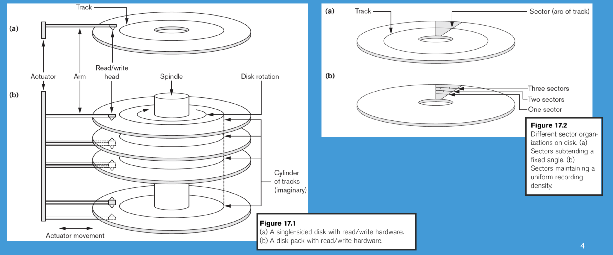
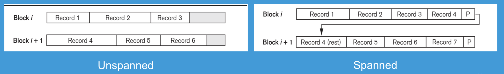
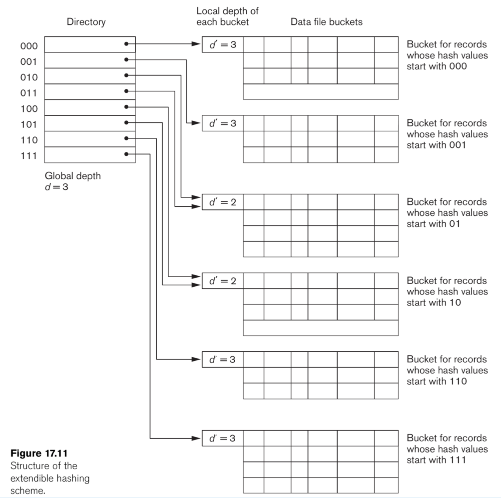

# 6 Lecture 6 — Functional Dependency & Normalization

## 6.1 Functional Dependency

Functional Dependency is a constraint between two sets of attributes from the database. For example, deptno and dname in DEPARTMENT, if you know the department number, you know the department name.

A functional dependency denoted by $X\rightarrow Y$ specifies a constraint on the possible tuples between two sets of attributes X and Y that are subsets of a relation R that can form a relation state r of R.

- The constraint is that, for any two tuples $t_1$ and $t_2$ in $r$ that have $t_1[X]=t_2[X]$, they must also have $t_1[Y]=t_2[Y]$
- The values of the $Y$ component of a tuple in $r$ depends on, or are determined by the values of the $X$ component

### 6.1.1 Formal Definition

Let $R$ be a relation scheme, and $\alpha \subseteq R, \beta \subseteq R$. We say $\alpha \rightarrow \beta$, if in any relation instance $r(R)$, for all pairs of tuples $t_1$ and $t_2$ in $r$, we have $(t_1[\alpha]=t_2[\alpha])\rightarrow (t_1[\beta]=t_2[\beta])$

Consider the Movie(title, year, length, type, studioName, starName) relation. It has a functional dependency $\text{{title,year,starName}}\rightarrow \text{{length,type,studioName}}​$

- Attributes $\text{{title,year,starName}}$ form a key for the relation Movie, as discussed in Lecture 5
- If two tuples agree on these three attributes, title, year, and starName, they must agree on the other attributes, length, type and studioName
- No proper subset of $\text{{title,year,starName}}$ functionally determines all other attributes

### 6.1.2 Candidate Key

Candidate key (key):

- If a constraint in $R$ states $X$ is a candidate key of $R$, then $X\rightarrow Y$ for any subset of attributes $Y$ of $R$
- A candidate key uniquely identifies a tuple
- The values of all remaining attributes are determined

If $X\rightarrow Y$ in $R$, this does not say whether or not $Y\rightarrow X$ in $R$. A functional dependency is property of the semantics of the attributes

### 6.1.3 Inference Rules for FDs

Given a set of FDs F, we can infer additional FDs that hold whenever the FDs in F hold

#### 6.1.3.1 Trivial Function Dependency

Some functional dependencies are "trivial", since they are always satisfied by all relations:

- e.g., $A\rightarrow A, AB\rightarrow A$, $\text{{Ename,Salary}}\rightarrow \text{Ename}$

A functional dependency is trivial if and only if the right-hand side (the dependent) is a subset of the left-hand side (the determinant)

#### 6.1.3.2 Armstrong's Inference Rules

- IR1. (reflexivity) If $Y\subseteq X$, then $X\rightarrow Y$ (trivial)
- IR2. (augmentation) If $X\rightarrow Y$, then $XZ\rightarrow YZ$
- IR3. (transtivity) If $X\rightarrow Y$ and $Y\rightarrow Z$, then $X\rightarrow Z$

Notice that IR1, IR2 and IR3 form a sound and complete set of inference rules

- Sound: These rules are true
- Complete: All the rules that are true can be deduced from these rules

#### 6.1.3.3 Rules Based on Armstrong's Axiom

Some additional inference rules that are useful:

- **Decomposition:** If $X\rightarrow YZ$, then $X\rightarrow Y$ and $X\rightarrow Z$
- **Union**: If $X\rightarrow Y​$ and $X\rightarrow Z​$, then $X\rightarrow YZ​$
- **Pseudo transitivity**: If $X\rightarrow Y$ and $YW\rightarrow Z$, then $XW\rightarrow Z$

Example: Suppose we are given a schema R with attributes A, B, C, D, E, F and the FDs are:

$A\rightarrow BC$, $B\rightarrow E$, $CD\rightarrow EF$. Show that FD: $AD\rightarrow F$ holds

Proof:

1. $A\rightarrow BC$ (given)
2. $A\rightarrow C$ (decomposition from 1)
3. $AD\rightarrow CD$ (union from 2)
4. $CD\rightarrow EF$ (given)
5. $AD\rightarrow EF$ (transitivity from 3 and 4)
6. $AD\rightarrow F$ (decomposition from 5)

### 6.1.4 Closure of a Set of FDs

From section 6.1.3, we know that given a set of FDs F, there are certain other FDs that are logically implied by F based on inference rules. The set of all FDs logically implied by F is the closure of F, denoted by $F^+$.

Two sets of FDs  $F$ and $G$ are equivalent if $F^+=G^+$

The closure of $X$ under $F$ (denoted by $X^+$) is the set of attributes that are functionally determined by $X$ under $F$ ($X$ and $X^+$ are a set of attributes):
$$
X\rightarrow Y \text{ in }F^+ \leftrightarrow Y\subseteq X^+
$$
If $X^+$ consists of all attributes of $R$, $X$ is a superkey for $R$. From the value of $X​$, we can determine the values of the whole tuple.

#### 6.1.4.1 Algorithm to Find Closure of Attribute Sets

Input:

- $R$: a relation schema
- $F$: a set of FDs
- $X\subset R$: the set of attributes for computing the closure

Output:

- $X^+$ is the closure of $X$ with respect to $F$

$$
X_0=X\\
\text{Repeat:}\\
X_{i+1}=X_i\cup Z, \text{where }Z \text{ is the set of attributes such that }Y\rightarrow Z \text{ in } F \text{ and } Y\subset X_i\\
\text{Until } X_{i+1}=X\\
\text{return } X_{i+1}
$$

Example: Given the following schema
$$
R=\left\{A,B,C,D,E,F\right\}, F=\left\{A\rightarrow B,B\rightarrow E,E\rightarrow CF, CD\rightarrow EF \right\}, X=\left\{A \right\}
$$
Find $X^+$

(See slide 17, lecture 6 for solution)

## 6.2 Normalization

### 6.2.1 Overview

In a logical/conceptual DB design, when we consider the schema, we ask ourselves two questions:

1. What relations (tables) are needed?
2. What their attributes should be?

What is a bad DB design?

- Repetition of data/information
- Potential inconsistency
- Inability to represent certain information
- Loss of data/information

Normalization was proposed to take a relation schema through a series of tests to certify whether it satisfies a certain normal form

Analyzing the relation schema based on FD and primary key to achieve

- Minimizing redundancy
- Minimizing the insertion, deletion and update anomalies

Normalization requires two properties

- Non-additive or lossless join
  - decomposition is reversible and no information is loss
  - no spurious tuples (tuples that should not exist) should be generated by doing a natural-join of any relations
- Preservation of the functional dependencies
  - Ensure each functional dependency is represented in some individual relation (sometimes can be sacrificed)

### 6.2.2 First Normal Form

First normal form (1NF)

- Disallow multivalued attributes, composite attributes and their combination
- Disallow multivalued attributes that are themselves composite
- The domain of an attribute must be atomic (simple and indivisible) values
- No repeating groups in a relation (no nested relations)

### 6.2.3 Second Normal Form

Full functional dependency

- If removal of any attribute A from X means that the dependency does not hold any more

Partial functional dependency

- If some attributes A belonging to X can be removed from X and the dependency still holds

A relation schema R is in 2NF if every non-prime attributes A in R is fully functional dependent on the primary key of R.

An attribute of R is called prime attribute of R if it is a member of some candidate key of R. Otherwise it is non-prime.

If a relation schema is not in 2NF, it can be 2NF normalized into a number of 2NF relations in which non-prime attributes are associated only with the part of the primary key on which they are fully functional dependent.

### 6.2.4 Third Normal Form

A relation schema $R$ is in 3NF if whenever a non-trivial FD: $X\rightarrow A$ holds in $R$, either

- $X​$ is a superkey of $R​$
- $A​$ is a prime attribute of $R​$

3NF is based on the concept of transitive dependency. A functional dependency $X\rightarrow Y$ in a relation schema $R$ is transitive dependency if there exists a set of attributes $Z$ in $R$ that is neither a candidate key nor a subset of any key of $R$, and both $X\rightarrow Z$ and $Z\rightarrow Y$ hold.

According to Codd's original definition, a relation $R$ is in 3NF if it satisfies 2NF and no non-prime attribute of $R$ is transitively dependent on primary key.

### 6.2.5 Boyce-Codd Normal Form

BCNF was proposed as a simpler form of 3NF, but it was found to be stricter than 3NF

- Every relation in BCNF is also in 3NF
- But relation in 3NF is not necessarily in BCNF

A relation schema R is in BCNF if whenever a non-trivial functional dependency $X\rightarrow A$ holds in R, then X is a superkey of R.

For example, the relation schema below is in 3NF but not in BCNF.

#### 6.2.5.1 Algorithm for BCNF Decomposition

Try to practice using the given example and another example [here](<https://courses.cs.washington.edu/courses/cse344/11au/sections/section10/final-practice-solution.pdf>)

***

Let R be the initial table with FDs F and S={R}

Until all relation schemes in S are in BCNF

for each R in S

​	for each FD:$X\rightarrow Y​$ that violates BCNF for R

​	$S=(S-\left\{R\right\})\cup(R-Y)\cup(X\cup Y)​$

End until

***

Literally, when we find a table R with BCNF violation $X\rightarrow Y$, we:

- Remove R from S
- Add a table that contains the same attributes as R except for Y
- Add a second table that contains the attributes in X and Y

Example:

Consider the relation scheme $R=\left\{A,B,C,D,E \right\}$ and the FDs: $\left\{A \right\}\rightarrow \left\{B,E\right\}, \left\{C\right\}\rightarrow \left\{D \right\}$. Candidate key AC. Find one BCNF for R.

Solution:

Both functional dependencies violate BCNF because the LHS is not a candidate key.

Pick the first FD, and R can be decomposited into $R_1=\left\{A,C,D\right\}, R_2=\left\{A,B,E\right\}​$

# 7 Lecture 7 — Files and Hash Files

## 7.1 Storage Medium for Databases

Memory Hierarchy:

- CPU cache, main memory, flash memory/phase change memory, magnetic disks/optical disks
- Slower in access delay but larger in memory size (less expensive)

Primary storage (volatile):

- The storage media that can be operated directly by the CPU
- Include main memory and cache memory

Secondary and tertiary storage (non-volatile)

- Slower in access
- Include magnetic disks, optical disks and flash memory

A database could be huge in size (several hundred GB or even higher). It needs to be resided in secondary/tertiary storage

### 7.1.1 Disks

Division and properties of disk storage devices:

- Preferred secondary storage device for high storage capacity and low cost
- Data are stored as magnetized areas on magnetic disk surfaces
- A disk pack contains several magnetic disks connected to a rotating spindle
- Disks are divided into concentric circular tracks on each disk surface
  - Track capacities vary typically from 4 to 50 Kbytes or more
- A track is divided into fixed size sectors and then into blocks
  - Typical block sizes range from B=512 bytes to B=4096 bytes
  - Whole blocks are transferred between disk and main memory for processing

A read-write head moves to the track that contains the block to be transferred. Disk rotation moves the block under the read-write head for reading and writing.

To access a physical disk block, we need:

- The identified track number (seek time 3 to 8ms)
- The block number (within the cylinder) (rotational delay 2ms)
- Get the block data (transfer delay)

Therefore, disk access delay = seek time + rotational delay + transfer delay. We can see that accessing a disk consumes plenty of time. Double buffering to be introduced in the next section can be used to speed up the transfer of contiguous disk blocks

### 7.1.2 Double Buffering

Suppose we have a file with a sequence of n blocks, B1, B2, …, Bn and we have a program that processes B1, B2, …, Bn. Let R be the time to read 1 block to buffer and P be the time to process 1 block. Assume P>R.

In a single buffer solution, we need to spend n(R+P) to access all n blocks. However, we can use the double buffer solution to read and process together, which gives R+np as result time.

## 7.2 Database System Management

### 7.2.1 Simplified Database System Environment

- DBMS is a collection of programs that enables users to create and maintain database
- DBMS is a general-purpose software that facilitates the process of defining, constructing and manipulating databases for various applications
- Database System = DMBS software + Database

### 7.2.2 Database Records

- Database: data file (records) + metadata
- Fixed and variable length records
- Records contain fields (attributes)
- Fields may be fixed length or variable length (e.g., varchar)
- Variable length fields can be mixed into one record. Separator characters or length fields are needed so that the record can be parsed

#### 7.2.2.1 Blocking

There is a technique called blocking which refers to storing a number of records into one block on the disk. Blocking factor ($bfr$) refers to the number of records per block. There may be empty space in a block if an integral number of records do not fit into one block.

Suppose the block size is $B$. For fixed-length records of size $R$ with $B \ge R$,

- $bfr = floor(B/R)$
- Unused space in each block = $B-(bfr\times R)$ bytes

#### 7.2.2.2 Files of Records

- A file (e.g., a table) is a sequence of records (e.g., tuples), where each record is a collection of data values (fields)
- A file can have fixed-length records or variable-length records
- A file descriptor (or file header) includes information that describes the file, such as the field names and their data types, and the addresses of the file blocks on disk
- File records are stored on disk blocks

The physical disk blocks that are allocated to hold the records of a file can be contiguous (one by one), linked (using pointers), or indexed (a table to describe their locations)

File records can be unspanned or spanned

- Unspanned: no record can span two blocks
- Spanned: a record can be stored in more than one block

In a file of fixed-length records, all records have the same format. Usually, unspanned blocking is used. File of variable-length records require additional information to be stored in each record, such as separator characters. Usually spanned blocking is used with such files.

### 7.2.3 Typical operations on files

| Operation Name | Content                                                      |
| -------------- | ------------------------------------------------------------ |
| OPEN           | Makes the file ready for access, and associates a pointer that will refer to a current file record at each point in time |
| FIND           | Search for the first file record that satisfies a certain condition and makes it the current file record |
| FINDNEXT       | Search for the next file record (from the current record) that satisfies a certain condition, and makes it the current file record |
| READ           | Reads the current file record into a program variable        |
| INSERT         | Inserts a new record into the file and makes it the current file record |
| DELETE         | Removes the current file record from the file, usually by marking the record to indicate that it is no longer valid |
| MODIFY         | Changes the values of some fields of the current file record |
| CLOSE          | Terminates access to the file                                |
| REORGANIZE     | Reorganizes the file records. For example, the reocrds marked "deleted" are physically removed from the file or a new organisation of the file records is created |
| READ_ORDERED   | Reads the file blocks in order of a specific field of the file |

### 7.2.4 Unordered Files

- Also called a heap file (records are unordered)
- New records are inserted at the end of a file and arranged in their insertion sequence
- A linear search through the file records is necessary to search for a record $O(n)$
- Record insertion is efficient (add to the end) $O(1)$
- Reading the records in order of a particular field requires sorting the file records

### 7.2.5 Ordered Files

- Also called a sequential file (records are ordered)
- File records are kept sorted by the values of an ordering field
- Insertion is expensive: records must be inserted in the correct order
  - It is common to keep a seperate unordered overflow file for new records to improve insertion efficiency; this is periodically merged with the main ordered file
- Binary search can be used to search for a record on its ordering field value
- Reading the records in order of the ordering field is quite efficient

## 7.3 Static Hashed Files

### 7.3.1 Overview of Static Hashing

- Hashing for disk files is called external hashing (files on disk)
- The file blocks are divided into M equal-sized buckets, numbered $bucket_0,bucket_1,…,bucket_{M-1}​$
- One of the file fields is designated to be the hash key of the file
- Suppose there is a hash function that takes a hash key as an argument to compute an integer in range 0 and B-1 where B is the number of buckets
- A bucket array (an array index) from 0 to B-1 holds the headers of B lists, one for each bucket of the array
- If a record has search key K, we store the record by linking it to the bucket list for the bucket numbered h(K) where h is the hash function
  - $h:\mathbb{R}\rightarrow \left\{0,1,…,B-1\right\}​$

Once the bucket numbers are determined, one can efficiently find the position of a file block.

- To reduce the number of overflow, a hash file is typically kept 70-80% full.

- The hash function h should distribute the records uniformly among the buckets
  - Otherwise, search time will be increased because many overflow records will exist
  - Searching overflow records are more expensive
- Main disadvantages of static external hashing:
  - Fixed number of buckets M is a problem if the number of records in the file grows or shrinks
  - Ordered access on the hash key is quite inefficient (requires sorting the records)

### 7.3.2 Collision Resolution

Consider the following situation: $bucket_1​$ of a hash table is already full. However, a new record with key $g​$ where $h(g)=1​$ comes. Collision occurs. We have several ways to resolve or avoid collision.

#### 7.3.2.1 Open Addressing

Proceeding from the occupied position specified by the hash address, the program checks the subsequent positions in order until an unused (empty) position is found.

- Linear Probing: If collide, try $bucket_{i+1},bucket_{i+2},…bucket_{i+n}$

- Quadratic Probing: If collide, try $bucket_{i+1},bucket_{i+4},…bucket_{i+n^2}$

#### 7.3.2.2 Chaining

- For this method, various overflow locations are kept, usually by extending the array with a number of overflow positions
- In addition, a pointer field is added to each bucket
- A collision is resolved by placing the new record in an unused overflow bucket and setting the pointer of the occupied hash address bucket to the address of that overflow bucket

#### 7.3.2.3 Multiple Hashing

- The program applies a second hash function if the first results in a collision
- If another collision results, the program uses open addressing or applies a third hash function and then uses open addressing if necessary

## 7.4 Extendible and Dynamic Hashing

### 7.4.1 Overview

Dynamic and Extendible Hashing Techniques:

- Hashing techniques are extended to allow dynamic growth and shrinking of the number of file records
- These techniques include the following: dynamic hashing and extendible hashing

Both dynamic and extendible hashing use the binary representation (e.g., 1100…) of the hash value $h(K)$ in order to access a directory

- In dynamic hashing the directory is a binary tree
- In extendible hashing the directory is an array of size $2^d$ where $d$ is called the global depth

The directories can be stored on disk, and they expand or shrink dynamically

- Directory entries point to the disk blocks that contain the stored records

An insertion in a disk block that is full causes the block to split into two blocks and the records are redistributed among the two blocks so that the directory is updated properly

### 7.4.2 Extendible Hashing

- A directory consisting of an array of $2^d$ bucket addresses is maintained
- $d$ is called the global depth of the directory
- The integer value corresponding to the first (high-order) d bits of a hash value is used as an index to the array to determine a directory entry and the address in that entry determines the bucket storing the records
- A location $d'$ (called, local depth stored with each bucket) specifies the number of bits on which the bucket contents are based
- The value of $d'​$ can be increased or decreased by one at a time to handle overflow or underflow respectively

- Suppose $d=4$. i.e., the hash function produces a sequence of four bits
- At the moment, only one of these bits is used as illustrated by $d'=1​$ in the box above the bucket array

- The bucket array therefore has only two entries and points to two blocks
  - The first holds all the current records whose search keys hash to a bit sequence beginning with 0
  - The second holds all those whose search keys hash to a sequence beginning with 1
- Suppose we insert a record whose key hash to the sequence 1010
- Since the first bit is 1, it belongs to the second block
- However, the second block is full. It needs to be split by setting $d'$ to 2

- The two entries beginning with 0 each point to the block for records whose hashed keys begin with 0 and the block still has the integer 1 in its "nub" to indicate that only the first bit determines membership in the block
- The blocks for records beginning with 1 needs to be split into 10 and 11

**Correction:** The "1001" in the second diagram should be 1101 and placed in the third bucket

### 7.4.2 Dynamic Hashing

- Dynamic and extendible hashing do not require an overflow area in general
- Dynamic hashing maintains tree-structured directory with two types of nodes
  - Internal nodes that have two pointers: the left pointer corresponding to the 0 bit (in the hash address) and a right pointer corresponding to the 1 bit
  - Leaf nodes: these hold a pointer to the actual bucket with records

