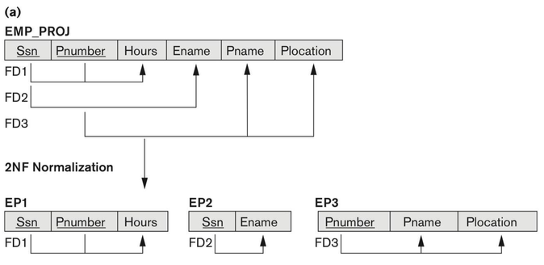
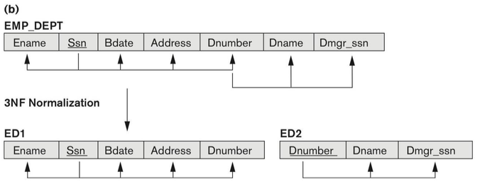
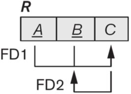

# 6 Lecture 6 — Functional Dependency & Normalization

## 6.1 Functional Dependency

Functional Dependency is a constraint between two sets of attributes from the database. For example, deptno and dname in DEPARTMENT, if you know the department number, you know the department name.

A functional dependency denoted by $X\rightarrow Y$ specifies a constraint on the possible tuples between two sets of attributes X and Y that are subsets of a relation R that can form a relation state r of R.

- The constraint is that, for any two tuples $t_1$ and $t_2$ in $r$ that have $t_1[X]=t_2[X]$, they must also have $t_1[Y]=t_2[Y]$
- The values of the $Y$ component of a tuple in $r$ depends on, or are determined by the values of the $X$ component

### 6.1.1 Formal Definition

Let $R$ be a relation scheme, and $\alpha \subseteq R, \beta \subseteq R$. We say $\alpha \rightarrow \beta$, if in any relation instance $r(R)$, for all pairs of tuples $t_1$ and $t_2$ in $r$, we have $(t_1[\alpha]=t_2[\alpha])\rightarrow (t_1[\beta]=t_2[\beta])$

Consider the Movie(title, year, length, type, studioName, starName) relation. It has a functional dependency $\text{{title,year,starName}}\rightarrow \text{{length,type,studioName}}​$

- Attributes $\text{{title,year,starName}}$ form a key for the relation Movie, as discussed in Lecture 5
- If two tuples agree on these three attributes, title, year, and starName, they must agree on the other attributes, length, type and studioName
- No proper subset of $\text{{title,year,starName}}$ functionally determines all other attributes

### 6.1.2 Candidate Key

Candidate key (key):

- If a constraint in $R$ states $X$ is a candidate key of $R$, then $X\rightarrow Y$ for any subset of attributes $Y$ of $R$
- A candidate key uniquely identifies a tuple
- The values of all remaining attributes are determined

If $X\rightarrow Y$ in $R$, this does not say whether or not $Y\rightarrow X$ in $R$. A functional dependency is property of the semantics of the attributes

### 6.1.3 Inference Rules for FDs

Given a set of FDs F, we can infer additional FDs that hold whenever the FDs in F hold

#### 6.1.3.1 Trivial Function Dependency

Some functional dependencies are "trivial", since they are always satisfied by all relations:

- e.g., $A\rightarrow A, AB\rightarrow A$, $\text{{Ename,Salary}}\rightarrow \text{Ename}$

A functional dependency is trivial if and only if the right-hand side (the dependent) is a subset of the left-hand side (the determinant)

#### 6.1.3.2 Armstrong's Inference Rules

- IR1. (reflexivity) If $Y\subseteq X$, then $X\rightarrow Y$ (trivial)
- IR2. (augmentation) If $X\rightarrow Y$, then $XZ\rightarrow YZ$
- IR3. (transtivity) If $X\rightarrow Y$ and $Y\rightarrow Z$, then $X\rightarrow Z$

Notice that IR1, IR2 and IR3 form a sound and complete set of inference rules

- Sound: These rules are true
- Complete: All the rules that are true can be deduced from these rules

#### 6.1.3.3 Rules Based on Armstrong's Axiom

Some additional inference rules that are useful:

- **Decomposition:** If $X\rightarrow YZ$, then $X\rightarrow Y$ and $X\rightarrow Z$
- **Union**: If $X\rightarrow Y​$ and $X\rightarrow Z​$, then $X\rightarrow YZ​$
- **Pseudo transitivity**: If $X\rightarrow Y$ and $YW\rightarrow Z$, then $XW\rightarrow Z$

Example: Suppose we are given a schema R with attributes A, B, C, D, E, F and the FDs are:

$A\rightarrow BC$, $B\rightarrow E$, $CD\rightarrow EF$. Show that FD: $AD\rightarrow F$ holds

Proof:

1. $A\rightarrow BC$ (given)
2. $A\rightarrow C$ (decomposition from 1)
3. $AD\rightarrow CD$ (union from 2)
4. $CD\rightarrow EF$ (given)
5. $AD\rightarrow EF$ (transitivity from 3 and 4)
6. $AD\rightarrow F$ (decomposition from 5)

### 6.1.4 Closure of a Set of FDs

From section 6.1.3, we know that given a set of FDs F, there are certain other FDs that are logically implied by F based on inference rules. The set of all FDs logically implied by F is the closure of F, denoted by $F^+$.

Two sets of FDs  $F$ and $G$ are equivalent if $F^+=G^+$

The closure of $X$ under $F$ (denoted by $X^+$) is the set of attributes that are functionally determined by $X$ under $F$ ($X$ and $X^+$ are a set of attributes):
$$
X\rightarrow Y \text{ in }F^+ \leftrightarrow Y\subseteq X^+
$$
If $X^+$ consists of all attributes of $R$, $X$ is a superkey for $R$. From the value of $X​$, we can determine the values of the whole tuple.

#### 6.1.4.1 Algorithm to Find Closure of Attribute Sets

Input:

- $R$: a relation schema
- $F$: a set of FDs
- $X\subset R$: the set of attributes for computing the closure

Output:

- $X^+$ is the closure of $X$ with respect to $F$

$$
X_0=X\\
\text{Repeat:}\\
X_{i+1}=X_i\cup Z, \text{where }Z \text{ is the set of attributes such that }Y\rightarrow Z \text{ in } F \text{ and } Y\subset X_i\\
\text{Until } X_{i+1}=X\\
\text{return } X_{i+1}
$$

Example: Given the following schema
$$
R=\left\{A,B,C,D,E,F\right\}, F=\left\{A\rightarrow B,B\rightarrow E,E\rightarrow CF, CD\rightarrow EF \right\}, X=\left\{A \right\}
$$
Find $X^+$

(See slide 17, lecture 6 for solution)

## 6.2 Normalization

### 6.2.1 Overview

In a logical/conceptual DB design, when we consider the schema, we ask ourselves two questions:

1. What relations (tables) are needed?
2. What their attributes should be?

What is a bad DB design?

- Repetition of data/information
- Potential inconsistency
- Inability to represent certain information
- Loss of data/information

Normalization was proposed to take a relation schema through a series of tests to certify whether it satisfies a certain normal form

Analyzing the relation schema based on FD and primary key to achieve

- Minimizing redundancy
- Minimizing the insertion, deletion and update anomalies

Normalization requires two properties

- Non-additive or lossless join
  - decomposition is reversible and no information is loss
  - no spurious tuples (tuples that should not exist) should be generated by doing a natural-join of any relations
- Preservation of the functional dependencies
  - Ensure each functional dependency is represented in some individual relation (sometimes can be sacrificed)

### 6.2.2 First Normal Form

First normal form (1NF)

- Disallow multivalued attributes, composite attributes and their combination
- Disallow multivalued attributes that are themselves composite
- The domain of an attribute must be atomic (simple and indivisible) values
- No repeating groups in a relation (no nested relations)

### 6.2.3 Second Normal Form

Full functional dependency

- If removal of any attribute A from X means that the dependency does not hold any more

Partial functional dependency

- If some attributes A belonging to X can be removed from X and the dependency still holds

A relation schema R is in 2NF if every non-prime attributes A in R is fully functional dependent on the primary key of R.

An attribute of R is called prime attribute of R if it is a member of some candidate key of R. Otherwise it is non-prime.

If a relation schema is not in 2NF, it can be 2NF normalized into a number of 2NF relations in which non-prime attributes are associated only with the part of the primary key on which they are fully functional dependent.

### 6.2.4 Third Normal Form

A relation schema $R$ is in 3NF if whenever a non-trivial FD: $X\rightarrow A$ holds in $R$, either

- $X​$ is a superkey of $R​$
- $A​$ is a prime attribute of $R​$

3NF is based on the concept of transitive dependency. A functional dependency $X\rightarrow Y$ in a relation schema $R$ is transitive dependency if there exists a set of attributes $Z$ in $R$ that is neither a candidate key nor a subset of any key of $R$, and both $X\rightarrow Z$ and $Z\rightarrow Y$ hold.

According to Codd's original definition, a relation $R$ is in 3NF if it satisfies 2NF and no non-prime attribute of $R$ is transitively dependent on primary key.

### 6.2.5 Boyce-Codd Normal Form

BCNF was proposed as a simpler form of 3NF, but it was found to be stricter than 3NF

- Every relation in BCNF is also in 3NF
- But relation in 3NF is not necessarily in BCNF

A relation schema R is in BCNF if whenever a non-trivial functional dependency $X\rightarrow A$ holds in R, then X is a superkey of R.

For example, the relation schema below is in 3NF but not in BCNF.

#### 6.2.5.1 Algorithm for BCNF Decomposition

Try to practice using the given example and another example [here](<https://courses.cs.washington.edu/courses/cse344/11au/sections/section10/final-practice-solution.pdf>)

***

Let R be the initial table with FDs F and S={R}

Until all relation schemes in S are in BCNF

for each R in S

​	for each FD:$X\rightarrow Y​$ that violates BCNF for R

​	$S=(S-\left\{R\right\})\cup(R-Y)\cup(X\cup Y)​$

End until

***

Literally, when we find a table R with BCNF violation $X\rightarrow Y$, we:

- Remove R from S
- Add a table that contains the same attributes as R except for Y
- Add a second table that contains the attributes in X and Y

Example:

Consider the relation scheme $R=\left\{A,B,C,D,E \right\}$ and the FDs: $\left\{A \right\}\rightarrow \left\{B,E\right\}, \left\{C\right\}\rightarrow \left\{D \right\}$. Candidate key AC. Find one BCNF for R.

Solution:

Both functional dependencies violate BCNF because the LHS is not a candidate key.

Pick the first FD, and R can be decomposited into $R_1=\left\{A,C,D\right\}, R_2=\left\{A,B,E\right\}$

